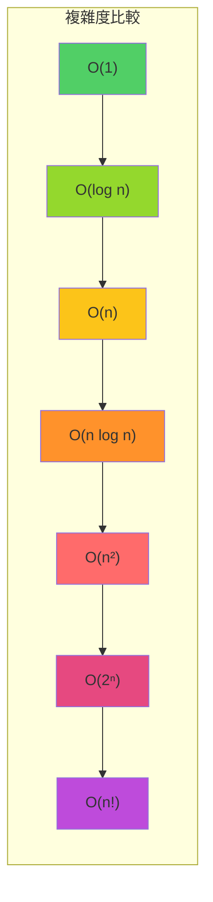
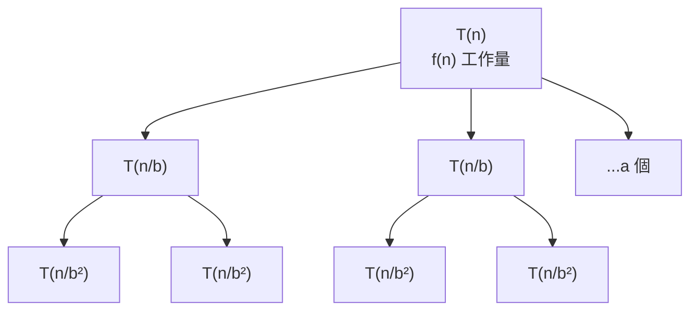
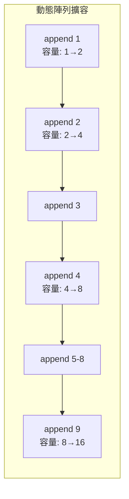

# 第 1 章：複雜度分析（Big O Notation）

!!! note "🎯 本章學習目標"
    完成本章後，你將能夠：
    
    - [ ] 理解 Big O、Big Ω、Big Θ 的定義與差異
    - [ ] 掌握常見時間複雜度類型並排序其效率
    - [ ] 分析迴圈、巢狀迴圈、遞迴的時間複雜度
    - [ ] 理解空間複雜度的計算（包含遞迴呼叫棧）
    - [ ] 了解攤銷分析（Amortized Analysis）的基本概念
    
    **預估學習時間**：2 小時  
    **前置知識**：基礎程式設計概念

---

## 1. 為什麼需要複雜度分析？

想像你要從台北到高雄，有三種方式：

1. **走路**：可能需要一週（隨著距離增加，時間線性增長）
2. **開車**：約 4 小時（比走路快，但仍受距離影響）
3. **搭高鐵**：約 1.5 小時（近乎固定時間）

在演算法中，我們也需要一種方式來**比較不同解法的效率**。複雜度分析讓我們能在不實際執行程式的情況下，預測演算法在**大規模資料**下的表現。

!!! warning "面試關鍵"
    在 FAANG 面試中，幾乎每道題都會問：「你的解法時間和空間複雜度是多少？」能清楚回答這個問題是通過面試的基本門檻。

---

## 2. Big O、Big Ω、Big Θ

### 三種漸進符號

| 符號 | 名稱 | 意義 | 面試使用頻率 |
|------|------|------|-------------|
| **O (Big O)** | 上界 | 最壞情況，「不會比這更慢」 | ⭐⭐⭐⭐⭐ 最常用 |
| **Ω (Big Omega)** | 下界 | 最好情況，「至少需要這麼久」 | ⭐⭐ 偶爾 |
| **Θ (Big Theta)** | 緊確界 | 精確描述，上下界相同 | ⭐⭐⭐ 有時 |

### 數學定義

對於函數 $f(n)$ 和 $g(n)$：

$$f(n) = O(g(n)) \iff \exists c > 0, n_0 > 0 \text{ 使得 } \forall n \geq n_0: f(n) \leq c \cdot g(n)$$

**白話解釋**：當 n 夠大時，$f(n)$ 的成長速度「不會超過」$g(n)$ 的某個倍數。



---

## 3. 常見時間複雜度

### 複雜度排行榜（由快到慢）

| 複雜度 | 名稱 | n=10 | n=100 | n=1000 | 典型演算法 |
|--------|------|------|-------|--------|-----------|
| O(1) | 常數 | 1 | 1 | 1 | Hash Table 查找 |
| O(log n) | 對數 | 3 | 7 | 10 | Binary Search |
| O(n) | 線性 | 10 | 100 | 1000 | 遍歷陣列 |
| O(n log n) | 線性對數 | 33 | 664 | 9966 | Merge Sort |
| O(n²) | 平方 | 100 | 10000 | 1000000 | 雙層迴圈 |
| O(2ⁿ) | 指數 | 1024 | 1.27×10³⁰ | 💀 | 暴力遞迴 |
| O(n!) | 階乘 | 3628800 | 💀 | 💀 | 全排列 |

### 程式碼範例

```python
# === O(1) 常數時間 ===
def get_first(arr: list) -> int:
    """直接存取陣列第一個元素"""
    return arr[0] if arr else None
# 無論 arr 有 10 個還是 10 億個元素，都只需要一步


# === O(log n) 對數時間 ===
def binary_search(arr: list[int], target: int) -> int:
    """二分搜尋"""
    left, right = 0, len(arr) - 1
    while left <= right:
        mid = (left + right) // 2
        if arr[mid] == target:
            return mid
        elif arr[mid] < target:
            left = mid + 1
        else:
            right = mid - 1
    return -1
# 每次迭代將搜尋範圍減半


# === O(n) 線性時間 ===
def find_max(arr: list[int]) -> int:
    """找最大值"""
    max_val = arr[0]
    for num in arr:
        if num > max_val:
            max_val = num
    return max_val
# 需要檢查每個元素一次


# === O(n log n) 線性對數時間 ===
def merge_sort(arr: list[int]) -> list[int]:
    """合併排序"""
    if len(arr) <= 1:
        return arr
    mid = len(arr) // 2
    left = merge_sort(arr[:mid])    # T(n/2)
    right = merge_sort(arr[mid:])   # T(n/2)
    return merge(left, right)       # O(n)
# T(n) = 2T(n/2) + O(n) → O(n log n)


# === O(n²) 平方時間 ===
def bubble_sort(arr: list[int]) -> list[int]:
    """泡沫排序"""
    n = len(arr)
    for i in range(n):              # 外層 n 次
        for j in range(n - i - 1):  # 內層約 n 次
            if arr[j] > arr[j + 1]:
                arr[j], arr[j + 1] = arr[j + 1], arr[j]
    return arr
# 雙層迴圈，n × n = n²


# === O(2ⁿ) 指數時間 ===
def fibonacci_naive(n: int) -> int:
    """費氏數列（暴力遞迴）"""
    if n <= 1:
        return n
    return fibonacci_naive(n - 1) + fibonacci_naive(n - 2)
# 每次呼叫分裂成兩個子問題
```

---

## 4. 如何分析複雜度

### 規則一：忽略常數與低階項

$$O(2n + 100) = O(n)$$
$$O(n^2 + n) = O(n^2)$$

當 n 足夠大時，低階項與常數的影響可以忽略。

### 規則二：多個獨立步驟相加

```python
def example(arr):
    # Step 1: O(n)
    for x in arr:
        print(x)
    
    # Step 2: O(n)
    for x in arr:
        print(x * 2)
    
# 總複雜度: O(n) + O(n) = O(2n) = O(n)
```

### 規則三：巢狀迴圈相乘

```python
def nested_example(arr):
    n = len(arr)
    for i in range(n):          # 外層 n 次
        for j in range(n):      # 內層 n 次
            print(i, j)
    
# 總複雜度: O(n) × O(n) = O(n²)
```

### 規則四：遞迴分析

使用 **Master Theorem** 或 **遞迴樹** 分析：

對於 $T(n) = aT(n/b) + f(n)$：



**常見模式**：

| 遞迴關係 | 結果 | 範例 |
|---------|------|------|
| $T(n) = T(n/2) + O(1)$ | $O(\log n)$ | Binary Search |
| $T(n) = T(n-1) + O(1)$ | $O(n)$ | 線性遞迴 |
| $T(n) = 2T(n/2) + O(n)$ | $O(n \log n)$ | Merge Sort |
| $T(n) = 2T(n-1) + O(1)$ | $O(2^n)$ | Fibonacci 暴力解 |

---

## 5. 空間複雜度

空間複雜度衡量演算法使用的**額外記憶體**（不包含輸入資料本身）。

### 常見記憶體消耗

```python
# === O(1) 空間 ===
def sum_array(arr: list[int]) -> int:
    """只使用常數個變數"""
    total = 0  # 固定空間
    for num in arr:
        total += num
    return total


# === O(n) 空間 ===
def duplicate_array(arr: list[int]) -> list[int]:
    """創建與輸入同大小的新陣列"""
    result = []  # 最終大小為 n
    for num in arr:
        result.append(num)
    return result


# === 遞迴的隱藏空間 ===
def factorial(n: int) -> int:
    """
    遞迴呼叫會使用 call stack
    每層呼叫佔用記憶體，共 n 層
    空間複雜度: O(n)
    """
    if n <= 1:
        return 1
    return n * factorial(n - 1)
```

### 空間複雜度分析表

| 情況 | 空間複雜度 | 說明 |
|------|-----------|------|
| 只用固定個變數 | O(1) | in-place 操作 |
| 創建新陣列 | O(n) | 如 map、filter |
| 創建二維陣列 | O(n²) | 如 DP 表格 |
| 遞迴深度 d | O(d) | call stack |
| Hash Table 儲存 | O(k) | k 為存入的 key 數 |

---

## 6. 攤銷分析（Amortized Analysis）

### 什麼是攤銷分析？

有些操作「偶爾」很慢，但平均起來仍然很快。攤銷分析計算的是**連續多次操作的平均成本**。

### 經典範例：動態陣列 append

```python
class DynamicArray:
    """
    模擬 Python list 的動態擴容機制
    """
    def __init__(self):
        self.capacity = 1
        self.size = 0
        self.data = [None] * self.capacity
    
    def append(self, item):
        """
        平均時間: O(1) (攤銷)
        最壞時間: O(n) (當需要擴容時)
        """
        # 需要擴容
        if self.size == self.capacity:
            self._resize(self.capacity * 2)  # O(n)
        
        self.data[self.size] = item  # O(1)
        self.size += 1
    
    def _resize(self, new_capacity):
        """擴容操作 O(n)"""
        new_data = [None] * new_capacity
        for i in range(self.size):
            new_data[i] = self.data[i]
        self.data = new_data
        self.capacity = new_capacity
```

**攤銷分析**：

- 假設進行 n 次 append
- 擴容發生在：1, 2, 4, 8, ..., n 時（共 log n 次）
- 總搬移成本：1 + 2 + 4 + ... + n ≈ 2n
- 攤銷到每次 append：2n / n = **O(1)**



---

## 7. 複雜度分析總結

| 操作 | 平均時間複雜度 | 最壞時間複雜度 | 空間複雜度 |
|------|---------------|---------------|-----------|
| 陣列存取 | O(1) | O(1) | O(1) |
| 陣列搜尋（無序） | O(n) | O(n) | O(1) |
| 陣列搜尋（有序） | O(log n) | O(log n) | O(1) |
| 鏈結串列存取 | O(n) | O(n) | O(1) |
| Hash Table 操作 | O(1) | O(n) | O(n) |
| 平衡 BST 操作 | O(log n) | O(log n) | O(n) |

---

## 8. 面試重點

!!! warning "⚠️ 常見陷阱"
    1. **忘記遞迴的空間複雜度**
       - 錯誤：說遞迴解法空間 O(1)
       - 正確：考慮 call stack 深度
    
    2. **忽略隱藏的迴圈**
       - 錯誤：`if x in list` 是 O(1)
       - 正確：Python list 的 `in` 是 O(n)
    
    3. **混淆最好與最壞情況**
       - 例如 Quick Sort：平均 O(n log n)，最壞 O(n²)
    
    4. **忘記字串操作的成本**
       - Python 字串 concatenation 是 O(n)
       - 多次拼接用 `"".join(list)` 更高效

!!! tip "💡 面試技巧"
    - **先說想法再說複雜度**：「這個解法用雙層迴圈，所以是 O(n²)」
    - **提及優化可能性**：「目前是 O(n²)，可以用 Hash Table 優化到 O(n)」
    - **分開講時間和空間**：「時間 O(n)，空間 O(1) 因為是 in-place」
    - **在白板上畫圖**：畫出 n 與執行步驟的關係圖

---

## 9. LeetCode 對應題目

### 📝 相關題目

| 難度 | 題號 | 題目名稱 | 考點 |
|------|------|---------|------|
| 🟢 Easy | #1 | Two Sum | O(n) vs O(n²) 解法比較 |
| 🟢 Easy | #21 | Merge Two Sorted Lists | O(n+m) 分析 |
| 🟡 Medium | #15 | 3Sum | 如何從 O(n³) 優化到 O(n²) |
| 🟡 Medium | #33 | Search in Rotated Sorted Array | O(log n) Binary Search |
| 🔴 Hard | #4 | Median of Two Sorted Arrays | O(log(m+n)) 進階二分 |

---

## 10. 練習題

!!! question "練習 1：分析複雜度（Easy）"
    **題目描述：**
    
    分析以下程式碼的時間和空間複雜度：
    
    ```python
    def mystery(n):
        if n <= 0:
            return 0
        return mystery(n // 2) + 1
    ```
    
    **提示：**
    <details>
    <summary>點擊查看提示</summary>
    思考 n 每次會減少多少？需要多少次才會到達基底情況？
    </details>

!!! question "練習 2：最佳化分析（Medium）"
    **題目描述：**
    
    給定一個陣列，找出是否存在重複元素。分析以下兩種解法的複雜度：
    
    **解法 A**：雙層迴圈比較
    **解法 B**：使用 Set
    
    **限制條件：**
    - `1 <= nums.length <= 10^5`
    - `-10^9 <= nums[i] <= 10^9`
    
    **提示：**
    <details>
    <summary>點擊查看提示</summary>
    Set 的查找時間是多少？這會如何影響整體複雜度？
    </details>

!!! question "練習 3：遞迴複雜度（Hard）"
    **題目描述：**
    
    分析以下遞迴的時間複雜度：
    
    ```python
    def f(n):
        if n <= 1:
            return 1
        return f(n - 1) + f(n - 1)
    ```
    
    **進階問題**：如何優化這個函數？
    
    **提示：**
    <details>
    <summary>點擊查看提示</summary>
    畫出遞迴樹，計算總共有多少個節點。
    </details>

---

## 11. 解答與詳解

??? success "練習 1 解答"
    ```python
    def mystery(n):
        """
        時間複雜度分析：
        - n 每次除以 2
        - 需要 log₂(n) 次才能到達基底
        - Time: O(log n)
        
        空間複雜度分析：
        - 遞迴深度 = log n
        - Space: O(log n)（call stack）
        """
        if n <= 0:
            return 0
        return mystery(n // 2) + 1
    ```
    
    **詳細解析：**
    - 這是計算 $\lfloor \log_2 n \rfloor$ 的函數
    - 每次呼叫 n 減半，所以呼叫次數是 $O(\log n)$
    - 遞迴會佔用 call stack，空間也是 $O(\log n)$

??? success "練習 2 解答"
    ```python
    # 解法 A：雙層迴圈
    def contains_duplicate_a(nums: list[int]) -> bool:
        """
        Time: O(n²) - 雙層迴圈
        Space: O(1) - 只用常數變數
        """
        n = len(nums)
        for i in range(n):
            for j in range(i + 1, n):
                if nums[i] == nums[j]:
                    return True
        return False
    
    
    # 解法 B：使用 Set
    def contains_duplicate_b(nums: list[int]) -> bool:
        """
        Time: O(n) - 遍歷一次，Set 查找 O(1)
        Space: O(n) - Set 最多存 n 個元素
        """
        seen = set()
        for num in nums:
            if num in seen:
                return True
            seen.add(num)
        return False
    ```
    
    **比較：**
    | 解法 | 時間 | 空間 | 適用場景 |
    |------|------|------|---------|
    | A | O(n²) | O(1) | 記憶體受限 |
    | B | O(n) | O(n) | 一般情況（推薦） |

??? success "練習 3 解答"
    ```python
    # 原始版本
    def f(n):
        """
        遞迴樹分析：
        - 每層節點數: 1, 2, 4, 8, ...
        - 共 n 層
        - 總節點數: 2^0 + 2^1 + ... + 2^(n-1) = 2^n - 1
        
        Time: O(2^n)
        Space: O(n)（遞迴深度）
        """
        if n <= 1:
            return 1
        return f(n - 1) + f(n - 1)
    
    
    # 優化版本：因為兩次呼叫結果相同
    def f_optimized(n):
        """
        Time: O(n)
        Space: O(n)
        """
        if n <= 1:
            return 1
        result = f_optimized(n - 1)
        return result + result  # 只計算一次！
    ```
    
    **關鍵洞察**：`f(n-1) + f(n-1)` 計算了兩次相同的值，優化後只算一次。

---

## 12. 延伸學習

### 🚀 進階主題
- **空間換時間**：Hash Table、Memoization
- **時間換空間**：Streaming Algorithm
- **平行計算複雜度**：Work、Span、Speedup
- **P vs NP 問題**：計算複雜度理論

### 📚 參考資源
- [Big O Cheat Sheet](https://www.bigocheatsheet.com/)
- [CLRS - Introduction to Algorithms, Chapter 3](https://mitpress.mit.edu/books/introduction-algorithms-fourth-edition)

### ⏭️ 下一章預告
下一章我們將學習「**Array 與 String**」，這是面試中最基礎也最常見的題目類型。掌握雙指標和滑動窗口技巧後，你就能解決大量的面試問題！
