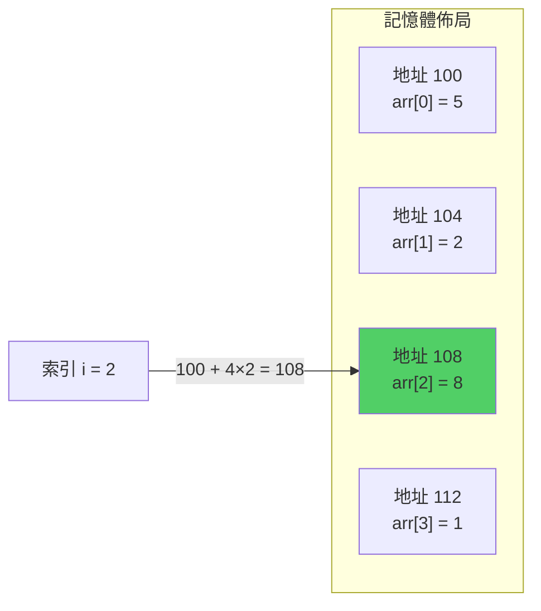
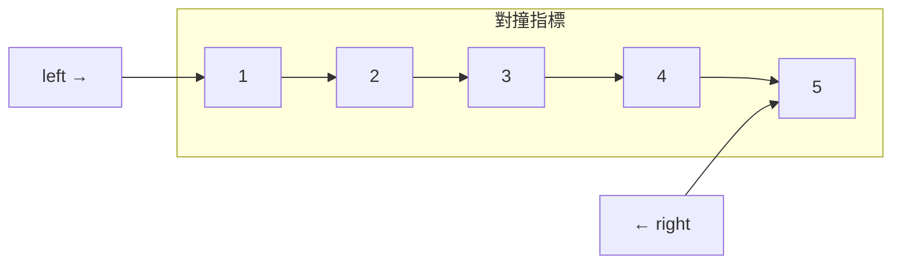
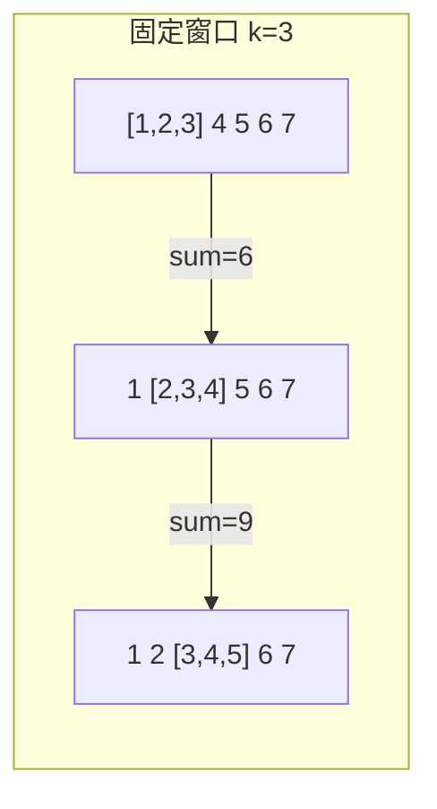

# 第 2 章：Array 與 String

!!! note "🎯 本章學習目標"
    完成本章後，你將能夠：
    
    - [ ] 理解陣列的記憶體佈局與隨機存取原理
    - [ ] 掌握雙指標（Two Pointers）技巧
    - [ ] 熟練運用滑動窗口（Sliding Window）解題
    - [ ] 了解 Python list 的動態擴容機制
    - [ ] 處理常見的字串操作問題
    
    **預估學習時間**：3 小時  
    **前置知識**：第 1 章複雜度分析

---

## 1. 陣列基礎

### 什麼是陣列？

陣列就像一排連續的郵箱，每個郵箱都有編號（索引），你可以直接根據編號找到對應的郵箱，不需要從頭開始找。

**核心特性**：
- **連續記憶體**：元素在記憶體中緊密排列
- **隨機存取**：透過索引 O(1) 時間存取任意元素
- **固定大小**：傳統陣列大小固定（Python list 例外）



### Python list 底層原理

Python 的 `list` 是**動態陣列**，會自動調整大小：

```python
import sys

def show_list_memory():
    """展示 Python list 的動態擴容"""
    arr = []
    prev_size = 0
    
    for i in range(20):
        arr.append(i)
        curr_size = sys.getsizeof(arr)
        if curr_size != prev_size:
            print(f"長度 {len(arr):2d}, 記憶體: {curr_size:4d} bytes")
            prev_size = curr_size

# 輸出：
# 長度  1, 記憶體:   88 bytes
# 長度  5, 記憶體:  120 bytes
# 長度  9, 記憶體:  184 bytes
# 長度 17, 記憶體:  248 bytes
```

---

## 2. 雙指標技巧（Two Pointers）

雙指標是陣列問題中最重要的技巧之一，可以將 O(n²) 降為 O(n)。

### 類型一：對撞指標（Opposite Direction）

兩個指標從兩端向中間移動。



**經典題目：Two Sum II（有序陣列）**

```python
def two_sum_sorted(numbers: list[int], target: int) -> list[int]:
    """
    在有序陣列中找出兩數之和等於 target 的索引
    
    Args:
        numbers: 升序排列的整數陣列
        target: 目標和
    
    Returns:
        [index1, index2]，索引從 1 開始
    
    Time: O(n)
    Space: O(1)
    """
    left, right = 0, len(numbers) - 1
    
    while left < right:
        current_sum = numbers[left] + numbers[right]
        
        if current_sum == target:
            return [left + 1, right + 1]
        elif current_sum < target:
            # 和太小，增大左指標
            left += 1
        else:
            # 和太大，減小右指標
            right -= 1
    
    return []


# 測試
print(two_sum_sorted([2, 7, 11, 15], 9))  # [1, 2]
```

### 類型二：同向指標（Fast & Slow）

兩個指標同方向移動，速度不同。

```python
def remove_duplicates(nums: list[int]) -> int:
    """
    原地移除有序陣列的重複元素
    
    Args:
        nums: 有序陣列（會被修改）
    
    Returns:
        去重後的長度
    
    Time: O(n)
    Space: O(1)
    """
    if not nums:
        return 0
    
    slow = 0  # 指向最後一個不重複元素
    
    for fast in range(1, len(nums)):
        if nums[fast] != nums[slow]:
            slow += 1
            nums[slow] = nums[fast]
    
    return slow + 1


# 測試
arr = [0, 0, 1, 1, 1, 2, 2, 3, 3, 4]
length = remove_duplicates(arr)
print(arr[:length])  # [0, 1, 2, 3, 4]
```

### 類型三：三指標

用於處理三數問題。

```python
def three_sum(nums: list[int]) -> list[list[int]]:
    """
    找出所有和為 0 的三元組
    
    思路：固定一個數，對剩餘部分用雙指標
    
    Time: O(n²)
    Space: O(1)（不計輸出）
    """
    nums.sort()
    result = []
    n = len(nums)
    
    for i in range(n - 2):
        # 跳過重複的第一個數
        if i > 0 and nums[i] == nums[i - 1]:
            continue
        
        # 提前終止：最小的三個數和 > 0
        if nums[i] + nums[i + 1] + nums[i + 2] > 0:
            break
        
        left, right = i + 1, n - 1
        
        while left < right:
            total = nums[i] + nums[left] + nums[right]
            
            if total == 0:
                result.append([nums[i], nums[left], nums[right]])
                # 跳過重複
                while left < right and nums[left] == nums[left + 1]:
                    left += 1
                while left < right and nums[right] == nums[right - 1]:
                    right -= 1
                left += 1
                right -= 1
            elif total < 0:
                left += 1
            else:
                right -= 1
    
    return result
```

---

## 3. 滑動窗口（Sliding Window）

滑動窗口用於處理**連續子陣列/子字串**的問題。

### 固定大小窗口



```python
def max_sum_subarray(nums: list[int], k: int) -> int:
    """
    找出長度為 k 的子陣列的最大和
    
    Time: O(n)
    Space: O(1)
    """
    if len(nums) < k:
        return 0
    
    # 計算第一個窗口
    window_sum = sum(nums[:k])
    max_sum = window_sum
    
    # 滑動窗口
    for i in range(k, len(nums)):
        window_sum += nums[i] - nums[i - k]  # 加新的，減舊的
        max_sum = max(max_sum, window_sum)
    
    return max_sum
```

### 動態大小窗口

窗口大小根據條件伸縮。

```python
def length_of_longest_substring(s: str) -> int:
    """
    無重複字元的最長子字串
    
    使用滑動窗口 + Hash Set
    
    Time: O(n)
    Space: O(min(m, n))，m 是字符集大小
    """
    char_set = set()
    left = 0
    max_length = 0
    
    for right in range(len(s)):
        # 收縮左邊界直到沒有重複
        while s[right] in char_set:
            char_set.remove(s[left])
            left += 1
        
        char_set.add(s[right])
        max_length = max(max_length, right - left + 1)
    
    return max_length


# 測試
print(length_of_longest_substring("abcabcbb"))  # 3 ("abc")
print(length_of_longest_substring("bbbbb"))     # 1 ("b")
```

### 滑動窗口模板

```python
def sliding_window_template(s: str) -> int:
    """
    滑動窗口通用模板
    """
    from collections import defaultdict
    
    window = defaultdict(int)  # 窗口內的狀態
    left = 0
    result = 0
    
    for right in range(len(s)):
        # 1. 擴展右邊界
        c = s[right]
        window[c] += 1
        
        # 2. 根據條件收縮左邊界
        while "窗口需要收縮的條件":
            d = s[left]
            window[d] -= 1
            left += 1
        
        # 3. 更新答案
        result = max(result, right - left + 1)
    
    return result
```

---

## 4. 字串處理技巧

### 常用操作與複雜度

| 操作 | Python 語法 | 時間複雜度 |
|------|------------|-----------|
| 長度 | `len(s)` | O(1) |
| 存取 | `s[i]` | O(1) |
| 切片 | `s[i:j]` | O(j-i) |
| 拼接 | `s1 + s2` | O(n+m) |
| 查找 | `s.find(t)` | O(n×m) |
| 比較 | `s1 == s2` | O(n) |

!!! warning "字串拼接陷阱"
    ```python
    # ❌ 效率低：O(n²)
    result = ""
    for char in chars:
        result += char
    
    # ✅ 高效：O(n)
    result = "".join(chars)
    ```

### 判斷迴文

```python
def is_palindrome(s: str) -> bool:
    """
    判斷字串是否為迴文（忽略非字母數字）
    
    Time: O(n)
    Space: O(1)
    """
    left, right = 0, len(s) - 1
    
    while left < right:
        # 跳過非字母數字
        while left < right and not s[left].isalnum():
            left += 1
        while left < right and not s[right].isalnum():
            right -= 1
        
        if s[left].lower() != s[right].lower():
            return False
        
        left += 1
        right -= 1
    
    return True


# 測試
print(is_palindrome("A man, a plan, a canal: Panama"))  # True
```

---

## 5. 複雜度分析

| 操作 | 平均時間複雜度 | 最壞時間複雜度 | 空間複雜度 |
|------|---------------|---------------|-----------|
| 雙指標（對撞） | O(n) | O(n) | O(1) |
| 雙指標（快慢） | O(n) | O(n) | O(1) |
| 滑動窗口 | O(n) | O(n) | O(k) |
| 字串拼接（join） | O(n) | O(n) | O(n) |

---

## 6. 面試重點

!!! warning "⚠️ 常見陷阱"
    1. **邊界條件**
       - 空陣列、單元素陣列
       - 指標相遇時的處理
    
    2. **重複元素處理**
       - Three Sum 需要跳過重複避免重複答案
    
    3. **字串不可變性**
       - Python 字串無法直接修改，需轉成 list

!!! tip "💡 面試技巧"
    - **看到有序陣列**：優先考慮雙指標
    - **看到連續子陣列**：優先考慮滑動窗口
    - **需要 O(1) 空間**：雙指標原地操作
    - **白板上畫圖**：標示指標位置和移動方向

---

## 7. LeetCode 對應題目

| 難度 | 題號 | 題目名稱 | 考點 |
|------|------|---------|------|
| 🟢 Easy | #26 | Remove Duplicates | 快慢指標 |
| 🟢 Easy | #125 | Valid Palindrome | 對撞指標 |
| 🟢 Easy | #283 | Move Zeroes | 雙指標交換 |
| 🟡 Medium | #3 | Longest Substring Without Repeating | 滑動窗口 |
| 🟡 Medium | #11 | Container With Most Water | 對撞指標 |
| 🟡 Medium | #15 | 3Sum | 三指標 |
| 🔴 Hard | #76 | Minimum Window Substring | 滑動窗口進階 |

---

## 8. 練習題

!!! question "練習 1：Move Zeroes（Easy）"
    **題目描述：**
    
    給定一個整數陣列 `nums`，將所有 0 移動到陣列末尾，同時保持非零元素的相對順序。必須原地操作，不能複製陣列。
    
    **範例：**
    ```
    輸入：nums = [0, 1, 0, 3, 12]
    輸出：[1, 3, 12, 0, 0]
    ```
    
    **提示：**
    <details>
    <summary>點擊查看提示</summary>
    用快慢指標：slow 指向下一個非零元素應該放的位置。
    </details>

!!! question "練習 2：Container With Most Water（Medium）"
    **題目描述：**
    
    給定 n 個非負整數 `height`，每個代表座標 (i, height[i]) 的垂直線。找出兩條線與 x 軸構成的容器能容納最多的水。
    
    **範例：**
    ```
    輸入：height = [1,8,6,2,5,4,8,3,7]
    輸出：49
    ```
    
    **提示：**
    <details>
    <summary>點擊查看提示</summary>
    從兩端開始，每次移動較短的那條線。
    </details>

!!! question "練習 3：Minimum Window Substring（Hard）"
    **題目描述：**
    
    給定字串 `s` 和 `t`，找出 `s` 中包含 `t` 所有字元的最小子字串。
    
    **範例：**
    ```
    輸入：s = "ADOBECODEBANC", t = "ABC"
    輸出："BANC"
    ```
    
    **提示：**
    <details>
    <summary>點擊查看提示</summary>
    滑動窗口 + 兩個 Counter 比較。
    </details>

---

## 9. 解答與詳解

??? success "練習 1 解答"
    ```python
    def move_zeroes(nums: list[int]) -> None:
        """
        Time: O(n)
        Space: O(1)
        """
        slow = 0
        
        for fast in range(len(nums)):
            if nums[fast] != 0:
                nums[slow], nums[fast] = nums[fast], nums[slow]
                slow += 1
    ```

??? success "練習 2 解答"
    ```python
    def max_area(height: list[int]) -> int:
        """
        Time: O(n)
        Space: O(1)
        """
        left, right = 0, len(height) - 1
        max_water = 0
        
        while left < right:
            width = right - left
            h = min(height[left], height[right])
            max_water = max(max_water, width * h)
            
            if height[left] < height[right]:
                left += 1
            else:
                right -= 1
        
        return max_water
    ```

??? success "練習 3 解答"
    ```python
    from collections import Counter
    
    def min_window(s: str, t: str) -> str:
        """
        Time: O(n)
        Space: O(k)
        """
        need = Counter(t)
        window = Counter()
        required = len(need)
        formed = 0
        
        left = 0
        result = ""
        min_len = float('inf')
        
        for right in range(len(s)):
            c = s[right]
            window[c] += 1
            
            if c in need and window[c] == need[c]:
                formed += 1
            
            while formed == required:
                if right - left + 1 < min_len:
                    min_len = right - left + 1
                    result = s[left:right + 1]
                
                d = s[left]
                window[d] -= 1
                if d in need and window[d] < need[d]:
                    formed -= 1
                left += 1
        
        return result
    ```

---

## 10. 延伸學習

### 🚀 進階主題
- **Prefix Sum**：區間和快速查詢
- **Kadane's Algorithm**：最大子陣列和
- **字串匹配演算法**：KMP、Rabin-Karp

### ⏭️ 下一章預告
下一章我們將學習「**Linked List（鏈結串列）**」，它與陣列形成對比，各有優缺點。掌握快慢指標在鏈結串列中的應用是面試必考重點！
