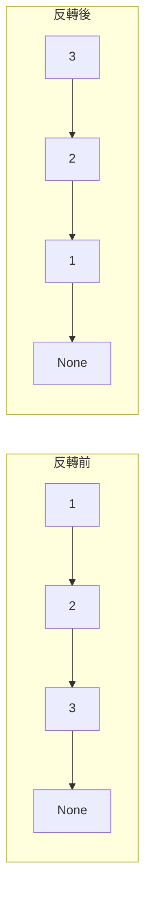
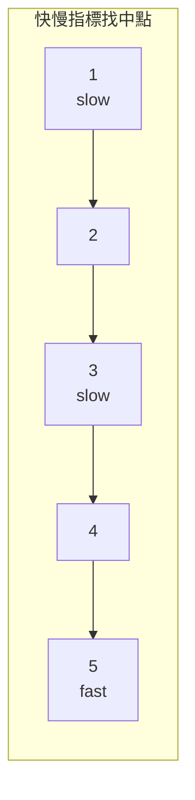

# 第 3 章：Linked List（鏈結串列）

!!! note "🎯 本章學習目標"
    完成本章後，你將能夠：
    
    - [ ] 理解單向、雙向、環形鏈結串列的差異
    - [ ] 實作鏈結串列的基本操作（插入、刪除、反轉）
    - [ ] 掌握快慢指標（Floyd's Cycle Detection）
    - [ ] 熟練使用 Dummy Node 技巧
    - [ ] 解決鏈結串列的經典面試問題
    
    **預估學習時間**：2.5 小時  
    **前置知識**：第 2 章 Array 與 String

---

## 1. 鏈結串列基礎

### 什麼是鏈結串列？

如果陣列是一排連續的郵箱，鏈結串列就像是**尋寶遊戲**：每個線索告訴你下一個線索在哪裡。

**核心特性**：
- **非連續記憶體**：節點可以分散在記憶體各處
- **循序存取**：必須從頭開始，沿著指標走
- **動態大小**：可以輕鬆新增或刪除節點


### 鏈結串列 vs 陣列

| 特性 | 陣列 | 鏈結串列 |
|------|------|---------|
| 記憶體 | 連續 | 分散 |
| 存取第 i 個 | O(1) | O(n) |
| 頭部插入 | O(n) | O(1) |
| 中間插入 | O(n) | O(1)* |
| 空間效率 | 高 | 低（需要指標） |

*假設已有該位置的指標

---

## 2. 鏈結串列完整實作

```python
class ListNode:
    """單向鏈結串列節點"""
    def __init__(self, val: int = 0, next: 'ListNode' = None):
        self.val = val
        self.next = next
    
    def __repr__(self):
        return f"ListNode({self.val})"


class LinkedList:
    """
    單向鏈結串列的完整實作
    
    時間複雜度：
    - 存取: O(n)
    - 頭部插入: O(1)
    - 尾部插入: O(n)
    - 刪除: O(n)
    
    空間複雜度：O(n)
    """
    
    def __init__(self):
        """使用 Dummy Head 簡化邊界處理"""
        self.dummy = ListNode(-1)  # 虛擬頭節點
        self.size = 0
    
    def get(self, index: int) -> int:
        """
        取得第 index 個節點的值
        
        Time: O(n)
        """
        if index < 0 or index >= self.size:
            return -1
        
        curr = self.dummy.next
        for _ in range(index):
            curr = curr.next
        
        return curr.val
    
    def add_at_head(self, val: int) -> None:
        """
        在頭部插入節點
        
        Time: O(1)
        """
        new_node = ListNode(val)
        new_node.next = self.dummy.next
        self.dummy.next = new_node
        self.size += 1
    
    def add_at_tail(self, val: int) -> None:
        """
        在尾部插入節點
        
        Time: O(n)
        """
        new_node = ListNode(val)
        curr = self.dummy
        
        while curr.next:
            curr = curr.next
        
        curr.next = new_node
        self.size += 1
    
    def add_at_index(self, index: int, val: int) -> None:
        """
        在指定位置插入節點
        
        Time: O(n)
        """
        if index > self.size:
            return
        if index < 0:
            index = 0
        
        prev = self.dummy
        for _ in range(index):
            prev = prev.next
        
        new_node = ListNode(val)
        new_node.next = prev.next
        prev.next = new_node
        self.size += 1
    
    def delete_at_index(self, index: int) -> None:
        """
        刪除指定位置的節點
        
        Time: O(n)
        """
        if index < 0 or index >= self.size:
            return
        
        prev = self.dummy
        for _ in range(index):
            prev = prev.next
        
        prev.next = prev.next.next
        self.size -= 1
    
    def to_list(self) -> list:
        """轉為 Python list（方便測試）"""
        result = []
        curr = self.dummy.next
        while curr:
            result.append(curr.val)
            curr = curr.next
        return result


# === 使用範例 ===
if __name__ == "__main__":
    ll = LinkedList()
    ll.add_at_head(1)
    ll.add_at_tail(3)
    ll.add_at_index(1, 2)
    print(ll.to_list())  # [1, 2, 3]
    
    ll.delete_at_index(1)
    print(ll.to_list())  # [1, 3]
```

---

## 3. 反轉鏈結串列

反轉鏈結串列是面試出現頻率極高的題目，必須熟練掌握。



### 方法一：迭代

```python
def reverse_list_iterative(head: ListNode) -> ListNode:
    """
    迭代反轉鏈結串列
    
    Time: O(n)
    Space: O(1)
    """
    prev = None
    curr = head
    
    while curr:
        next_temp = curr.next  # 暫存下一個節點
        curr.next = prev       # 反轉指標
        prev = curr            # 移動 prev
        curr = next_temp       # 移動 curr
    
    return prev
```

### 方法二：遞迴

```python
def reverse_list_recursive(head: ListNode) -> ListNode:
    """
    遞迴反轉鏈結串列
    
    Time: O(n)
    Space: O(n)（遞迴呼叫棧）
    """
    # 基底情況
    if not head or not head.next:
        return head
    
    # 遞迴反轉後面的部分
    new_head = reverse_list_recursive(head.next)
    
    # 反轉當前節點
    head.next.next = head
    head.next = None
    
    return new_head
```

---

## 4. 快慢指標（Floyd's Algorithm）

快慢指標是解決鏈結串列問題的核心技巧。

### 應用一：找中點

```python
def find_middle(head: ListNode) -> ListNode:
    """
    找鏈結串列的中間節點
    快指標走兩步，慢指標走一步
    
    Time: O(n)
    Space: O(1)
    """
    slow = fast = head
    
    while fast and fast.next:
        slow = slow.next
        fast = fast.next.next
    
    return slow
```



### 應用二：檢測環

```python
def has_cycle(head: ListNode) -> bool:
    """
    檢測鏈結串列是否有環
    
    原理：快慢指標若有環必相遇，否則快指標先到終點
    
    Time: O(n)
    Space: O(1)
    """
    slow = fast = head
    
    while fast and fast.next:
        slow = slow.next
        fast = fast.next.next
        
        if slow == fast:
            return True
    
    return False


def detect_cycle(head: ListNode) -> ListNode:
    """
    找到環的起點
    
    原理：相遇後，一個指標從 head 出發，另一個從相遇點出發，
    兩者以相同速度前進，再次相遇處即為環起點
    
    Time: O(n)
    Space: O(1)
    """
    slow = fast = head
    
    # 第一階段：找相遇點
    while fast and fast.next:
        slow = slow.next
        fast = fast.next.next
        
        if slow == fast:
            break
    else:
        return None  # 無環
    
    # 第二階段：找環起點
    slow = head
    while slow != fast:
        slow = slow.next
        fast = fast.next
    
    return slow
```

---

## 5. Dummy Node 技巧

當頭節點可能被刪除或改變時，使用虛擬頭節點簡化邏輯。

```python
def remove_elements(head: ListNode, val: int) -> ListNode:
    """
    刪除所有值等於 val 的節點
    
    使用 Dummy Node 避免頭節點的特殊處理
    
    Time: O(n)
    Space: O(1)
    """
    dummy = ListNode(-1)
    dummy.next = head
    
    curr = dummy
    while curr.next:
        if curr.next.val == val:
            curr.next = curr.next.next
        else:
            curr = curr.next
    
    return dummy.next
```

---

## 6. 合併兩個有序鏈結串列

```python
def merge_two_lists(l1: ListNode, l2: ListNode) -> ListNode:
    """
    合併兩個有序鏈結串列
    
    Time: O(n + m)
    Space: O(1)
    """
    dummy = ListNode(-1)
    curr = dummy
    
    while l1 and l2:
        if l1.val <= l2.val:
            curr.next = l1
            l1 = l1.next
        else:
            curr.next = l2
            l2 = l2.next
        curr = curr.next
    
    # 連接剩餘部分
    curr.next = l1 if l1 else l2
    
    return dummy.next
```

---

## 7. 複雜度分析

| 操作 | 平均時間複雜度 | 最壞時間複雜度 | 空間複雜度 |
|------|---------------|---------------|-----------|
| 存取 | O(n) | O(n) | O(1) |
| 頭部插入 | O(1) | O(1) | O(1) |
| 尾部插入 | O(n) | O(n) | O(1) |
| 反轉（迭代） | O(n) | O(n) | O(1) |
| 反轉（遞迴） | O(n) | O(n) | O(n) |
| 環檢測 | O(n) | O(n) | O(1) |

---

## 8. 面試重點

!!! warning "⚠️ 常見陷阱"
    1. **忘記處理 None**
       - 每次存取 `node.next` 前檢查 `node` 是否為 None
    
    2. **丟失指標**
       - 修改指標前先暫存必要的節點
    
    3. **環形鏈結串列無限迴圈**
       - 使用快慢指標而非遍歷到 None

!!! tip "💡 面試技巧"
    - **畫圖**：鏈結串列問題一定要畫圖！
    - **Dummy Node**：不確定頭節點是否會變，就用 Dummy
    - **快慢指標**：環、中點、倒數第 k 個節點
    - **遞迴**：很多問題遞迴更簡潔，但注意空間

---

## 9. LeetCode 對應題目

| 難度 | 題號 | 題目名稱 | 考點 |
|------|------|---------|------|
| 🟢 Easy | #21 | Merge Two Sorted Lists | 合併 |
| 🟢 Easy | #141 | Linked List Cycle | 環檢測 |
| 🟢 Easy | #206 | Reverse Linked List | 反轉 |
| 🟡 Medium | #19 | Remove Nth Node From End | 快慢指標 |
| 🟡 Medium | #142 | Linked List Cycle II | 環起點 |
| 🟡 Medium | #148 | Sort List | 排序 |
| 🔴 Hard | #23 | Merge k Sorted Lists | 分治/堆 |

---

## 10. 練習題

!!! question "練習 1：Palindrome Linked List（Easy）"
    **題目描述：**
    
    判斷鏈結串列是否為迴文。
    
    **範例：**
    ```
    輸入：1 -> 2 -> 2 -> 1
    輸出：True
    ```
    
    **提示：**
    <details>
    <summary>點擊查看提示</summary>
    找中點 + 反轉後半部分 + 比較
    </details>

!!! question "練習 2：Remove Nth Node From End（Medium）"
    **題目描述：**
    
    刪除鏈結串列倒數第 n 個節點。
    
    **範例：**
    ```
    輸入：1 -> 2 -> 3 -> 4 -> 5, n = 2
    輸出：1 -> 2 -> 3 -> 5
    ```
    
    **提示：**
    <details>
    <summary>點擊查看提示</summary>
    雙指標：讓快指標先走 n 步
    </details>

!!! question "練習 3：Reorder List（Medium）"
    **題目描述：**
    
    將 L0 → L1 → ... → Ln-1 → Ln 變成 L0 → Ln → L1 → Ln-1 → L2 → Ln-2 → ...
    
    **範例：**
    ```
    輸入：1 -> 2 -> 3 -> 4 -> 5
    輸出：1 -> 5 -> 2 -> 4 -> 3
    ```
    
    **提示：**
    <details>
    <summary>點擊查看提示</summary>
    找中點 + 反轉後半 + 交錯合併
    </details>

---

## 11. 解答與詳解

??? success "練習 1 解答"
    ```python
    def is_palindrome(head: ListNode) -> bool:
        """
        Time: O(n)
        Space: O(1)
        """
        # 1. 找中點
        slow = fast = head
        while fast and fast.next:
            slow = slow.next
            fast = fast.next.next
        
        # 2. 反轉後半部分
        prev = None
        while slow:
            next_temp = slow.next
            slow.next = prev
            prev = slow
            slow = next_temp
        
        # 3. 比較兩半
        left, right = head, prev
        while right:
            if left.val != right.val:
                return False
            left = left.next
            right = right.next
        
        return True
    ```

??? success "練習 2 解答"
    ```python
    def remove_nth_from_end(head: ListNode, n: int) -> ListNode:
        """
        Time: O(n)
        Space: O(1)
        """
        dummy = ListNode(-1)
        dummy.next = head
        
        fast = slow = dummy
        
        # 快指標先走 n+1 步
        for _ in range(n + 1):
            fast = fast.next
        
        # 同時前進
        while fast:
            fast = fast.next
            slow = slow.next
        
        # 刪除節點
        slow.next = slow.next.next
        
        return dummy.next
    ```

??? success "練習 3 解答"
    ```python
    def reorder_list(head: ListNode) -> None:
        """
        Time: O(n)
        Space: O(1)
        """
        if not head or not head.next:
            return
        
        # 1. 找中點
        slow = fast = head
        while fast.next and fast.next.next:
            slow = slow.next
            fast = fast.next.next
        
        # 2. 分割並反轉後半
        second = slow.next
        slow.next = None
        
        prev = None
        while second:
            next_temp = second.next
            second.next = prev
            prev = second
            second = next_temp
        second = prev
        
        # 3. 交錯合併
        first = head
        while second:
            tmp1, tmp2 = first.next, second.next
            first.next = second
            second.next = tmp1
            first, second = tmp1, tmp2
    ```

---

## 12. 延伸學習

### 🚀 進階主題
- **雙向鏈結串列**：LRU Cache 實作
- **Skip List**：Redis 底層資料結構
- **XOR Linked List**：節省空間的雙向鏈結

### ⏭️ 下一章預告
下一章我們將學習「**Stack 與 Queue**」，Stack 的 LIFO 特性和 Queue 的 FIFO 特性各有獨特的應用場景，單調棧更是面試重點！
