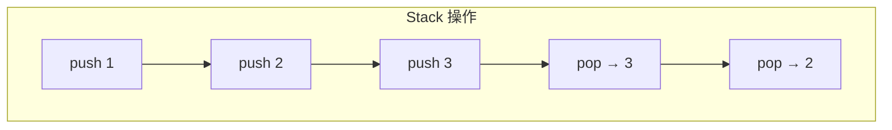
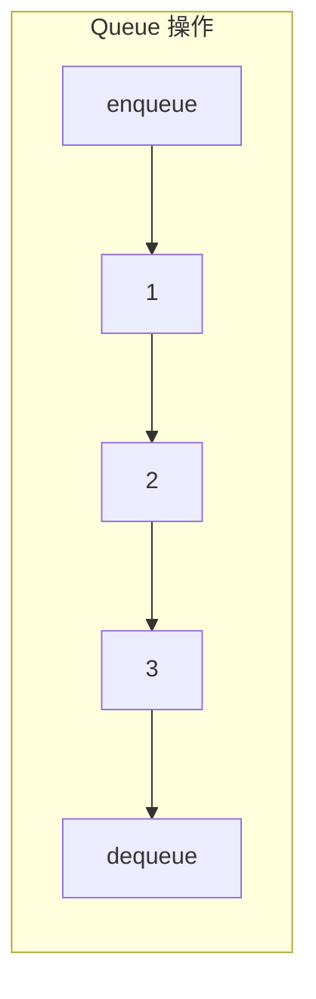
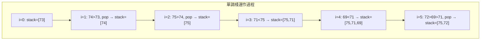

# 第 4 章：Stack 與 Queue

!!! note "🎯 本章學習目標"
    完成本章後，你將能夠：
    
    - [ ] 理解 Stack（LIFO）與 Queue（FIFO）的特性差異
    - [ ] 使用 Python 實作 Stack 和 Queue
    - [ ] 掌握 Monotonic Stack（單調棧）技巧
    - [ ] 了解 Deque（雙端佇列）的應用
    - [ ] 解決括號匹配、表達式求值等經典問題
    
    **預估學習時間**：2.5 小時  
    **前置知識**：第 3 章 Linked List

---

## 1. Stack（堆疊）

### 什麼是 Stack？

Stack 就像疊盤子：**後放的先拿**（Last In, First Out，LIFO）。



### Python 實作

```python
class Stack:
    """
    使用 Python list 實作 Stack
    
    時間複雜度：
    - push: O(1) 攤銷
    - pop: O(1)
    - peek: O(1)
    
    空間複雜度：O(n)
    """
    
    def __init__(self):
        self._data = []
    
    def push(self, item) -> None:
        """將元素壓入棧頂"""
        self._data.append(item)
    
    def pop(self):
        """移除並返回棧頂元素"""
        if self.is_empty():
            raise IndexError("Stack is empty")
        return self._data.pop()
    
    def peek(self):
        """返回棧頂元素（不移除）"""
        if self.is_empty():
            raise IndexError("Stack is empty")
        return self._data[-1]
    
    def is_empty(self) -> bool:
        return len(self._data) == 0
    
    def size(self) -> int:
        return len(self._data)


# 實務上直接用 list
stack = []
stack.append(1)      # push
stack.append(2)
top = stack.pop()    # pop → 2
peek = stack[-1]     # peek → 1
```

### 經典應用：括號匹配

```python
def is_valid_parentheses(s: str) -> bool:
    """
    判斷括號是否有效
    
    Time: O(n)
    Space: O(n)
    """
    stack = []
    mapping = {')': '(', ']': '[', '}': '{'}
    
    for char in s:
        if char in mapping:
            # 右括號：檢查是否匹配
            if not stack or stack.pop() != mapping[char]:
                return False
        else:
            # 左括號：入棧
            stack.append(char)
    
    return len(stack) == 0


# 測試
print(is_valid_parentheses("()[]{}"))   # True
print(is_valid_parentheses("([)]"))     # False
print(is_valid_parentheses("{[]}"))     # True
```

---

## 2. Queue（佇列）

### 什麼是 Queue？

Queue 就像排隊：**先來先服務**（First In, First Out，FIFO）。



### Python 實作

```python
from collections import deque

class Queue:
    """
    使用 deque 實作 Queue
    
    時間複雜度：
    - enqueue: O(1)
    - dequeue: O(1)
    
    空間複雜度：O(n)
    """
    
    def __init__(self):
        self._data = deque()
    
    def enqueue(self, item) -> None:
        """加入隊尾"""
        self._data.append(item)
    
    def dequeue(self):
        """移除並返回隊首"""
        if self.is_empty():
            raise IndexError("Queue is empty")
        return self._data.popleft()
    
    def front(self):
        """返回隊首元素（不移除）"""
        if self.is_empty():
            raise IndexError("Queue is empty")
        return self._data[0]
    
    def is_empty(self) -> bool:
        return len(self._data) == 0
    
    def size(self) -> int:
        return len(self._data)


# 實務上直接用 deque
from collections import deque
queue = deque()
queue.append(1)       # enqueue
queue.append(2)
front = queue.popleft()  # dequeue → 1
```

!!! warning "為何不用 list？"
    `list.pop(0)` 是 O(n) 操作，因為需要移動所有元素。`deque.popleft()` 是 O(1)。

---

## 3. Monotonic Stack（單調棧）

### 什麼是單調棧？

維持棧內元素單調遞增或遞減的棧，用於解決「下一個更大/更小元素」的問題。

### 經典問題：Daily Temperatures

```python
def daily_temperatures(temperatures: list[int]) -> list[int]:
    """
    計算每天需要等幾天才會有更高溫度
    
    思路：維持一個單調遞減棧（存索引）
    
    Time: O(n)
    Space: O(n)
    """
    n = len(temperatures)
    result = [0] * n
    stack = []  # 存索引，對應溫度遞減
    
    for i in range(n):
        # 當前溫度比棧頂高，棧頂找到了「下一個更高溫度」
        while stack and temperatures[i] > temperatures[stack[-1]]:
            prev_index = stack.pop()
            result[prev_index] = i - prev_index
        
        stack.append(i)
    
    return result


# 測試
temps = [73, 74, 75, 71, 69, 72, 76, 73]
print(daily_temperatures(temps))  # [1, 1, 4, 2, 1, 1, 0, 0]
```



### 單調棧模板

```python
def monotonic_stack_template(nums: list[int]) -> list[int]:
    """
    單調棧通用模板：找每個元素右邊第一個更大的元素
    """
    n = len(nums)
    result = [-1] * n  # 預設找不到
    stack = []
    
    for i in range(n):
        # 維持單調遞減（找更大）
        # 若要找更小，改為 <
        while stack and nums[i] > nums[stack[-1]]:
            idx = stack.pop()
            result[idx] = nums[i]
        
        stack.append(i)
    
    return result
```

---

## 4. 用 Stack 實作 Queue（及反向）

### 用兩個 Stack 實作 Queue

```python
class MyQueue:
    """
    用兩個 Stack 實作 Queue
    
    Time: push O(1), pop 攤銷 O(1)
    Space: O(n)
    """
    
    def __init__(self):
        self.in_stack = []   # 入隊用
        self.out_stack = []  # 出隊用
    
    def push(self, x: int) -> None:
        self.in_stack.append(x)
    
    def pop(self) -> int:
        self._transfer()
        return self.out_stack.pop()
    
    def peek(self) -> int:
        self._transfer()
        return self.out_stack[-1]
    
    def empty(self) -> bool:
        return not self.in_stack and not self.out_stack
    
    def _transfer(self) -> None:
        """只有 out_stack 為空時才轉移"""
        if not self.out_stack:
            while self.in_stack:
                self.out_stack.append(self.in_stack.pop())
```

### 用兩個 Queue 實作 Stack

```python
from collections import deque

class MyStack:
    """
    用兩個 Queue 實作 Stack
    
    Time: push O(n), pop O(1)
    Space: O(n)
    """
    
    def __init__(self):
        self.queue = deque()
    
    def push(self, x: int) -> None:
        self.queue.append(x)
        # 將前面的元素移到後面
        for _ in range(len(self.queue) - 1):
            self.queue.append(self.queue.popleft())
    
    def pop(self) -> int:
        return self.queue.popleft()
    
    def top(self) -> int:
        return self.queue[0]
    
    def empty(self) -> bool:
        return len(self.queue) == 0
```

---

## 5. Min Stack

設計一個支援 O(1) 取得最小值的 Stack。

```python
class MinStack:
    """
    支援 O(1) 取得最小值的 Stack
    
    所有操作 Time: O(1)
    Space: O(n)
    """
    
    def __init__(self):
        self.stack = []
        self.min_stack = []  # 同步記錄每個狀態的最小值
    
    def push(self, val: int) -> None:
        self.stack.append(val)
        # 維護 min_stack
        if not self.min_stack or val <= self.min_stack[-1]:
            self.min_stack.append(val)
        else:
            self.min_stack.append(self.min_stack[-1])
    
    def pop(self) -> None:
        self.stack.pop()
        self.min_stack.pop()
    
    def top(self) -> int:
        return self.stack[-1]
    
    def getMin(self) -> int:
        return self.min_stack[-1]
```

---

## 6. 複雜度分析

| 操作 | Stack (list) | Queue (deque) | 說明 |
|------|-------------|---------------|------|
| push/enqueue | O(1) 攤銷 | O(1) | list 可能需要擴容 |
| pop/dequeue | O(1) | O(1) | |
| peek/front | O(1) | O(1) | |
| 空間 | O(n) | O(n) | |

---

## 7. 面試重點

!!! warning "⚠️ 常見陷阱"
    1. **空棧/空隊操作**
       - pop/dequeue 前檢查是否為空
    
    2. **混用 list 和 deque**
       - Queue 務必用 deque，避免 O(n) 的 pop(0)
    
    3. **單調棧的方向**
       - 搞清楚是「下一個更大」還是「下一個更小」

!!! tip "💡 面試技巧"
    - **括號問題**：Stack 是首選
    - **表達式求值**：雙 Stack（數字棧 + 運算符棧）
    - **滑動窗口最大值**：Monotonic Deque
    - **BFS**：Queue 是標準做法

---

## 8. LeetCode 對應題目

| 難度 | 題號 | 題目名稱 | 考點 |
|------|------|---------|------|
| 🟢 Easy | #20 | Valid Parentheses | Stack 括號匹配 |
| 🟢 Easy | #155 | Min Stack | 輔助棧 |
| 🟢 Easy | #232 | Implement Queue using Stacks | 雙 Stack |
| 🟡 Medium | #150 | Evaluate Reverse Polish Notation | Stack 表達式 |
| 🟡 Medium | #739 | Daily Temperatures | 單調棧 |
| 🔴 Hard | #84 | Largest Rectangle in Histogram | 單調棧經典 |
| 🔴 Hard | #239 | Sliding Window Maximum | 單調 Deque |

---

## 9. 練習題

!!! question "練習 1：Valid Parentheses（Easy）"
    **題目描述：**
    
    判斷字串是否包含有效的括號組合。包含 '(', ')', '{', '}', '[', ']'。
    
    **範例：**
    ```
    輸入："([{}])"
    輸出：True
    ```
    
    **提示：**
    <details>
    <summary>點擊查看提示</summary>
    遇到左括號入棧，遇到右括號檢查棧頂是否匹配。
    </details>

!!! question "練習 2：Daily Temperatures（Medium）"
    **題目描述：**
    
    給定每日溫度陣列，計算需要等幾天才會有更高溫度。
    
    **範例：**
    ```
    輸入：[73, 74, 75, 71, 69, 72, 76, 73]
    輸出：[1, 1, 4, 2, 1, 1, 0, 0]
    ```
    
    **提示：**
    <details>
    <summary>點擊查看提示</summary>
    使用單調遞減棧，存索引。
    </details>

!!! question "練習 3：Largest Rectangle in Histogram（Hard）"
    **題目描述：**
    
    給定直方圖的高度陣列，找出最大矩形面積。
    
    **範例：**
    ```
    輸入：heights = [2,1,5,6,2,3]
    輸出：10
    ```
    
    **提示：**
    <details>
    <summary>點擊查看提示</summary>
    對每個柱子，找左右第一個更矮的柱子，用單調棧。
    </details>

---

## 10. 解答與詳解

??? success "練習 1 解答"
    ```python
    def is_valid(s: str) -> bool:
        """
        Time: O(n)
        Space: O(n)
        """
        stack = []
        pairs = {')': '(', ']': '[', '}': '{'}
        
        for char in s:
            if char in pairs:
                if not stack or stack.pop() != pairs[char]:
                    return False
            else:
                stack.append(char)
        
        return len(stack) == 0
    ```

??? success "練習 2 解答"
    ```python
    def daily_temperatures(temperatures: list[int]) -> list[int]:
        """
        Time: O(n)
        Space: O(n)
        """
        n = len(temperatures)
        result = [0] * n
        stack = []
        
        for i in range(n):
            while stack and temperatures[i] > temperatures[stack[-1]]:
                idx = stack.pop()
                result[idx] = i - idx
            stack.append(i)
        
        return result
    ```

??? success "練習 3 解答"
    ```python
    def largest_rectangle_area(heights: list[int]) -> int:
        """
        Time: O(n)
        Space: O(n)
        """
        stack = []
        max_area = 0
        heights = [0] + heights + [0]  # 加哨兵
        
        for i, h in enumerate(heights):
            while stack and h < heights[stack[-1]]:
                height = heights[stack.pop()]
                width = i - stack[-1] - 1
                max_area = max(max_area, height * width)
            stack.append(i)
        
        return max_area
    ```

---

## 11. 延伸學習

### 🚀 進階主題
- **表達式求值**：中綴轉後綴、計算器實作
- **Monotonic Deque**：滑動窗口最大值
- **Call Stack**：理解遞迴的執行機制

### ⏭️ 下一章預告
下一章我們將學習「**Hash Table（雜湊表）**」，它能實現 O(1) 的查找，是解決「快速查找」問題的利器，與 Stack/Queue 常常搭配使用！
