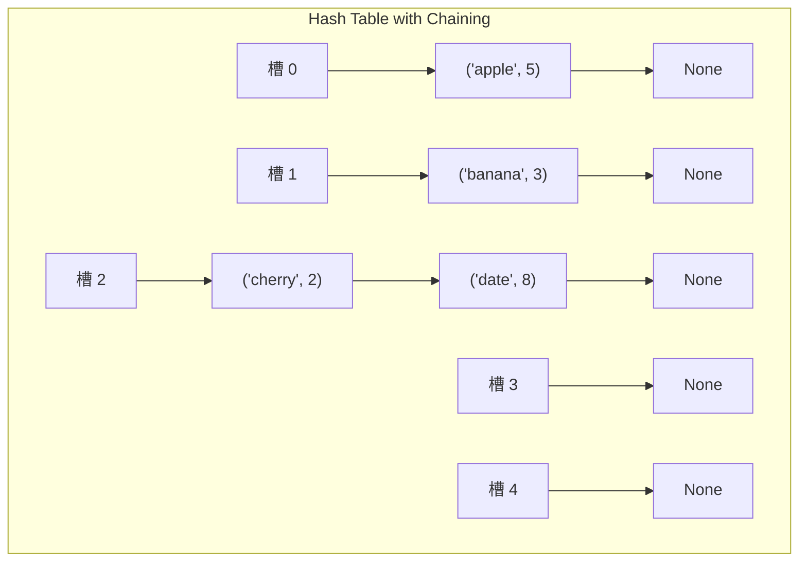
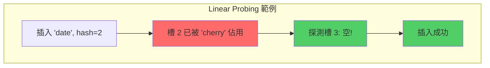
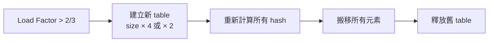
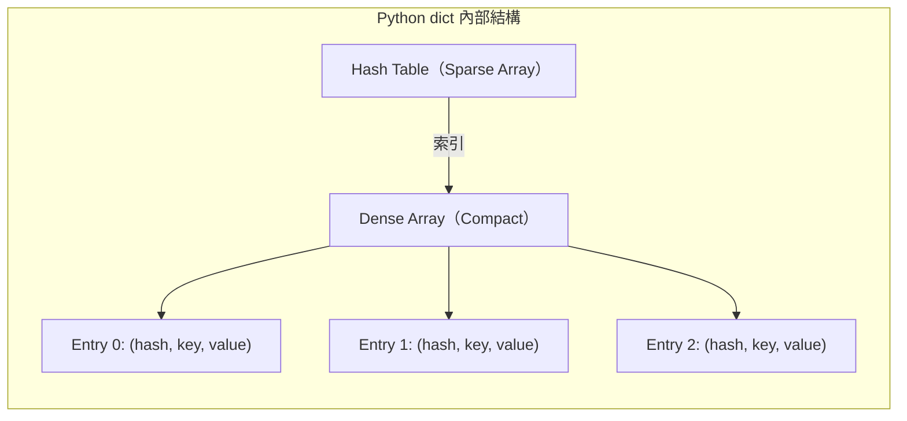

# 第 5 章：Hash Table（雜湊表）

!!! note "🎯 本章學習目標"
    完成本章後，你將能夠：
    
    - [ ] 理解 Hash Function 的設計原則與實作方式
    - [ ] 掌握兩種碰撞處理策略：Chaining 與 Open Addressing
    - [ ] 解釋 Load Factor 與 Rehashing 的觸發機制
    - [ ] 區分 Hash Set 與 Hash Map 的使用場景
    - [ ] 深入了解 Python `dict` 和 `set` 的底層實作原理
    - [ ] 解決 Two Sum 類問題與其他 Hash Table 面試經典題
    
    **預估學習時間**：3-4 小時  
    **前置知識**：基礎 Python 語法、陣列操作、時間複雜度概念

---

## 1. 核心概念

### 什麼是 Hash Table？

想像你走進一間擁有百萬本書的圖書館，如果沒有任何索引系統，你可能需要逐一翻閱每一本書才能找到你要的那本——這就是 **O(n)** 的線性搜尋。但如果圖書館有一個索引卡片系統，你只需要根據書名查詢索引卡，卡片上直接告訴你書在第幾排第幾格——這就是 **Hash Table** 的工作原理，實現 **O(1)** 常數時間的查找。

**Hash Table（雜湊表）** 是一種基於 **鍵值對（Key-Value Pair）** 的資料結構，透過 **Hash Function（雜湊函數）** 將 key 轉換成陣列索引，從而實現快速的插入、刪除和查找操作。

### 為什麼 Hash Table 如此重要？

在 FAANG 面試中，Hash Table 是最常被考的資料結構之一，原因有三：

1. **效能優勢**：將 O(n) 的查找降為 O(1)，是許多演算法優化的關鍵
2. **實用性高**：從資料庫索引、快取系統到編譯器的符號表，無處不在
3. **思維模式**：Hash Table 思維是解決「重複」、「計數」、「配對」問題的核心

---

## 2. Hash Function（雜湊函數）設計

### 什麼是好的 Hash Function？

一個優秀的 Hash Function 需要滿足以下條件：

| 特性 | 說明 | 實際影響 |
|------|------|---------|
| **確定性** | 相同的 key 永遠產生相同的 hash 值 | 保證查找結果一致 |
| **均勻分布** | Hash 值應平均分散在整個陣列範圍 | 減少碰撞機率 |
| **計算快速** | 計算 hash 值的時間應該是 O(1) | 維持整體效能 |
| **雪崩效應** | 輸入微小變化應導致輸出巨大變化 | 提高安全性（密碼學應用） |

### 常見 Hash Function 設計

#### 方法一：除法雜湊（Division Method）

最基本的方法是取模運算：

$$h(k) = k \mod m$$

其中 $k$ 是 key，$m$ 是 hash table 的大小。

!!! warning "選擇 m 的技巧"
    實務上，`m` 應該選擇**質數**，且不要接近 2 的冪次。這是因為如果 key 本身具有某種規律（例如都是偶數），質數的 `m` 能更好地打散分布。

#### 方法二：乘法雜湊（Multiplication Method）

$$h(k) = \lfloor m \cdot (kA \mod 1) \rfloor$$

其中 $A$ 是一個介於 0 和 1 之間的常數，Knuth 建議使用 $A \approx 0.6180339887$（黃金比例的倒數）。

#### Python 字串的 Hash 實作範例

```python
def simple_string_hash(s: str, table_size: int) -> int:
    """
    簡單的字串雜湊函數
    
    原理：將每個字元的 ASCII 值乘以位置的權重，加總後取模
    
    Args:
        s: 要雜湊的字串
        table_size: 雜湊表的大小
    
    Returns:
        雜湊值（0 到 table_size-1 之間的整數）
    
    Time: O(n)，n 為字串長度
    Space: O(1)
    """
    hash_value = 0
    prime = 31  # 使用質數作為基底，這是常見做法（Java String 也用 31）
    
    for i, char in enumerate(s):
        # 使用 Horner's method 計算多項式值
        # "abc" -> 'a'*31^2 + 'b'*31^1 + 'c'*31^0
        hash_value = (hash_value * prime + ord(char)) % table_size
    
    return hash_value


# === 測試範例 ===
if __name__ == "__main__":
    test_strings = ["hello", "world", "python", "olleh"]
    table_size = 100
    
    for s in test_strings:
        print(f"'{s}' -> hash value: {simple_string_hash(s, table_size)}")
```

---

## 3. Collision Resolution（碰撞處理）

### 為什麼會發生碰撞？

根據 **鴿巢原理（Pigeonhole Principle）**：如果 n 隻鴿子需要住進 m 個巢，而 n > m，則至少有一個巢需要容納超過一隻鴿子。

同理，當可能的 key 數量遠大於 hash table 的大小時，碰撞是無法避免的。

```mermaid
graph LR
    subgraph Keys
        A["'apple'"]
        B["'banana'"]
        C["'cherry'"]
        D["'date'"]
    end
    
    subgraph Hash Function
        H[h key mod 5]
    end
    
    subgraph Table Size = 5
        S0["槽 0"]
        S1["槽 1"]
        S2["槽 2 ⚠️ 碰撞"]
        S3["槽 3"]
        S4["槽 4"]
    end
    
    A --> H --> S2
    B --> H --> S1
    C --> H --> S2
    D --> H --> S4
    
    style S2 fill:#ff6b6b,stroke:#333
```

### 策略一：Chaining（鏈結法）

**核心思想**：每個槽位儲存一個鏈結串列，發生碰撞時，新元素加入該串列。



#### Chaining 完整實作

```python
class HashTableChaining:
    """
    使用 Chaining（鏈結法）實作的 Hash Table
    
    屬性說明：
    - size: Hash Table 的槽位數量
    - table: 儲存鏈結串列的陣列
    - count: 目前儲存的元素數量
    
    時間複雜度：
    - 插入（put）: 平均 O(1)，最壞 O(n)
    - 查找（get）: 平均 O(1)，最壞 O(n)
    - 刪除（remove）: 平均 O(1)，最壞 O(n)
    
    空間複雜度：O(n + m)，n 為元素數量，m 為槽位數量
    """
    
    def __init__(self, size: int = 10):
        """
        初始化 Hash Table
        
        Args:
            size: 槽位數量，預設為 10
        """
        self.size = size
        self.table = [[] for _ in range(size)]  # 每個槽位是一個 list
        self.count = 0
    
    def _hash(self, key: str) -> int:
        """
        計算 key 的 hash 值
        
        使用 Python 內建 hash() 函數並取模
        
        Time: O(len(key))
        Space: O(1)
        """
        return hash(key) % self.size
    
    def put(self, key: str, value) -> None:
        """
        插入或更新鍵值對
        
        Args:
            key: 鍵
            value: 值
        
        Time: 平均 O(1)，最壞 O(n)（當所有元素都在同一槽位）
        Space: O(1)
        """
        index = self._hash(key)
        bucket = self.table[index]
        
        # === 步驟 1：檢查 key 是否已存在 ===
        for i, (k, v) in enumerate(bucket):
            if k == key:
                # 找到相同的 key，更新 value
                bucket[i] = (key, value)
                return
        
        # === 步驟 2：key 不存在，新增到鏈結串列 ===
        bucket.append((key, value))
        self.count += 1
        
        # === 步驟 3：檢查是否需要 Rehash ===
        if self.count / self.size > 0.75:  # Load Factor > 0.75
            self._rehash()
    
    def get(self, key: str, default=None):
        """
        根據 key 取得 value
        
        Args:
            key: 要查找的鍵
            default: 找不到時返回的預設值
        
        Returns:
            對應的 value 或 default
        
        Time: 平均 O(1)，最壞 O(n)
        Space: O(1)
        """
        index = self._hash(key)
        bucket = self.table[index]
        
        for k, v in bucket:
            if k == key:
                return v
        
        return default
    
    def remove(self, key: str) -> bool:
        """
        刪除指定的鍵值對
        
        Args:
            key: 要刪除的鍵
        
        Returns:
            刪除成功返回 True，key 不存在返回 False
        
        Time: 平均 O(1)，最壞 O(n)
        Space: O(1)
        """
        index = self._hash(key)
        bucket = self.table[index]
        
        for i, (k, v) in enumerate(bucket):
            if k == key:
                del bucket[i]
                self.count -= 1
                return True
        
        return False
    
    def _rehash(self):
        """
        擴展 Hash Table 並重新分配元素
        
        當 Load Factor 過高時調用，將 size 翻倍
        
        Time: O(n)，n 為元素數量
        Space: O(n)
        """
        old_table = self.table
        self.size *= 2
        self.table = [[] for _ in range(self.size)]
        self.count = 0
        
        # 重新插入所有元素
        for bucket in old_table:
            for key, value in bucket:
                self.put(key, value)
    
    def __str__(self):
        """視覺化顯示 Hash Table 內容"""
        result = []
        for i, bucket in enumerate(self.table):
            if bucket:
                items = ", ".join([f"({k}: {v})" for k, v in bucket])
                result.append(f"[{i}] -> {items}")
            else:
                result.append(f"[{i}] -> Empty")
        return "\n".join(result)


# === 使用範例 ===
if __name__ == "__main__":
    ht = HashTableChaining(5)
    
    # 插入資料
    ht.put("apple", 100)
    ht.put("banana", 200)
    ht.put("cherry", 300)
    ht.put("date", 400)
    
    print("=== Hash Table 內容 ===")
    print(ht)
    print()
    
    # 查詢
    print(f"apple 的值: {ht.get('apple')}")
    print(f"grape 的值: {ht.get('grape', 'Not Found')}")
    
    # 刪除
    ht.remove("banana")
    print("\n刪除 banana 後：")
    print(ht)
```

### 策略二：Open Addressing（開放定址法）

**核心思想**：當發生碰撞時，根據某種探測序列在 table 中尋找下一個空槽位。

#### 三種探測方法

| 探測方法 | 公式 | 優點 | 缺點 |
|---------|-----|------|------|
| **Linear Probing** | $h(k, i) = (h(k) + i) \mod m$ | 實作簡單，快取友好 | Primary Clustering |
| **Quadratic Probing** | $h(k, i) = (h(k) + c_1 i + c_2 i^2) \mod m$ | 減少 clustering | Secondary Clustering |
| **Double Hashing** | $h(k, i) = (h_1(k) + i \cdot h_2(k)) \mod m$ | 最佳分散效果 | 需要設計兩個 hash 函數 |



#### Open Addressing 完整實作

```python
class HashTableOpenAddressing:
    """
    使用 Open Addressing（Linear Probing）實作的 Hash Table
    
    屬性說明：
    - size: Hash Table 的槽位數量
    - table: 儲存 (key, value) 的陣列
    - count: 目前儲存的元素數量
    - DELETED: 標記已刪除的槽位（墓碑標記）
    
    時間複雜度：
    - 插入（put）: 平均 O(1)，最壞 O(n)
    - 查找（get）: 平均 O(1)，最壞 O(n)
    - 刪除（remove）: 平均 O(1)，最壞 O(n)
    
    空間複雜度：O(m)，m 為槽位數量
    """
    
    DELETED = object()  # 墓碑標記
    
    def __init__(self, size: int = 10):
        """初始化 Hash Table"""
        self.size = size
        self.table = [None] * size
        self.count = 0
    
    def _hash(self, key: str) -> int:
        """計算 hash 值"""
        return hash(key) % self.size
    
    def _probe(self, key: str, for_insert: bool = False) -> int:
        """
        Linear Probing 探測
        
        Args:
            key: 要查找或插入的 key
            for_insert: True 表示是插入操作，會接受 DELETED 的槽位
        
        Returns:
            找到的槽位索引，若 for_insert=True 但 table 已滿，返回 -1
        
        Time: 平均 O(1)，最壞 O(n)
        """
        start_index = self._hash(key)
        index = start_index
        first_deleted = -1  # 記錄第一個遇到的 DELETED 槽位
        
        while True:
            slot = self.table[index]
            
            if slot is None:
                # 空槽位
                if for_insert:
                    return first_deleted if first_deleted != -1 else index
                return -1  # 查找模式下，key 不存在
            
            if slot is self.DELETED:
                # 記錄第一個 DELETED 槽位以供插入使用
                if for_insert and first_deleted == -1:
                    first_deleted = index
            elif slot[0] == key:
                # 找到匹配的 key
                return index
            
            # 繼續探測下一個槽位
            index = (index + 1) % self.size
            
            # 已經繞完一圈
            if index == start_index:
                return first_deleted if for_insert and first_deleted != -1 else -1
    
    def put(self, key: str, value) -> bool:
        """
        插入或更新鍵值對
        
        Returns:
            插入成功返回 True，table 已滿返回 False
        
        Time: 平均 O(1)，最壞 O(n)
        Space: O(1)
        """
        # === 步驟 1：檢查是否需要 Rehash ===
        if self.count / self.size > 0.7:
            self._rehash()
        
        # === 步驟 2：找到合適的槽位 ===
        index = self._probe(key, for_insert=True)
        
        if index == -1:
            return False  # Table 已滿
        
        # === 步驟 3：插入或更新 ===
        if self.table[index] is None or self.table[index] is self.DELETED:
            self.count += 1
        
        self.table[index] = (key, value)
        return True
    
    def get(self, key: str, default=None):
        """
        根據 key 取得 value
        
        Time: 平均 O(1)，最壞 O(n)
        Space: O(1)
        """
        index = self._probe(key, for_insert=False)
        
        if index == -1:
            return default
        
        return self.table[index][1]
    
    def remove(self, key: str) -> bool:
        """
        刪除指定的鍵值對（使用墓碑標記）
        
        Time: 平均 O(1)，最壞 O(n)
        Space: O(1)
        """
        index = self._probe(key, for_insert=False)
        
        if index == -1:
            return False
        
        # 使用墓碑標記而非直接設為 None，以維持探測鏈
        self.table[index] = self.DELETED
        self.count -= 1
        return True
    
    def _rehash(self):
        """擴展 Hash Table 並重新分配元素"""
        old_table = self.table
        self.size *= 2
        self.table = [None] * self.size
        self.count = 0
        
        for slot in old_table:
            if slot is not None and slot is not self.DELETED:
                self.put(slot[0], slot[1])
    
    def __str__(self):
        result = []
        for i, slot in enumerate(self.table):
            if slot is None:
                result.append(f"[{i}] Empty")
            elif slot is self.DELETED:
                result.append(f"[{i}] DELETED")
            else:
                result.append(f"[{i}] ({slot[0]}: {slot[1]})")
        return "\n".join(result)


# === 使用範例 ===
if __name__ == "__main__":
    ht = HashTableOpenAddressing(7)
    
    # 插入
    for fruit, price in [("apple", 100), ("banana", 200), ("cherry", 300)]:
        ht.put(fruit, price)
    
    print("=== Hash Table 內容 ===")
    print(ht)
    
    # 查詢
    print(f"\napple 的價格: {ht.get('apple')}")
    
    # 刪除並觀察墓碑標記
    ht.remove("banana")
    print("\n刪除 banana 後：")
    print(ht)
```

---

## 4. Load Factor 與 Rehashing

### Load Factor（負載因子）

$$\text{Load Factor} = \alpha = \frac{n}{m}$$

其中 $n$ 是元素數量，$m$ 是 table 大小。

| 策略 | 建議 Load Factor 上限 | 原因 |
|------|---------------------|------|
| **Chaining** | 1.0 ~ 2.0 | 允許每個槽位有多個元素 |
| **Open Addressing** | 0.5 ~ 0.7 | 避免過多探測，維持 O(1) 效能 |

### Python dict 的 Resize 機制

Python 的 `dict` 採用 Open Addressing，當 Load Factor 超過 **2/3** 時觸發 resize：



!!! tip "Google 面試考點"
    面試官可能會問：「Rehashing 的時間複雜度是多少？」
    
    答案是 **O(n)**，因為需要重新計算並搬移所有元素。但這是**攤銷成本**——雖然單次 rehash 是 O(n)，但平均到每次插入操作上仍是 O(1)。

---

## 5. Hash Set vs Hash Map

### 核心差異

| 特性 | Hash Set | Hash Map |
|------|----------|----------|
| **儲存內容** | 只儲存 key | 儲存 key-value 對 |
| **Python 實作** | `set` | `dict` |
| **Java 實作** | `HashSet` | `HashMap` |
| **應用場景** | 去重、成員檢查 | 快速查表、計數 |

```python
# === Hash Set 應用：快速去重 ===
def remove_duplicates(nums: list[int]) -> list[int]:
    """
    使用 Set 去除重複元素（不保留順序）
    
    Time: O(n)
    Space: O(n)
    """
    return list(set(nums))


# === Hash Map 應用：計算字元頻率 ===
def char_frequency(s: str) -> dict[str, int]:
    """
    統計字串中每個字元出現的次數
    
    Time: O(n)
    Space: O(k)，k 為不同字元數
    """
    freq = {}
    for char in s:
        freq[char] = freq.get(char, 0) + 1
    return freq


# === 使用 collections.Counter 更 Pythonic ===
from collections import Counter

def char_frequency_v2(s: str) -> dict[str, int]:
    return dict(Counter(s))
```

---

## 6. Python dict 和 set 底層原理

### Python 3.7+ 的 dict 如何保持插入順序？

Python 3.7 開始，`dict` 保證保持插入順序。這是透過將資料儲存在兩個陣列中實現的：



### dict 和 set 的時間複雜度

| 操作 | 平均時間複雜度 | 最壞時間複雜度 | 說明 |
|------|---------------|---------------|------|
| `d[key]`（取值） | O(1) | O(n) | 碰撞極端時退化 |
| `d[key] = value`（設值） | O(1) | O(n) | 可能觸發 rehash |
| `key in d`（檢查存在） | O(1) | O(n) | 等同於 `get` 操作 |
| `del d[key]`（刪除） | O(1) | O(n) | 使用墓碑機制 |
| `len(d)` | O(1) | O(1) | 維護計數器 |

---

## 7. 複雜度總結

| 操作 | Chaining 平均 | Chaining 最壞 | Open Addressing 平均 | Open Addressing 最壞 |
|------|--------------|---------------|---------------------|---------------------|
| 插入 | O(1) | O(n) | O(1) | O(n) |
| 查找 | O(1) | O(n) | O(1) | O(n) |
| 刪除 | O(1) | O(n) | O(1) | O(n) |
| 空間 | O(n + m) | O(n + m) | O(m) | O(m) |

**複雜度分析詳解：**

- **為什麼平均是 O(1)**：當 Hash Function 均勻分布且 Load Factor 維持在合理範圍，每個槽位平均只有 1-2 個元素，查找時間接近常數
- **為什麼最壞是 O(n)**：極端情況下（如所有 key 碰撞到同一槽位），所有元素形成一條鏈，退化成線性搜尋
- **空間複雜度差異**：Chaining 需要額外的指標空間（鏈結串列），Open Addressing 只需陣列本身

---

## 8. 面試重點

!!! warning "⚠️ 常見陷阱"
    1. **忘記處理 key 不存在的情況**
        - 錯誤做法：直接 `return d[key]`，當 key 不存在會拋出 `KeyError`
        - 正確做法：使用 `d.get(key, default)` 或先檢查 `if key in d`
    
    2. **使用可變物件作為 dict 的 key**
        - 錯誤做法：`d[[1, 2, 3]] = "value"`（list 是 unhashable）
        - 正確做法：使用 tuple `d[(1, 2, 3)] = "value"`
    
    3. **在遍歷 dict 時修改它**
        - 錯誤做法：`for k in d: del d[k]`
        - 正確做法：`for k in list(d.keys()): del d[k]` 或使用 dict comprehension
    
    4. **忽略 Hash Collision 對效能的影響**
        - 在安全敏感的場景（如 web server 處理使用者輸入），惡意構造的 key 可能導致 DoS 攻擊

!!! tip "💡 面試技巧"
    - **當看到 O(n²) 暴力解時**：思考能否用 Hash Table 將其中一個 O(n) 查找優化為 O(1)
    - **計數問題**：第一反應用 `Counter` 或手動建立頻率表
    - **配對問題**：如 Two Sum，建立「目標值 → 索引」的映射
    - **在白板上畫圖**：畫出 Hash Table 的槽位和碰撞情況，幫助面試官理解你的思路
    - **討論 Trade-off**：主動提及「Hash Table 用空間換時間」的權衡

!!! info "🏢 各公司考點偏好"
    - **Google**：注重複雜度分析，會問「為什麼 Hash Table 的平均時間是 O(1)」
    - **Microsoft**：可能問 .NET 的 Dictionary 實作或實際系統應用
    - **Amazon**：強調 Scalability，如「當資料量超過單機記憶體怎麼辦」
    - **Meta**：實際應用場景，如「設計一個 URL 短網址服務」

---

## 9. LeetCode 對應題目

### 📝 相關題目

| 難度 | 題號 | 題目名稱 | 考點 |
|------|------|---------|------|
| 🟢 Easy | #1 | Two Sum | Hash Map 查表配對 |
| 🟢 Easy | #217 | Contains Duplicate | Hash Set 去重 |
| 🟢 Easy | #242 | Valid Anagram | 字元頻率統計 |
| 🟡 Medium | #49 | Group Anagrams | Hash Map + 排序作為 key |
| 🟡 Medium | #347 | Top K Frequent Elements | Hash Map + Heap/Bucket Sort |
| 🟡 Medium | #128 | Longest Consecutive Sequence | Hash Set 優化區間查找 |
| 🟡 Medium | #3 | Longest Substring Without Repeating Characters | Sliding Window + Hash Set |
| 🔴 Hard | #895 | Maximum Frequency Stack | 多層 Hash Map |
| 🔴 Hard | #460 | LFU Cache | Hash Map + Doubly Linked List |

---

## 10. 練習題

!!! question "練習 1：Two Sum（Easy）"
    **題目描述：**
    
    給定一個整數陣列 `nums` 和一個目標值 `target`，找出陣列中和為目標值的兩個數的索引。
    
    假設每個輸入只會有一個解，且同一元素不能使用兩次。
    
    **範例：**
    ```
    輸入：nums = [2, 7, 11, 15], target = 9
    輸出：[0, 1]
    解釋：nums[0] + nums[1] = 2 + 7 = 9
    ```
    
    **限制條件：**
    
    - `2 <= nums.length <= 10^4`
    - `-10^9 <= nums[i] <= 10^9`
    - `-10^9 <= target <= 10^9`
    - 只會存在一個有效答案
    
    **提示：**
    <details>
    <summary>點擊查看提示</summary>
    對於每個數 x，我們需要找 target - x 是否存在。如何快速查找一個數是否存在於陣列中？
    </details>

!!! question "練習 2：Group Anagrams（Medium）"
    **題目描述：**
    
    給定一個字串陣列 `strs`，將變位詞（Anagram）分組。變位詞是指由相同字母重新排列得到的字串。
    
    **範例：**
    ```
    輸入：strs = ["eat", "tea", "tan", "ate", "nat", "bat"]
    輸出：[["bat"], ["nat", "tan"], ["ate", "eat", "tea"]]
    ```
    
    **限制條件：**
    
    - `1 <= strs.length <= 10^4`
    - `0 <= strs[i].length <= 100`
    - `strs[i]` 只包含小寫字母
    
    **提示：**
    <details>
    <summary>點擊查看提示</summary>
    兩個字串是變位詞，當且僅當它們排序後的結果相同。你可以用什麼作為 Hash Map 的 key？
    </details>

!!! question "練習 3：LRU Cache（Hard）"
    **題目描述：**
    
    設計並實作一個符合 **LRU（Least Recently Used，最近最少使用）** 快取機制的資料結構。
    
    實作 `LRUCache` 類別：
    
    - `LRUCache(int capacity)` 初始化一個容量為 `capacity` 的快取
    - `int get(int key)` 如果 key 存在於快取中，返回其值，否則返回 -1
    - `void put(int key, int value)` 如果 key 已存在，更新其值；否則插入新的 key-value 對。當快取達到最大容量時，應該在插入新項目之前，刪除最久未使用的項目
    
    **範例：**
    ```
    輸入：
    ["LRUCache", "put", "put", "get", "put", "get", "put", "get", "get", "get"]
    [[2], [1, 1], [2, 2], [1], [3, 3], [2], [4, 4], [1], [3], [4]]
    
    輸出：
    [null, null, null, 1, null, -1, null, -1, 3, 4]
    
    解釋：
    LRUCache cache = new LRUCache(2);
    cache.put(1, 1);
    cache.put(2, 2);
    cache.get(1);    // 返回 1
    cache.put(3, 3); // 移除 key 2
    cache.get(2);    // 返回 -1（未找到）
    cache.put(4, 4); // 移除 key 1
    cache.get(1);    // 返回 -1（未找到）
    cache.get(3);    // 返回 3
    cache.get(4);    // 返回 4
    ```
    
    **限制條件：**
    
    - `1 <= capacity <= 3000`
    - `0 <= key <= 10^4`
    - `0 <= value <= 10^5`
    - 最多調用 `2 * 10^5` 次 `get` 和 `put`
    - `get` 和 `put` 必須都在 O(1) 時間內完成
    
    **提示：**
    <details>
    <summary>點擊查看提示</summary>
    結合 Hash Map 和 Doubly Linked List。Hash Map 用於 O(1) 查找，Linked List 用於維護使用順序。
    </details>

---

## 11. 解答與詳解

??? success "練習 1 解答：Two Sum"
    ```python
    def two_sum(nums: list[int], target: int) -> list[int]:
        """
        解題思路：
        1. 遍歷陣列，對於每個數 x，查找 target - x 是否已在 Hash Map 中
        2. 如果找到，返回兩個索引
        3. 如果沒找到，將 x 的值和索引存入 Hash Map
        
        Time: O(n)，只遍歷一次陣列
        Space: O(n)，最壞情況儲存所有元素
        """
        num_to_index = {}  # 值 -> 索引 的映射
        
        for i, num in enumerate(nums):
            complement = target - num
            
            # 檢查補數是否已在 Hash Map 中
            if complement in num_to_index:
                return [num_to_index[complement], i]
            
            # 將當前數加入 Hash Map
            num_to_index[num] = i
        
        return []  # 根據題目假設，不會執行到這裡
    
    
    # 測試
    print(two_sum([2, 7, 11, 15], 9))  # [0, 1]
    print(two_sum([3, 2, 4], 6))       # [1, 2]
    print(two_sum([3, 3], 6))          # [0, 1]
    ```
    
    **詳細解析：**
    
    1. **為什麼用 Hash Map 比暴力解快？**
        - 暴力解：對每個數，遍歷剩餘數找補數，O(n²)
        - Hash Map：對每個數，O(1) 查找補數是否存在，總共 O(n)
    
    2. **為什麼這樣遍歷不會漏掉答案？**
        - 當我們遍歷到第二個數時，第一個數已經在 Hash Map 中
        - 所以一定能在遍歷到較後的那個數時找到配對

??? success "練習 2 解答：Group Anagrams"
    ```python
    from collections import defaultdict
    
    def group_anagrams(strs: list[str]) -> list[list[str]]:
        """
        解題思路：
        1. 變位詞排序後結果相同，用排序後的字串作為 Hash Map 的 key
        2. 遍歷所有字串，根據 key 分組
        
        Time: O(n * k log k)，n 是字串數量，k 是最長字串長度
        Space: O(n * k)，儲存所有字串
        """
        groups = defaultdict(list)  # key: 排序後字串, value: 原始字串列表
        
        for s in strs:
            # 將字串排序後作為 key
            key = "".join(sorted(s))
            groups[key].append(s)
        
        return list(groups.values())
    
    
    def group_anagrams_optimal(strs: list[str]) -> list[list[str]]:
        """
        優化版：用字元計數作為 key，避免排序
        
        Time: O(n * k)，n 是字串數量，k 是最長字串長度
        Space: O(n * k)
        """
        groups = defaultdict(list)
        
        for s in strs:
            # 計算 26 個字母的頻率，用 tuple 作為 key（tuple 可 hash）
            count = [0] * 26
            for c in s:
                count[ord(c) - ord('a')] += 1
            
            key = tuple(count)
            groups[key].append(s)
        
        return list(groups.values())
    
    
    # 測試
    strs = ["eat", "tea", "tan", "ate", "nat", "bat"]
    print(group_anagrams(strs))
    ```
    
    **詳細解析：**
    
    1. **為什麼排序後的字串可以作為 key？**
        - 變位詞的定義是包含相同字母，排序後一定相同
        - 例如 "eat", "tea", "ate" 排序後都是 "aet"
    
    2. **優化版為什麼更快？**
        - 排序是 O(k log k)，計數是 O(k)
        - 當字串很長時，計數法更有優勢

??? success "練習 3 解答：LRU Cache"
    ```python
    class DLinkedNode:
        """雙向鏈結串列節點"""
        def __init__(self, key=0, value=0):
            self.key = key
            self.value = value
            self.prev = None
            self.next = None
    
    
    class LRUCache:
        """
        LRU Cache 實作
        
        解題思路：
        1. 使用 Hash Map 實現 O(1) 的 key 查找
        2. 使用 Doubly Linked List 維護使用順序
        3. 最近使用的放在頭部，最久未使用的在尾部
        
        Time: get O(1), put O(1)
        Space: O(capacity)
        """
        
        def __init__(self, capacity: int):
            self.capacity = capacity
            self.cache = {}  # key -> DLinkedNode
            
            # 使用虛擬頭尾節點，簡化邊界處理
            self.head = DLinkedNode()
            self.tail = DLinkedNode()
            self.head.next = self.tail
            self.tail.prev = self.head
        
        def _add_to_head(self, node: DLinkedNode) -> None:
            """將節點添加到頭部（最近使用）"""
            node.prev = self.head
            node.next = self.head.next
            self.head.next.prev = node
            self.head.next = node
        
        def _remove_node(self, node: DLinkedNode) -> None:
            """從鏈結串列中移除節點"""
            node.prev.next = node.next
            node.next.prev = node.prev
        
        def _move_to_head(self, node: DLinkedNode) -> None:
            """將節點移動到頭部（標記為最近使用）"""
            self._remove_node(node)
            self._add_to_head(node)
        
        def _remove_tail(self) -> DLinkedNode:
            """移除尾部節點（最久未使用）並返回"""
            node = self.tail.prev
            self._remove_node(node)
            return node
        
        def get(self, key: int) -> int:
            if key not in self.cache:
                return -1
            
            node = self.cache[key]
            self._move_to_head(node)  # 標記為最近使用
            return node.value
        
        def put(self, key: int, value: int) -> None:
            if key in self.cache:
                # Key 已存在，更新值並移動到頭部
                node = self.cache[key]
                node.value = value
                self._move_to_head(node)
            else:
                # Key 不存在，創建新節點
                node = DLinkedNode(key, value)
                self.cache[key] = node
                self._add_to_head(node)
                
                # 超過容量，移除最久未使用的
                if len(self.cache) > self.capacity:
                    removed = self._remove_tail()
                    del self.cache[removed.key]
    
    
    # 測試
    cache = LRUCache(2)
    cache.put(1, 1)
    cache.put(2, 2)
    print(cache.get(1))    # 1
    cache.put(3, 3)        # 移除 key 2
    print(cache.get(2))    # -1
    cache.put(4, 4)        # 移除 key 1
    print(cache.get(1))    # -1
    print(cache.get(3))    # 3
    print(cache.get(4))    # 4
    ```
    
    **詳細解析：**
    
    1. **為什麼需要 Hash Map + Doubly Linked List 兩種資料結構？**
        - Hash Map：O(1) 根據 key 找到節點
        - Doubly Linked List：O(1) 插入/刪除節點，維護 LRU 順序
        - 單獨使用任一種都無法同時達成 O(1) 的 `get` 和 `put`
    
    2. **為什麼使用虛擬頭尾節點？**
        - 避免處理「頭部為空」或「尾部為空」的邊界情況
        - 讓程式碼更簡潔，不需要大量 `if` 判斷

---

## 12. 延伸學習

### 🚀 進階主題

- **Perfect Hashing**：當 key 集合固定時，可以設計無碰撞的 hash function
- **Consistent Hashing**：分散式系統中用於負載均衡，如 Amazon DynamoDB
- **Bloom Filter**：機率性資料結構，用極少空間判斷元素是否「可能存在」
- **Cuckoo Hashing**：保證最壞情況 O(1) 查找的 hash table 變種

### 📚 參考資源

- [Introduction to Algorithms (CLRS) - Chapter 11: Hash Tables](https://mitpress.mit.edu/books/introduction-algorithms-fourth-edition)
- [Python 官方文檔：dict 實作細節](https://docs.python.org/3/faq/design.html#how-are-dictionaries-implemented-in-cpython)
- [LeetCode Hash Table 題單](https://leetcode.com/tag/hash-table/) - 200+ 道相關練習

### ⏭️ 下一章預告

下一章我們將學習「**Heap（堆積）與 Priority Queue（優先佇列）**」，它與 Hash Table 常常搭配使用，例如「Top K Frequent Elements」就需要先用 Hash Map 計數，再用 Heap 找出前 K 大。這兩者的組合是面試中的黃金搭檔！

---

!!! abstract "本章重點回顧"
    1. **Hash Table 的核心價值**：用空間換時間，實現 O(1) 的增刪查
    2. **碰撞處理**：Chaining 用鏈結串列，Open Addressing 用探測
    3. **Load Factor**：控制在合理範圍內維持效能
    4. **面試關鍵**：看到暴力解就思考「能否用 Hash Table 優化」
    5. **Python 實戰**：善用 `dict`、`set`、`Counter`、`defaultdict`
