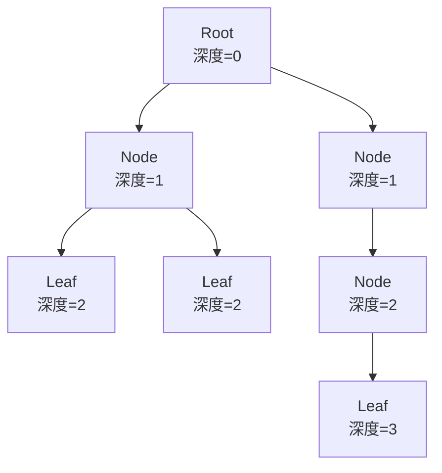
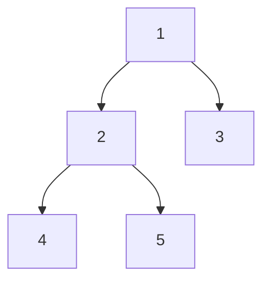

# 第 6 章：Tree 與 Binary Tree

!!! note "🎯 本章學習目標"
    完成本章後，你將能夠：
    
    - [ ] 理解樹的基本術語（節點、邊、深度、高度）
    - [ ] 區分 Complete、Full、Perfect Binary Tree
    - [ ] 實作前序、中序、後序、層序遍歷
    - [ ] 掌握遞迴與迭代兩種遍歷方式
    - [ ] 解決樹的高度、深度等經典問題
    
    **預估學習時間**：3 小時  
    **前置知識**：第 4 章 Stack 與 Queue、遞迴基礎

---

## 1. 樹的基本概念

### 術語定義



| 術語 | 定義 |
|------|------|
| **Root（根）** | 樹的最頂端節點，沒有父節點 |
| **Leaf（葉）** | 沒有子節點的節點 |
| **Depth（深度）** | 從 Root 到該節點的邊數 |
| **Height（高度）** | 從該節點到最遠葉節點的邊數 |
| **Level（層）** | Depth + 1 |

### Binary Tree 類型

| 類型 | 定義 | 特點 |
|------|------|------|
| **Full** | 每個節點有 0 或 2 個子節點 | 沒有只有一個子節點的情況 |
| **Complete** | 除最後一層外全滿，最後一層靠左 | 可用陣列高效儲存（Heap） |
| **Perfect** | Full + Complete + 所有葉在同一層 | 節點數：$2^{h+1} - 1$ |

---

## 2. Binary Tree 實作

```python
class TreeNode:
    """二元樹節點"""
    def __init__(self, val: int = 0, left: 'TreeNode' = None, right: 'TreeNode' = None):
        self.val = val
        self.left = left
        self.right = right
    
    def __repr__(self):
        return f"TreeNode({self.val})"


def build_tree(values: list) -> TreeNode:
    """
    從陣列建立二元樹（層序）
    None 表示空節點
    
    Example: [1, 2, 3, None, 4] 建立：
          1
         / \
        2   3
         \
          4
    """
    if not values:
        return None
    
    root = TreeNode(values[0])
    queue = [root]
    i = 1
    
    while queue and i < len(values):
        node = queue.pop(0)
        
        if i < len(values) and values[i] is not None:
            node.left = TreeNode(values[i])
            queue.append(node.left)
        i += 1
        
        if i < len(values) and values[i] is not None:
            node.right = TreeNode(values[i])
            queue.append(node.right)
        i += 1
    
    return root
```

---

## 3. 遍歷方式

### 遍歷順序對照



| 遍歷方式 | 順序 | 結果 | 口訣 |
|---------|------|------|------|
| **前序 (Preorder)** | 根→左→右 | 1, 2, 4, 5, 3 | 先處理根 |
| **中序 (Inorder)** | 左→根→右 | 4, 2, 5, 1, 3 | 根在中間 |
| **後序 (Postorder)** | 左→右→根 | 4, 5, 2, 3, 1 | 最後處理根 |
| **層序 (Level-order)** | 逐層 | 1, 2, 3, 4, 5 | BFS |

### 遞迴實作

```python
def preorder_recursive(root: TreeNode) -> list[int]:
    """前序遍歷（遞迴）"""
    result = []
    
    def dfs(node):
        if not node:
            return
        result.append(node.val)  # 根
        dfs(node.left)           # 左
        dfs(node.right)          # 右
    
    dfs(root)
    return result


def inorder_recursive(root: TreeNode) -> list[int]:
    """中序遍歷（遞迴）"""
    result = []
    
    def dfs(node):
        if not node:
            return
        dfs(node.left)           # 左
        result.append(node.val)  # 根
        dfs(node.right)          # 右
    
    dfs(root)
    return result


def postorder_recursive(root: TreeNode) -> list[int]:
    """後序遍歷（遞迴）"""
    result = []
    
    def dfs(node):
        if not node:
            return
        dfs(node.left)           # 左
        dfs(node.right)          # 右
        result.append(node.val)  # 根
    
    dfs(root)
    return result
```

### 迭代實作

```python
def preorder_iterative(root: TreeNode) -> list[int]:
    """
    前序遍歷（迭代）
    
    Time: O(n)
    Space: O(h)，h 為樹高
    """
    if not root:
        return []
    
    result = []
    stack = [root]
    
    while stack:
        node = stack.pop()
        result.append(node.val)
        
        # 先右後左（因為 Stack 是 LIFO）
        if node.right:
            stack.append(node.right)
        if node.left:
            stack.append(node.left)
    
    return result


def inorder_iterative(root: TreeNode) -> list[int]:
    """
    中序遍歷（迭代）
    
    Time: O(n)
    Space: O(h)
    """
    result = []
    stack = []
    curr = root
    
    while curr or stack:
        # 一路向左
        while curr:
            stack.append(curr)
            curr = curr.left
        
        # 處理當前節點
        curr = stack.pop()
        result.append(curr.val)
        
        # 轉向右子樹
        curr = curr.right
    
    return result


def postorder_iterative(root: TreeNode) -> list[int]:
    """
    後序遍歷（迭代）
    
    技巧：根→右→左 的反轉 = 左→右→根
    
    Time: O(n)
    Space: O(h)
    """
    if not root:
        return []
    
    result = []
    stack = [root]
    
    while stack:
        node = stack.pop()
        result.append(node.val)
        
        # 先左後右（最後反轉）
        if node.left:
            stack.append(node.left)
        if node.right:
            stack.append(node.right)
    
    return result[::-1]


def level_order(root: TreeNode) -> list[list[int]]:
    """
    層序遍歷（BFS）
    
    Time: O(n)
    Space: O(w)，w 為最寬層的寬度
    """
    if not root:
        return []
    
    from collections import deque
    
    result = []
    queue = deque([root])
    
    while queue:
        level_size = len(queue)
        current_level = []
        
        for _ in range(level_size):
            node = queue.popleft()
            current_level.append(node.val)
            
            if node.left:
                queue.append(node.left)
            if node.right:
                queue.append(node.right)
        
        result.append(current_level)
    
    return result
```

---

## 4. 經典問題

### 最大深度

```python
def max_depth(root: TreeNode) -> int:
    """
    計算二元樹最大深度
    
    Time: O(n)
    Space: O(h)
    """
    if not root:
        return 0
    
    return 1 + max(max_depth(root.left), max_depth(root.right))
```

### 反轉二元樹

```python
def invert_tree(root: TreeNode) -> TreeNode:
    """
    反轉二元樹（水平翻轉）
    
    Time: O(n)
    Space: O(h)
    """
    if not root:
        return None
    
    # 交換左右子樹
    root.left, root.right = root.right, root.left
    
    # 遞迴處理
    invert_tree(root.left)
    invert_tree(root.right)
    
    return root
```

### 對稱樹

```python
def is_symmetric(root: TreeNode) -> bool:
    """
    判斷二元樹是否對稱
    
    Time: O(n)
    Space: O(h)
    """
    def is_mirror(t1: TreeNode, t2: TreeNode) -> bool:
        if not t1 and not t2:
            return True
        if not t1 or not t2:
            return False
        
        return (t1.val == t2.val and
                is_mirror(t1.left, t2.right) and
                is_mirror(t1.right, t2.left))
    
    return is_mirror(root, root)
```

---

## 5. 複雜度分析

| 操作 | 時間複雜度 | 空間複雜度 | 說明 |
|------|-----------|-----------|------|
| 遍歷 | O(n) | O(h) | h 為樹高 |
| 搜尋 | O(n) | O(h) | 一般二元樹 |
| 插入 | O(n) | O(h) | 需先找位置 |

**樹高分析**：
- 平衡樹：h = O(log n)
- 最壞情況（斜樹）：h = O(n)

---

## 6. 面試重點

!!! warning "⚠️ 常見陷阱"
    1. **忘記 null 檢查**
       - 每次存取 node.left 或 node.right 前檢查
    
    2. **混淆深度與高度**
       - 深度：從上往下數
       - 高度：從下往上數
    
    3. **遞迴邊界條件**
       - 通常 `if not node: return` 是第一行

!!! tip "💡 面試技巧"
    - **樹的問題首選遞迴**：更簡潔易懂
    - **需要層資訊時用 BFS**：層序遍歷
    - **需要路徑時用 DFS**：前/中/後序
    - **畫圖**：畫出 3-5 個節點的例子

---

## 7. LeetCode 對應題目

| 難度 | 題號 | 題目名稱 | 考點 |
|------|------|---------|------|
| 🟢 Easy | #94 | Binary Tree Inorder Traversal | 中序遍歷 |
| 🟢 Easy | #104 | Maximum Depth of Binary Tree | 深度 |
| 🟢 Easy | #226 | Invert Binary Tree | 遞迴 |
| 🟢 Easy | #101 | Symmetric Tree | 對稱判斷 |
| 🟡 Medium | #102 | Binary Tree Level Order Traversal | BFS |
| 🟡 Medium | #105 | Construct Binary Tree from Preorder and Inorder | 重建樹 |
| 🔴 Hard | #124 | Binary Tree Maximum Path Sum | DP on Tree |

---

## 8. 練習題

!!! question "練習 1：Same Tree（Easy）"
    **題目描述：**
    
    判斷兩棵二元樹是否相同。
    
    **範例：**
    ```
    輸入：p = [1,2,3], q = [1,2,3]
    輸出：True
    ```
    
    **提示：**
    <details>
    <summary>點擊查看提示</summary>
    同時遍歷兩棵樹，比較每個節點。
    </details>

!!! question "練習 2：Path Sum（Easy）"
    **題目描述：**
    
    判斷是否存在從根到葉的路徑，使路徑上所有節點值的和等於目標值。
    
    **範例：**
    ```
    輸入：root = [5,4,8,11,null,13,4,7,2,null,null,null,1], targetSum = 22
    輸出：True （路徑 5 → 4 → 11 → 2）
    ```
    
    **提示：**
    <details>
    <summary>點擊查看提示</summary>
    遞迴時減去當前節點值，到葉節點時檢查是否為 0。
    </details>

!!! question "練習 3：Lowest Common Ancestor（Medium）"
    **題目描述：**
    
    找出二元樹中兩個節點的最近公共祖先（LCA）。
    
    **範例：**
    ```
    輸入：root = [3,5,1,6,2,0,8,null,null,7,4], p = 5, q = 1
    輸出：3
    ```
    
    **提示：**
    <details>
    <summary>點擊查看提示</summary>
    遞迴返回：找到 p 或 q 時返回該節點，若左右子樹都有返回值則當前為 LCA。
    </details>

---

## 9. 解答與詳解

??? success "練習 1 解答"
    ```python
    def is_same_tree(p: TreeNode, q: TreeNode) -> bool:
        """
        Time: O(n)
        Space: O(h)
        """
        if not p and not q:
            return True
        if not p or not q:
            return False
        
        return (p.val == q.val and
                is_same_tree(p.left, q.left) and
                is_same_tree(p.right, q.right))
    ```

??? success "練習 2 解答"
    ```python
    def has_path_sum(root: TreeNode, targetSum: int) -> bool:
        """
        Time: O(n)
        Space: O(h)
        """
        if not root:
            return False
        
        # 到達葉節點
        if not root.left and not root.right:
            return root.val == targetSum
        
        # 遞迴檢查子樹
        remaining = targetSum - root.val
        return (has_path_sum(root.left, remaining) or
                has_path_sum(root.right, remaining))
    ```

??? success "練習 3 解答"
    ```python
    def lowest_common_ancestor(root: TreeNode, p: TreeNode, q: TreeNode) -> TreeNode:
        """
        Time: O(n)
        Space: O(h)
        """
        if not root or root == p or root == q:
            return root
        
        left = lowest_common_ancestor(root.left, p, q)
        right = lowest_common_ancestor(root.right, p, q)
        
        # 左右都找到，當前節點是 LCA
        if left and right:
            return root
        
        # 只有一邊找到
        return left if left else right
    ```

---

## 10. 延伸學習

### 🚀 進階主題
- **二元搜尋樹（BST）**：有序的二元樹
- **平衡樹**：AVL、Red-Black Tree
- **Trie（字典樹）**：字串前綴問題
- **線段樹**：區間查詢問題

### ⏭️ 下一章預告
下一章我們將學習「**Binary Search Tree（BST）**」，它在二元樹的基礎上加入排序規則，讓搜尋操作可以達到 O(log n) 的效率！
