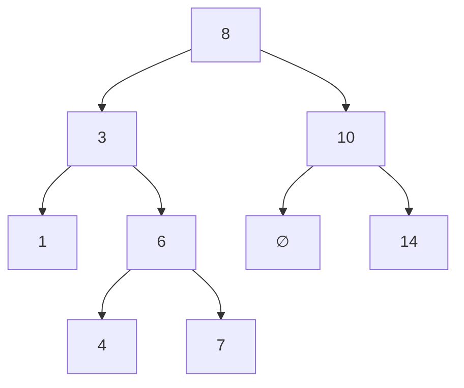
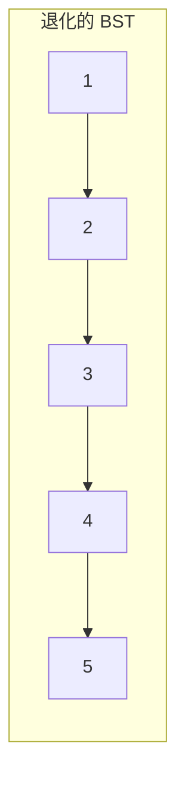

# 第 7 章：Binary Search Tree（BST）

!!! note "🎯 本章學習目標"
    完成本章後，你將能夠：
    
    - [ ] 理解 BST 的定義與性質
    - [ ] 實作 BST 的搜尋、插入、刪除操作
    - [ ] 利用 BST 的中序遍歷特性解題
    - [ ] 了解 AVL、Red-Black Tree 等平衡樹概念
    - [ ] 判斷一棵樹是否為合法的 BST
    
    **預估學習時間**：2.5 小時  
    **前置知識**：第 6 章 Tree 與 Binary Tree

---

## 1. BST 定義與性質

### 什麼是 BST？

**Binary Search Tree（二元搜尋樹）** 是一種特殊的二元樹，滿足以下性質：

- 左子樹的所有節點值 **小於** 根節點
- 右子樹的所有節點值 **大於** 根節點
- 左右子樹也分別是 BST



### 關鍵性質

!!! info "BST 的中序遍歷是升序排列"
    上圖的中序遍歷：1, 3, 4, 6, 7, 8, 10, 14

這個性質是解決很多 BST 問題的關鍵！

---

## 2. BST 完整實作

```python
class TreeNode:
    def __init__(self, val: int = 0):
        self.val = val
        self.left = None
        self.right = None


class BST:
    """
    Binary Search Tree 完整實作
    
    時間複雜度（平均）：
    - 搜尋: O(log n)
    - 插入: O(log n)
    - 刪除: O(log n)
    
    空間複雜度：O(n)
    """
    
    def __init__(self):
        self.root = None
    
    def search(self, val: int) -> TreeNode:
        """
        搜尋節點
        
        Time: O(h)，h 為樹高
        Space: O(1)（迭代）
        """
        curr = self.root
        
        while curr:
            if val == curr.val:
                return curr
            elif val < curr.val:
                curr = curr.left
            else:
                curr = curr.right
        
        return None
    
    def insert(self, val: int) -> None:
        """
        插入節點
        
        Time: O(h)
        Space: O(1)
        """
        new_node = TreeNode(val)
        
        if not self.root:
            self.root = new_node
            return
        
        curr = self.root
        
        while True:
            if val < curr.val:
                if curr.left:
                    curr = curr.left
                else:
                    curr.left = new_node
                    return
            else:
                if curr.right:
                    curr = curr.right
                else:
                    curr.right = new_node
                    return
    
    def delete(self, val: int) -> None:
        """
        刪除節點
        
        三種情況：
        1. 葉節點：直接刪除
        2. 只有一個子節點：用子節點替換
        3. 有兩個子節點：用後繼節點替換
        
        Time: O(h)
        Space: O(1)
        """
        self.root = self._delete_recursive(self.root, val)
    
    def _delete_recursive(self, node: TreeNode, val: int) -> TreeNode:
        if not node:
            return None
        
        if val < node.val:
            node.left = self._delete_recursive(node.left, val)
        elif val > node.val:
            node.right = self._delete_recursive(node.right, val)
        else:
            # 找到要刪除的節點
            
            # 情況 1 & 2：沒有子節點或只有一個
            if not node.left:
                return node.right
            if not node.right:
                return node.left
            
            # 情況 3：有兩個子節點
            # 找右子樹的最小值（後繼節點）
            successor = self._find_min(node.right)
            node.val = successor.val
            node.right = self._delete_recursive(node.right, successor.val)
        
        return node
    
    def _find_min(self, node: TreeNode) -> TreeNode:
        """找子樹中的最小值"""
        while node.left:
            node = node.left
        return node
    
    def inorder(self) -> list[int]:
        """中序遍歷（返回升序排列）"""
        result = []
        self._inorder_recursive(self.root, result)
        return result
    
    def _inorder_recursive(self, node: TreeNode, result: list):
        if node:
            self._inorder_recursive(node.left, result)
            result.append(node.val)
            self._inorder_recursive(node.right, result)


# === 使用範例 ===
if __name__ == "__main__":
    bst = BST()
    for val in [8, 3, 10, 1, 6, 14, 4, 7]:
        bst.insert(val)
    
    print("中序遍歷:", bst.inorder())  # [1, 3, 4, 6, 7, 8, 10, 14]
    
    print("搜尋 6:", bst.search(6))  # TreeNode(6)
    print("搜尋 5:", bst.search(5))  # None
    
    bst.delete(3)
    print("刪除 3 後:", bst.inorder())  # [1, 4, 6, 7, 8, 10, 14]
```

---

## 3. 驗證 BST

```python
def is_valid_bst(root: TreeNode) -> bool:
    """
    驗證是否為合法 BST
    
    方法一：遞迴傳遞範圍
    
    Time: O(n)
    Space: O(h)
    """
    def validate(node, min_val, max_val):
        if not node:
            return True
        
        if not (min_val < node.val < max_val):
            return False
        
        return (validate(node.left, min_val, node.val) and
                validate(node.right, node.val, max_val))
    
    return validate(root, float('-inf'), float('inf'))


def is_valid_bst_inorder(root: TreeNode) -> bool:
    """
    方法二：中序遍歷應該嚴格遞增
    
    Time: O(n)
    Space: O(h)
    """
    stack = []
    prev = float('-inf')
    curr = root
    
    while stack or curr:
        while curr:
            stack.append(curr)
            curr = curr.left
        
        curr = stack.pop()
        
        if curr.val <= prev:
            return False
        prev = curr.val
        
        curr = curr.right
    
    return True
```

---

## 4. 常見 BST 問題

### Kth Smallest Element

```python
def kth_smallest(root: TreeNode, k: int) -> int:
    """
    找 BST 中第 k 小的元素
    
    利用中序遍歷是升序的特性
    
    Time: O(h + k)
    Space: O(h)
    """
    stack = []
    curr = root
    count = 0
    
    while stack or curr:
        while curr:
            stack.append(curr)
            curr = curr.left
        
        curr = stack.pop()
        count += 1
        
        if count == k:
            return curr.val
        
        curr = curr.right
    
    return -1
```

### Lowest Common Ancestor in BST

```python
def lca_bst(root: TreeNode, p: TreeNode, q: TreeNode) -> TreeNode:
    """
    BST 中兩節點的最近公共祖先
    
    利用 BST 性質：比兩者都大就往左，比兩者都小就往右
    
    Time: O(h)
    Space: O(1)
    """
    curr = root
    
    while curr:
        if p.val < curr.val and q.val < curr.val:
            curr = curr.left
        elif p.val > curr.val and q.val > curr.val:
            curr = curr.right
        else:
            return curr
    
    return None
```

---

## 5. 平衡樹概念

### 為什麼需要平衡？

BST 的效能取決於樹高。最壞情況下（插入升序或降序資料），BST 會退化成鏈表，操作變成 O(n)。



### 常見平衡樹

| 類型 | 平衡條件 | 特點 |
|------|---------|------|
| **AVL Tree** | 左右子樹高度差 ≤ 1 | 嚴格平衡，查詢快 |
| **Red-Black Tree** | 透過顏色規則保持平衡 | 插入刪除快，Java TreeMap/TreeSet 使用 |
| **B-Tree/B+ Tree** | 多路平衡樹 | 資料庫索引使用 |

!!! tip "面試時"
    通常不需要實作平衡樹，但要能解釋為什麼需要平衡，以及各類型的應用場景。

---

## 6. 複雜度分析

| 操作 | 平均時間複雜度 | 最壞時間複雜度 | 說明 |
|------|---------------|---------------|------|
| 搜尋 | O(log n) | O(n) | 退化成鏈表時 |
| 插入 | O(log n) | O(n) | |
| 刪除 | O(log n) | O(n) | |
| 空間 | O(n) | O(n) | |

**平衡樹保證最壞情況也是 O(log n)**

---

## 7. 面試重點

!!! warning "⚠️ 常見陷阱"
    1. **BST 左子樹/右子樹的定義**
       - 是整個子樹的所有節點都要小於/大於根，不只是直接子節點
    
    2. **刪除有兩個子節點的節點**
       - 可以用前驅或後繼替換，面試時說清楚選擇
    
    3. **處理重複值**
       - 標準 BST 通常不允許重複
       - 如果允許，約定好放左邊還是右邊

!!! tip "💡 面試技巧"
    - **善用中序遍歷**：很多問題可以轉化為「對升序陣列的操作」
    - **範圍傳遞**：驗證 BST 時傳遞有效範圍
    - **BST 比一般 Tree 多一個條件可用**：根據值的大小縮小範圍

---

## 8. LeetCode 對應題目

| 難度 | 題號 | 題目名稱 | 考點 |
|------|------|---------|------|
| 🟢 Easy | #700 | Search in a BST | 基本搜尋 |
| 🟢 Easy | #235 | LCA of BST | 利用 BST 性質 |
| 🟡 Medium | #98 | Validate BST | 範圍驗證 |
| 🟡 Medium | #230 | Kth Smallest Element in BST | 中序遍歷 |
| 🟡 Medium | #450 | Delete Node in BST | 刪除操作 |
| 🟡 Medium | #108 | Convert Sorted Array to BST | 建樹 |
| 🔴 Hard | #99 | Recover BST | 找錯位節點 |

---

## 9. 練習題

!!! question "練習 1：Search in a BST（Easy）"
    **題目描述：**
    
    在 BST 中搜尋值為 val 的節點，返回該節點為根的子樹。若不存在返回 null。
    
    **提示：**
    <details>
    <summary>點擊查看提示</summary>
    利用 BST 性質：val 小於當前節點就往左，大於就往右。
    </details>

!!! question "練習 2：Validate BST（Medium）"
    **題目描述：**
    
    判斷給定的二元樹是否為合法的 BST。
    
    **提示：**
    <details>
    <summary>點擊查看提示</summary>
    遞迴傳遞有效範圍 (min, max)，或用中序遍歷檢查是否嚴格遞增。
    </details>

!!! question "練習 3：Convert Sorted Array to BST（Easy）"
    **題目描述：**
    
    將升序陣列轉換為高度平衡的 BST。
    
    **提示：**
    <details>
    <summary>點擊查看提示</summary>
    每次取中間元素作為根，左半部分建左子樹，右半部分建右子樹。
    </details>

---

## 10. 解答與詳解

??? success "練習 1 解答"
    ```python
    def search_bst(root: TreeNode, val: int) -> TreeNode:
        """
        Time: O(h)
        Space: O(1)
        """
        while root:
            if val == root.val:
                return root
            elif val < root.val:
                root = root.left
            else:
                root = root.right
        return None
    ```

??? success "練習 2 解答"
    ```python
    def is_valid_bst(root: TreeNode) -> bool:
        """
        Time: O(n)
        Space: O(h)
        """
        def validate(node, min_val, max_val):
            if not node:
                return True
            
            if not (min_val < node.val < max_val):
                return False
            
            return (validate(node.left, min_val, node.val) and
                    validate(node.right, node.val, max_val))
        
        return validate(root, float('-inf'), float('inf'))
    ```

??? success "練習 3 解答"
    ```python
    def sorted_array_to_bst(nums: list[int]) -> TreeNode:
        """
        Time: O(n)
        Space: O(log n)
        """
        def build(left: int, right: int) -> TreeNode:
            if left > right:
                return None
            
            mid = (left + right) // 2
            node = TreeNode(nums[mid])
            node.left = build(left, mid - 1)
            node.right = build(mid + 1, right)
            return node
        
        return build(0, len(nums) - 1)
    ```

---

## 11. 延伸學習

### 🚀 進階主題
- **AVL Tree 旋轉操作**：LL, RR, LR, RL
- **Red-Black Tree 規則**：面試可能會問
- **Splay Tree**：自調整 BST

### ⏭️ 下一章預告
下一章我們將學習「**Heap 與 Priority Queue**」，它是另一種特殊的樹結構，用於高效地找出最大/最小值，在 Top K 問題中非常重要！
