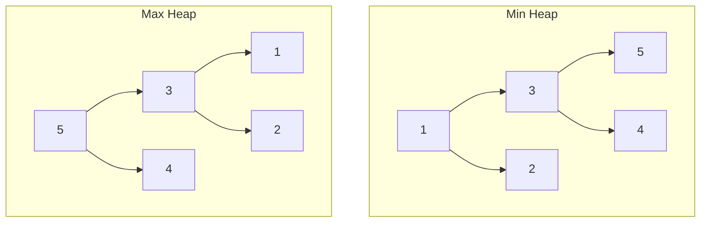

# 第 8 章：Heap 與 Priority Queue

!!! note "🎯 本章學習目標"
    完成本章後，你將能夠：
    
    - [ ] 理解 Heap 的結構與性質
    - [ ] 實作 Min Heap 的 push 和 pop 操作
    - [ ] 熟練使用 Python heapq 模組
    - [ ] 解決 Top K 類型問題
    - [ ] 理解 Heap Sort 原理
    
    **預估學習時間**：2.5 小時  
    **前置知識**：第 6 章 Tree 與 Binary Tree

---

## 1. Heap 基礎

### 什麼是 Heap？

**Heap（堆積）** 是一種特殊的 **Complete Binary Tree**，滿足：

- **Min Heap**：父節點 ≤ 子節點（根是最小值）
- **Max Heap**：父節點 ≥ 子節點（根是最大值）



### 陣列表示法

由於 Heap 是 Complete Binary Tree，可以用陣列高效儲存：

```
      0
     / \
    1   2
   / \
  3   4

對於索引 i：
- 父節點：(i - 1) // 2
- 左子節點：2 * i + 1
- 右子節點：2 * i + 2
```

---

## 2. Heap 完整實作

```python
class MinHeap:
    """
    Min Heap 完整實作
    
    時間複雜度：
    - push: O(log n)
    - pop: O(log n)
    - peek: O(1)
    - heapify: O(n)
    
    空間複雜度：O(n)
    """
    
    def __init__(self):
        self.data = []
    
    def push(self, val: int) -> None:
        """
        插入元素
        
        1. 加到陣列末尾
        2. 上浮（Sift Up）到正確位置
        """
        self.data.append(val)
        self._sift_up(len(self.data) - 1)
    
    def pop(self) -> int:
        """
        移除並返回最小值
        
        1. 將最後元素移到根
        2. 下沉（Sift Down）到正確位置
        """
        if not self.data:
            raise IndexError("Heap is empty")
        
        min_val = self.data[0]
        last_val = self.data.pop()
        
        if self.data:
            self.data[0] = last_val
            self._sift_down(0)
        
        return min_val
    
    def peek(self) -> int:
        """返回最小值（不移除）"""
        if not self.data:
            raise IndexError("Heap is empty")
        return self.data[0]
    
    def _sift_up(self, idx: int) -> None:
        """上浮操作"""
        while idx > 0:
            parent = (idx - 1) // 2
            if self.data[idx] < self.data[parent]:
                self.data[idx], self.data[parent] = self.data[parent], self.data[idx]
                idx = parent
            else:
                break
    
    def _sift_down(self, idx: int) -> None:
        """下沉操作"""
        n = len(self.data)
        
        while True:
            smallest = idx
            left = 2 * idx + 1
            right = 2 * idx + 2
            
            if left < n and self.data[left] < self.data[smallest]:
                smallest = left
            if right < n and self.data[right] < self.data[smallest]:
                smallest = right
            
            if smallest != idx:
                self.data[idx], self.data[smallest] = self.data[smallest], self.data[idx]
                idx = smallest
            else:
                break
    
    def __len__(self):
        return len(self.data)


# === 使用範例 ===
if __name__ == "__main__":
    heap = MinHeap()
    for val in [5, 3, 8, 1, 2]:
        heap.push(val)
    
    print("依序取出:", end=" ")
    while heap.data:
        print(heap.pop(), end=" ")  # 1 2 3 5 8
```

---

## 3. Python heapq 模組

Python 的 `heapq` 預設是 **Min Heap**：

```python
import heapq

# 建立 heap
nums = [5, 3, 8, 1, 2]
heapq.heapify(nums)  # O(n) 原地轉成 heap
print(nums)  # [1, 2, 8, 5, 3]

# 操作
heapq.heappush(nums, 0)  # 插入
smallest = heapq.heappop(nums)  # 取出最小值

# 其他便利函數
heapq.heappushpop(nums, 4)  # push 後 pop（比分開做更快）
heapq.heapreplace(nums, 4)  # pop 後 push

# 取 k 個最大/最小
largest_3 = heapq.nlargest(3, nums)
smallest_3 = heapq.nsmallest(3, nums)
```

### 實現 Max Heap

```python
import heapq

# 方法：存負數
max_heap = []
heapq.heappush(max_heap, -5)
heapq.heappush(max_heap, -3)
heapq.heappush(max_heap, -8)

largest = -heapq.heappop(max_heap)  # 8
```

---

## 4. Top K 問題

### Top K Frequent Elements

```python
import heapq
from collections import Counter

def top_k_frequent(nums: list[int], k: int) -> list[int]:
    """
    找出出現頻率最高的 k 個元素
    
    方法一：用 Min Heap 維護 k 個最大
    
    Time: O(n log k)
    Space: O(n)
    """
    count = Counter(nums)
    
    # 維護大小為 k 的 min heap
    heap = []
    for num, freq in count.items():
        heapq.heappush(heap, (freq, num))
        if len(heap) > k:
            heapq.heappop(heap)
    
    return [num for freq, num in heap]


def top_k_frequent_quick_select(nums: list[int], k: int) -> list[int]:
    """
    方法二：Quick Select（平均 O(n)）
    """
    count = Counter(nums)
    unique = list(count.keys())
    
    def partition(left, right, pivot_idx):
        pivot_freq = count[unique[pivot_idx]]
        unique[pivot_idx], unique[right] = unique[right], unique[pivot_idx]
        
        store_idx = left
        for i in range(left, right):
            if count[unique[i]] < pivot_freq:
                unique[store_idx], unique[i] = unique[i], unique[store_idx]
                store_idx += 1
        
        unique[right], unique[store_idx] = unique[store_idx], unique[right]
        return store_idx
    
    def quick_select(left, right, k_smallest):
        if left == right:
            return
        
        import random
        pivot_idx = random.randint(left, right)
        pivot_idx = partition(left, right, pivot_idx)
        
        if k_smallest == pivot_idx:
            return
        elif k_smallest < pivot_idx:
            quick_select(left, pivot_idx - 1, k_smallest)
        else:
            quick_select(pivot_idx + 1, right, k_smallest)
    
    n = len(unique)
    quick_select(0, n - 1, n - k)
    return unique[n - k:]
```

### Kth Largest Element

```python
import heapq

def find_kth_largest(nums: list[int], k: int) -> int:
    """
    找第 k 大的元素
    
    方法：維護大小為 k 的 min heap
    heap 頂部就是第 k 大
    
    Time: O(n log k)
    Space: O(k)
    """
    heap = []
    
    for num in nums:
        heapq.heappush(heap, num)
        if len(heap) > k:
            heapq.heappop(heap)
    
    return heap[0]
```

---

## 5. Merge K Sorted Lists

```python
import heapq

def merge_k_lists(lists: list) -> 'ListNode':
    """
    合併 k 個有序鏈結串列
    
    Time: O(n log k)，n 是所有節點數
    Space: O(k)
    """
    heap = []
    
    # 將每個 list 的頭節點加入 heap
    for i, lst in enumerate(lists):
        if lst:
            heapq.heappush(heap, (lst.val, i, lst))
    
    dummy = ListNode(-1)
    curr = dummy
    
    while heap:
        val, i, node = heapq.heappop(heap)
        curr.next = node
        curr = curr.next
        
        if node.next:
            heapq.heappush(heap, (node.next.val, i, node.next))
    
    return dummy.next
```

---

## 6. Heap Sort

```python
def heap_sort(nums: list[int]) -> list[int]:
    """
    堆積排序
    
    Time: O(n log n)
    Space: O(1)（原地排序）
    """
    n = len(nums)
    
    # 建立 Max Heap
    def heapify(size, i):
        largest = i
        left = 2 * i + 1
        right = 2 * i + 2
        
        if left < size and nums[left] > nums[largest]:
            largest = left
        if right < size and nums[right] > nums[largest]:
            largest = right
        
        if largest != i:
            nums[i], nums[largest] = nums[largest], nums[i]
            heapify(size, largest)
    
    # 從最後一個非葉節點開始建 heap
    for i in range(n // 2 - 1, -1, -1):
        heapify(n, i)
    
    # 逐一取出最大值放到末尾
    for i in range(n - 1, 0, -1):
        nums[0], nums[i] = nums[i], nums[0]
        heapify(i, 0)
    
    return nums
```

---

## 7. 複雜度分析

| 操作 | 時間複雜度 | 說明 |
|------|-----------|------|
| push | O(log n) | 上浮最多 log n 層 |
| pop | O(log n) | 下沉最多 log n 層 |
| peek | O(1) | 直接存取根 |
| heapify | O(n) | 建堆是線性時間 |
| Top K | O(n log k) | 維護 k 大小的 heap |

!!! info "為什麼 heapify 是 O(n)？"
    直覺上建 n 個元素的 heap 是 O(n log n)，但由於大部分節點在底層（不需要下沉很多），實際上是 O(n)。

---

## 8. 面試重點

!!! warning "⚠️ 常見陷阱"
    1. **Python heapq 是 Min Heap**
       - 要 Max Heap 需存負數
    
    2. **heapq 直接操作 list**
       - `heappush(list, item)` 不是 `list.heappush(item)`
    
    3. **Top K 最大用 Min Heap**
       - 維護 k 個最大元素，heap 頂是第 k 大

!!! tip "💡 面試技巧"
    - **找極值問題**：優先考慮 Heap
    - **Top K 問題**：Heap 是標準解法
    - **動態資料流**：Heap 可以持續維護
    - **說清楚選擇**：Min Heap 還是 Max Heap

---

## 9. LeetCode 對應題目

| 難度 | 題號 | 題目名稱 | 考點 |
|------|------|---------|------|
| 🟢 Easy | #703 | Kth Largest Element in Stream | 維護 Min Heap |
| 🟡 Medium | #215 | Kth Largest Element in Array | Top K |
| 🟡 Medium | #347 | Top K Frequent Elements | Heap + Counter |
| 🟡 Medium | #373 | Find K Pairs with Smallest Sums | 多路歸併 |
| 🔴 Hard | #23 | Merge k Sorted Lists | k 路歸併 |
| 🔴 Hard | #295 | Find Median from Data Stream | 雙 Heap |

---

## 10. 練習題

!!! question "練習 1：Kth Largest Element（Medium）"
    **題目描述：**
    
    在未排序的陣列中找到第 k 大的元素。
    
    **範例：**
    ```
    輸入：nums = [3,2,1,5,6,4], k = 2
    輸出：5
    ```
    
    **提示：**
    <details>
    <summary>點擊查看提示</summary>
    維護大小為 k 的 min heap。
    </details>

!!! question "練習 2：Last Stone Weight（Easy）"
    **題目描述：**
    
    每次取出最重的兩個石頭撞碎，較重的剩下差值，相同則都消失。返回最後剩餘石頭的重量。
    
    **範例：**
    ```
    輸入：stones = [2,7,4,1,8,1]
    輸出：1
    ```
    
    **提示：**
    <details>
    <summary>點擊查看提示</summary>
    用 Max Heap 模擬過程。
    </details>

!!! question "練習 3：Find Median from Data Stream（Hard）"
    **題目描述：**
    
    設計一個資料結構，支援：
    - `addNum(num)`：加入數字
    - `findMedian()`：返回當前所有數字的中位數
    
    **提示：**
    <details>
    <summary>點擊查看提示</summary>
    用兩個 Heap：Max Heap 存較小的一半，Min Heap 存較大的一半。
    </details>

---

## 11. 解答與詳解

??? success "練習 1 解答"
    ```python
    import heapq
    
    def find_kth_largest(nums: list[int], k: int) -> int:
        """
        Time: O(n log k)
        Space: O(k)
        """
        heap = []
        for num in nums:
            heapq.heappush(heap, num)
            if len(heap) > k:
                heapq.heappop(heap)
        return heap[0]
    ```

??? success "練習 2 解答"
    ```python
    import heapq
    
    def last_stone_weight(stones: list[int]) -> int:
        """
        Time: O(n log n)
        Space: O(n)
        """
        # 轉成 max heap（存負數）
        heap = [-s for s in stones]
        heapq.heapify(heap)
        
        while len(heap) > 1:
            first = -heapq.heappop(heap)
            second = -heapq.heappop(heap)
            
            if first != second:
                heapq.heappush(heap, -(first - second))
        
        return -heap[0] if heap else 0
    ```

??? success "練習 3 解答"
    ```python
    import heapq
    
    class MedianFinder:
        """
        Time: addNum O(log n), findMedian O(1)
        Space: O(n)
        """
        def __init__(self):
            self.small = []  # Max Heap（存負數）
            self.large = []  # Min Heap
        
        def addNum(self, num: int) -> None:
            # 先加入 small
            heapq.heappush(self.small, -num)
            
            # 確保 small 的最大值 <= large 的最小值
            if self.small and self.large and -self.small[0] > self.large[0]:
                val = -heapq.heappop(self.small)
                heapq.heappush(self.large, val)
            
            # 平衡兩個 heap 的大小
            if len(self.small) > len(self.large) + 1:
                val = -heapq.heappop(self.small)
                heapq.heappush(self.large, val)
            if len(self.large) > len(self.small):
                val = heapq.heappop(self.large)
                heapq.heappush(self.small, -val)
        
        def findMedian(self) -> float:
            if len(self.small) > len(self.large):
                return -self.small[0]
            return (-self.small[0] + self.large[0]) / 2
    ```

---

## 12. 延伸學習

### 🚀 進階主題
- **Fibonacci Heap**：更優的 decrease-key 操作
- **d-ary Heap**：每個節點 d 個子節點
- **Indexed Priority Queue**：支援動態更新優先級

### ⏭️ 下一章預告
下一章我們將學習「**Graph（圖論）**」，它是資料結構中最複雜也最有趣的主題，BFS、DFS、拓撲排序等都是面試常考內容！
