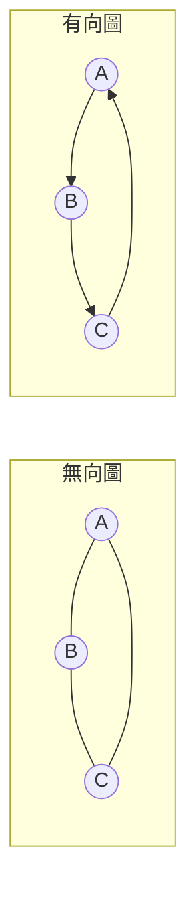
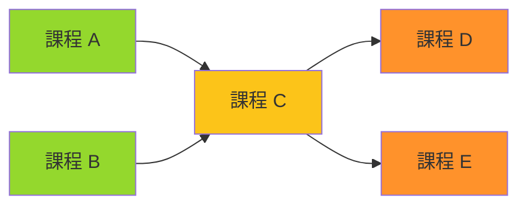

# 第 9 章：Graph（圖論）

!!! note "🎯 本章學習目標"
    完成本章後，你將能夠：
    
    - [ ] 理解圖的基本概念與表示方式
    - [ ] 實作 DFS 與 BFS 遍歷演算法
    - [ ] 解決連通性與環偵測問題
    - [ ] 掌握拓撲排序（Topological Sort）
    - [ ] 理解最短路徑演算法（Dijkstra、Bellman-Ford）
    
    **預估學習時間**：4 小時  
    **前置知識**：第 4 章 Stack 與 Queue、第 6 章 Tree

---

## 1. 圖的基礎

### 什麼是圖？

**圖（Graph）** 由**節點（Vertices）** 和**邊（Edges）** 組成，用來表示物件之間的關係。



### 圖的種類

| 類型 | 說明 | 範例 |
|------|------|------|
| 無向圖 | 邊沒有方向 | 社交網路（朋友關係） |
| 有向圖 | 邊有方向 | Twitter 追蹤、課程先修 |
| 加權圖 | 邊有權重 | 地圖導航（距離） |
| 無環圖 | 不存在環 | DAG（有向無環圖） |

### 圖的表示方式

```python
from collections import defaultdict

# === 方式一：鄰接矩陣（Adjacency Matrix）===
# 適合：密集圖、需要快速查詢兩點是否相連
# 空間：O(V²)
adj_matrix = [
    [0, 1, 1],  # A 連到 B, C
    [1, 0, 1],  # B 連到 A, C
    [1, 1, 0],  # C 連到 A, B
]

# === 方式二：鄰接串列（Adjacency List）===
# 適合：稀疏圖（大部分題目）
# 空間：O(V + E)
adj_list = {
    'A': ['B', 'C'],
    'B': ['A', 'C'],
    'C': ['A', 'B'],
}

# 使用 defaultdict 更方便
graph = defaultdict(list)
edges = [('A', 'B'), ('B', 'C'), ('A', 'C')]
for u, v in edges:
    graph[u].append(v)
    graph[v].append(u)  # 無向圖需要雙向加邊
```

---

## 2. DFS（深度優先搜尋）

### 遞迴實作

```python
def dfs_recursive(graph: dict, start: str) -> list[str]:
    """
    DFS 遞迴版本
    
    Time: O(V + E)
    Space: O(V)（遞迴呼叫棧）
    """
    visited = set()
    result = []
    
    def dfs(node):
        if node in visited:
            return
        visited.add(node)
        result.append(node)
        
        for neighbor in graph[node]:
            dfs(neighbor)
    
    dfs(start)
    return result
```

### 迭代實作（使用 Stack）

```python
def dfs_iterative(graph: dict, start: str) -> list[str]:
    """
    DFS 迭代版本
    
    Time: O(V + E)
    Space: O(V)
    """
    visited = set()
    result = []
    stack = [start]
    
    while stack:
        node = stack.pop()
        if node in visited:
            continue
        
        visited.add(node)
        result.append(node)
        
        # 加入鄰居（注意順序）
        for neighbor in graph[node]:
            if neighbor not in visited:
                stack.append(neighbor)
    
    return result
```

---

## 3. BFS（廣度優先搜尋）

```python
from collections import deque

def bfs(graph: dict, start: str) -> list[str]:
    """
    BFS 遍歷
    
    Time: O(V + E)
    Space: O(V)
    """
    visited = set([start])
    result = []
    queue = deque([start])
    
    while queue:
        node = queue.popleft()
        result.append(node)
        
        for neighbor in graph[node]:
            if neighbor not in visited:
                visited.add(neighbor)
                queue.append(neighbor)
    
    return result


def bfs_shortest_path(graph: dict, start: str, end: str) -> int:
    """
    BFS 求最短路徑（無權圖）
    
    Time: O(V + E)
    Space: O(V)
    """
    if start == end:
        return 0
    
    visited = set([start])
    queue = deque([(start, 0)])
    
    while queue:
        node, dist = queue.popleft()
        
        for neighbor in graph[node]:
            if neighbor == end:
                return dist + 1
            if neighbor not in visited:
                visited.add(neighbor)
                queue.append((neighbor, dist + 1))
    
    return -1  # 無法到達
```

### DFS vs BFS 比較

| 特性 | DFS | BFS |
|------|-----|-----|
| 資料結構 | Stack（或遞迴） | Queue |
| 搜尋順序 | 先深入再回溯 | 逐層擴展 |
| 最短路徑 | ❌ 不保證 | ✅ 無權圖最短 |
| 空間使用 | O(h) 遞迴深度 | O(w) 最寬層 |
| 適用場景 | 路徑存在性、回溯 | 最短路徑、層序 |

---

## 4. 環偵測

### 無向圖環偵測

```python
def has_cycle_undirected(graph: dict, n: int) -> bool:
    """
    無向圖環偵測
    
    方法：DFS 時檢查是否訪問到非父節點的已訪問節點
    
    Time: O(V + E)
    Space: O(V)
    """
    visited = set()
    
    def dfs(node, parent):
        visited.add(node)
        
        for neighbor in graph[node]:
            if neighbor not in visited:
                if dfs(neighbor, node):
                    return True
            elif neighbor != parent:
                return True  # 找到環！
        
        return False
    
    # 處理非連通圖
    for node in range(n):
        if node not in visited:
            if dfs(node, -1):
                return True
    
    return False
```

### 有向圖環偵測

```python
def has_cycle_directed(graph: dict, n: int) -> bool:
    """
    有向圖環偵測
    
    方法：三色標記法
    - 白色（0）：未訪問
    - 灰色（1）：訪問中（在當前路徑上）
    - 黑色（2）：已完成
    
    Time: O(V + E)
    Space: O(V)
    """
    color = [0] * n  # 0: 白, 1: 灰, 2: 黑
    
    def dfs(node):
        color[node] = 1  # 標記為灰色
        
        for neighbor in graph[node]:
            if color[neighbor] == 1:  # 遇到灰色 = 環
                return True
            if color[neighbor] == 0 and dfs(neighbor):
                return True
        
        color[node] = 2  # 標記為黑色
        return False
    
    for node in range(n):
        if color[node] == 0:
            if dfs(node):
                return True
    
    return False
```

---

## 5. 拓撲排序



### Kahn's Algorithm（BFS）

```python
from collections import deque

def topological_sort_bfs(graph: dict, n: int) -> list[int]:
    """
    拓撲排序 - Kahn's Algorithm
    
    適用：有向無環圖（DAG）
    
    Time: O(V + E)
    Space: O(V)
    """
    # 計算入度
    in_degree = [0] * n
    for node in range(n):
        for neighbor in graph[node]:
            in_degree[neighbor] += 1
    
    # 入度為 0 的節點先加入
    queue = deque([i for i in range(n) if in_degree[i] == 0])
    result = []
    
    while queue:
        node = queue.popleft()
        result.append(node)
        
        for neighbor in graph[node]:
            in_degree[neighbor] -= 1
            if in_degree[neighbor] == 0:
                queue.append(neighbor)
    
    # 檢查是否有環
    if len(result) != n:
        return []  # 有環，無法拓撲排序
    
    return result
```

### DFS 版本

```python
def topological_sort_dfs(graph: dict, n: int) -> list[int]:
    """
    拓撲排序 - DFS 後序反轉
    
    Time: O(V + E)
    Space: O(V)
    """
    visited = set()
    result = []
    
    def dfs(node):
        visited.add(node)
        for neighbor in graph[node]:
            if neighbor not in visited:
                dfs(neighbor)
        result.append(node)  # 後序加入
    
    for node in range(n):
        if node not in visited:
            dfs(node)
    
    return result[::-1]  # 反轉
```

---

## 6. 最短路徑演算法

### Dijkstra（單源最短路徑，非負權重）

```python
import heapq

def dijkstra(graph: dict, start: int, n: int) -> list[int]:
    """
    Dijkstra 演算法
    
    適用：非負權重圖
    
    Time: O((V + E) log V)
    Space: O(V)
    """
    dist = [float('inf')] * n
    dist[start] = 0
    heap = [(0, start)]  # (距離, 節點)
    
    while heap:
        d, node = heapq.heappop(heap)
        
        if d > dist[node]:
            continue
        
        for neighbor, weight in graph[node]:
            new_dist = d + weight
            if new_dist < dist[neighbor]:
                dist[neighbor] = new_dist
                heapq.heappush(heap, (new_dist, neighbor))
    
    return dist
```

### Bellman-Ford（可處理負權重）

```python
def bellman_ford(edges: list, start: int, n: int) -> list[int]:
    """
    Bellman-Ford 演算法
    
    適用：可有負權重邊，可偵測負環
    
    Time: O(V × E)
    Space: O(V)
    """
    dist = [float('inf')] * n
    dist[start] = 0
    
    # 鬆弛 V-1 次
    for _ in range(n - 1):
        for u, v, w in edges:
            if dist[u] != float('inf') and dist[u] + w < dist[v]:
                dist[v] = dist[u] + w
    
    # 檢查負環
    for u, v, w in edges:
        if dist[u] != float('inf') and dist[u] + w < dist[v]:
            return None  # 存在負環
    
    return dist
```

---

## 7. 複雜度分析

| 演算法 | 時間複雜度 | 空間複雜度 | 適用場景 |
|--------|-----------|-----------|---------|
| DFS | O(V + E) | O(V) | 路徑存在、環偵測 |
| BFS | O(V + E) | O(V) | 無權最短路徑 |
| 拓撲排序 | O(V + E) | O(V) | DAG 排程 |
| Dijkstra | O((V+E) log V) | O(V) | 非負權最短路徑 |
| Bellman-Ford | O(V × E) | O(V) | 負權邊、負環偵測 |

---

## 8. 面試重點

!!! warning "⚠️ 常見陷阱"
    1. **忘記處理非連通圖**
       - 需要對所有未訪問節點啟動 DFS/BFS
    
    2. **有向圖 vs 無向圖環偵測**
       - 無向圖：檢查非父節點
       - 有向圖：三色標記法
    
    3. **BFS 標記時機**
       - 入隊時標記 visited，不是出隊時！
    
    4. **Dijkstra 用於負權重**
       - ❌ 錯誤：Dijkstra 不能處理負權
       - ✅ 正確：使用 Bellman-Ford

!!! tip "💡 面試技巧"
    - **網格題目**：四方向移動就是圖的 BFS/DFS
    - **最短路徑**：無權用 BFS，有權用 Dijkstra
    - **順序依賴**：想到拓撲排序
    - **島嶼問題**：DFS/BFS 標記連通區域

---

## 9. LeetCode 對應題目

| 難度 | 題號 | 題目名稱 | 考點 |
|------|------|---------|------|
| 🟢 Easy | #733 | Flood Fill | DFS/BFS 基礎 |
| 🟡 Medium | #200 | Number of Islands | 連通分量 |
| 🟡 Medium | #207 | Course Schedule | 環偵測、拓撲排序 |
| 🟡 Medium | #210 | Course Schedule II | 拓撲排序結果 |
| 🟡 Medium | #133 | Clone Graph | DFS + HashMap |
| 🟡 Medium | #743 | Network Delay Time | Dijkstra |
| 🔴 Hard | #787 | Cheapest Flights Within K Stops | Bellman-Ford 變體 |

---

## 10. 練習題

!!! question "練習 1：Number of Islands（Medium）"
    **題目描述：**
    
    給定一個 m×n 的 2D 網格，'1' 代表陸地，'0' 代表水。計算島嶼的數量。
    
    **範例：**
    ```
    輸入：grid = [
      ["1","1","0","0","0"],
      ["1","1","0","0","0"],
      ["0","0","1","0","0"],
      ["0","0","0","1","1"]
    ]
    輸出：3
    ```
    
    **提示：**
    <details>
    <summary>點擊查看提示</summary>
    遍歷網格，對每個 '1' 進行 DFS/BFS 標記整個連通區域。
    </details>

!!! question "練習 2：Course Schedule（Medium）"
    **題目描述：**
    
    給定課程數量 n 和先修條件 prerequisites，判斷是否能完成所有課程。
    
    **範例：**
    ```
    輸入：numCourses = 2, prerequisites = [[1,0]]
    輸出：true
    解釋：要上課程 1，必須先完成課程 0。這是可行的。
    ```
    
    **提示：**
    <details>
    <summary>點擊查看提示</summary>
    這是有向圖環偵測問題。有環則無法完成。
    </details>

!!! question "練習 3：Word Ladder（Hard）"
    **題目描述：**
    
    給定 beginWord、endWord 和 wordList，找出從 beginWord 變換到 endWord 的最短轉換序列長度。每次只能改變一個字母。
    
    **範例：**
    ```
    輸入：beginWord = "hit", endWord = "cog", 
         wordList = ["hot","dot","dog","lot","log","cog"]
    輸出：5
    解釋：hit -> hot -> dot -> dog -> cog
    ```
    
    **提示：**
    <details>
    <summary>點擊查看提示</summary>
    將每個單字視為節點，可以轉換的視為邊，用 BFS 找最短路徑。
    </details>

---

## 11. 解答與詳解

??? success "練習 1 解答"
    ```python
    def num_islands(grid: list[list[str]]) -> int:
        """
        Time: O(m × n)
        Space: O(m × n)（最壞情況遞迴深度）
        """
        if not grid:
            return 0
        
        m, n = len(grid), len(grid[0])
        count = 0
        
        def dfs(i, j):
            if i < 0 or i >= m or j < 0 or j >= n or grid[i][j] != '1':
                return
            grid[i][j] = '0'  # 標記已訪問
            dfs(i + 1, j)
            dfs(i - 1, j)
            dfs(i, j + 1)
            dfs(i, j - 1)
        
        for i in range(m):
            for j in range(n):
                if grid[i][j] == '1':
                    count += 1
                    dfs(i, j)
        
        return count
    ```

??? success "練習 2 解答"
    ```python
    from collections import defaultdict, deque
    
    def can_finish(num_courses: int, prerequisites: list[list[int]]) -> bool:
        """
        Kahn's Algorithm 拓撲排序
        
        Time: O(V + E)
        Space: O(V + E)
        """
        graph = defaultdict(list)
        in_degree = [0] * num_courses
        
        for course, prereq in prerequisites:
            graph[prereq].append(course)
            in_degree[course] += 1
        
        queue = deque([i for i in range(num_courses) if in_degree[i] == 0])
        count = 0
        
        while queue:
            node = queue.popleft()
            count += 1
            for neighbor in graph[node]:
                in_degree[neighbor] -= 1
                if in_degree[neighbor] == 0:
                    queue.append(neighbor)
        
        return count == num_courses
    ```

??? success "練習 3 解答"
    ```python
    from collections import deque
    
    def ladder_length(begin_word: str, end_word: str, word_list: list[str]) -> int:
        """
        BFS 求最短路徑
        
        Time: O(M² × N)，M 是單字長度，N 是單字數量
        Space: O(M² × N)
        """
        word_set = set(word_list)
        if end_word not in word_set:
            return 0
        
        queue = deque([(begin_word, 1)])
        visited = set([begin_word])
        
        while queue:
            word, length = queue.popleft()
            
            for i in range(len(word)):
                for c in 'abcdefghijklmnopqrstuvwxyz':
                    new_word = word[:i] + c + word[i+1:]
                    
                    if new_word == end_word:
                        return length + 1
                    
                    if new_word in word_set and new_word not in visited:
                        visited.add(new_word)
                        queue.append((new_word, length + 1))
        
        return 0
    ```

---

## 12. 延伸學習

### 🚀 進階主題
- **Floyd-Warshall**：所有點對最短路徑
- **Minimum Spanning Tree**：Prim、Kruskal
- **Union Find**：連通性的更高效解法
- **A* 演算法**：啟發式搜尋

### ⏭️ 下一章預告
下一章我們將學習「**排序演算法**」，包括 Quick Sort、Merge Sort 等經典排序，這些不僅是面試必考，也是許多演算法的基礎！
