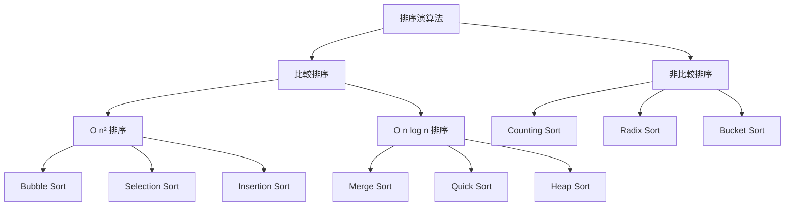
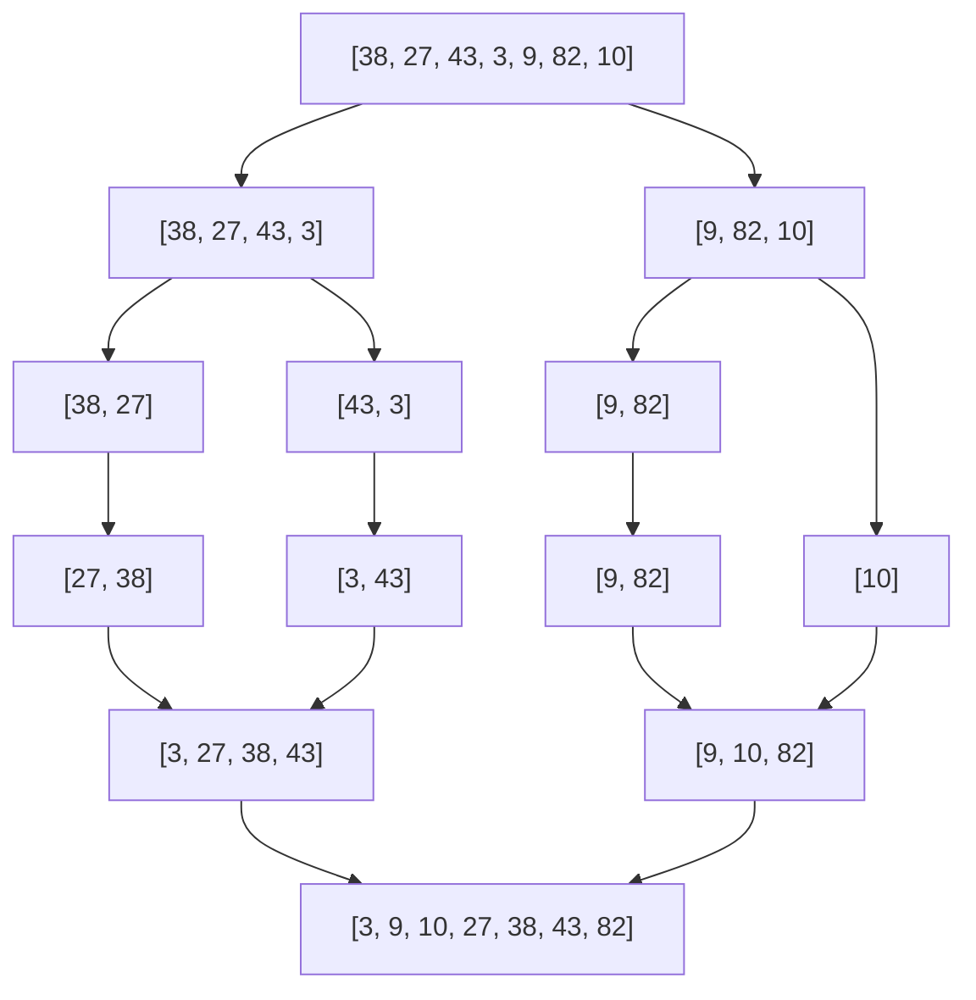

# 第 10 章：排序演算法

!!! note "🎯 本章學習目標"
    完成本章後，你將能夠：
    
    - [ ] 理解並實作 Quick Sort 與 Merge Sort
    - [ ] 掌握各種排序演算法的複雜度與穩定性
    - [ ] 了解 Counting Sort、Radix Sort 等線性排序
    - [ ] 根據場景選擇合適的排序演算法
    - [ ] 解決面試中的排序變體問題
    
    **預估學習時間**：3 小時  
    **前置知識**：第 1 章 複雜度分析、第 8 章 Heap

---

## 1. 排序演算法概覽



### 排序演算法比較

| 演算法 | 平均時間 | 最壞時間 | 空間 | 穩定性 |
|--------|---------|---------|------|--------|
| Bubble Sort | O(n²) | O(n²) | O(1) | ✅ 穩定 |
| Selection Sort | O(n²) | O(n²) | O(1) | ❌ 不穩定 |
| Insertion Sort | O(n²) | O(n²) | O(1) | ✅ 穩定 |
| **Merge Sort** | O(n log n) | O(n log n) | O(n) | ✅ 穩定 |
| **Quick Sort** | O(n log n) | O(n²) | O(log n) | ❌ 不穩定 |
| Heap Sort | O(n log n) | O(n log n) | O(1) | ❌ 不穩定 |
| Counting Sort | O(n + k) | O(n + k) | O(k) | ✅ 穩定 |

!!! info "什麼是穩定性？"
    **穩定排序**：相同值的元素在排序後保持原本的相對順序。
    
    例如排序 `[(A, 3), (B, 1), (C, 3)]` by 數字：
    - 穩定：`[(B, 1), (A, 3), (C, 3)]` ← A 仍在 C 前面
    - 不穩定：可能是 `[(B, 1), (C, 3), (A, 3)]`

---

## 2. Merge Sort（合併排序）

### 原理

使用 **Divide and Conquer**：
1. 將陣列分成兩半
2. 分別遞迴排序
3. 合併兩個有序陣列



### 實作

```python
def merge_sort(arr: list[int]) -> list[int]:
    """
    Merge Sort 實作
    
    Time: O(n log n)（所有情況）
    Space: O(n)（需要額外陣列）
    穩定性: ✅ 穩定
    """
    if len(arr) <= 1:
        return arr
    
    mid = len(arr) // 2
    left = merge_sort(arr[:mid])
    right = merge_sort(arr[mid:])
    
    return merge(left, right)


def merge(left: list[int], right: list[int]) -> list[int]:
    """合併兩個有序陣列"""
    result = []
    i = j = 0
    
    while i < len(left) and j < len(right):
        if left[i] <= right[j]:  # <= 保證穩定性
            result.append(left[i])
            i += 1
        else:
            result.append(right[j])
            j += 1
    
    result.extend(left[i:])
    result.extend(right[j:])
    return result


# === In-place 版本（面試可能會問）===
def merge_sort_inplace(arr: list[int], left: int, right: int) -> None:
    """
    原地 Merge Sort
    """
    if left >= right:
        return
    
    mid = (left + right) // 2
    merge_sort_inplace(arr, left, mid)
    merge_sort_inplace(arr, mid + 1, right)
    merge_inplace(arr, left, mid, right)


def merge_inplace(arr: list[int], left: int, mid: int, right: int) -> None:
    """原地合併"""
    temp = arr[left:right + 1]
    i, j = 0, mid - left + 1
    k = left
    
    while i <= mid - left and j <= right - left:
        if temp[i] <= temp[j]:
            arr[k] = temp[i]
            i += 1
        else:
            arr[k] = temp[j]
            j += 1
        k += 1
    
    while i <= mid - left:
        arr[k] = temp[i]
        i += 1
        k += 1
```

---

## 3. Quick Sort（快速排序）

### 原理

1. 選擇一個 **pivot（樞軸）**
2. **Partition**：將小於 pivot 的放左邊，大於的放右邊
3. 分別對左右遞迴排序

### 實作

```python
import random

def quick_sort(arr: list[int]) -> list[int]:
    """
    Quick Sort（簡潔版）
    
    Time: 平均 O(n log n)，最壞 O(n²)
    Space: O(n)（這個版本）
    """
    if len(arr) <= 1:
        return arr
    
    pivot = arr[len(arr) // 2]
    left = [x for x in arr if x < pivot]
    middle = [x for x in arr if x == pivot]
    right = [x for x in arr if x > pivot]
    
    return quick_sort(left) + middle + quick_sort(right)


def quick_sort_inplace(arr: list[int], left: int, right: int) -> None:
    """
    Quick Sort（原地版）
    
    Time: 平均 O(n log n)
    Space: O(log n)（遞迴呼叫棧）
    """
    if left >= right:
        return
    
    pivot_idx = partition(arr, left, right)
    quick_sort_inplace(arr, left, pivot_idx - 1)
    quick_sort_inplace(arr, pivot_idx + 1, right)


def partition(arr: list[int], left: int, right: int) -> int:
    """
    Lomuto Partition Scheme
    
    選擇最右邊為 pivot，將小於 pivot 的移到左邊
    """
    # 隨機選 pivot 避免最壞情況
    rand_idx = random.randint(left, right)
    arr[rand_idx], arr[right] = arr[right], arr[rand_idx]
    
    pivot = arr[right]
    store_idx = left
    
    for i in range(left, right):
        if arr[i] < pivot:
            arr[store_idx], arr[i] = arr[i], arr[store_idx]
            store_idx += 1
    
    arr[store_idx], arr[right] = arr[right], arr[store_idx]
    return store_idx
```

### Quick Select：找第 K 大/小

```python
def quick_select(arr: list[int], k: int) -> int:
    """
    找第 k 小的元素（k 從 1 開始）
    
    Time: 平均 O(n)，最壞 O(n²)
    Space: O(1)
    """
    k -= 1  # 轉成 0-indexed
    left, right = 0, len(arr) - 1
    
    while left <= right:
        pivot_idx = partition(arr, left, right)
        
        if pivot_idx == k:
            return arr[k]
        elif pivot_idx < k:
            left = pivot_idx + 1
        else:
            right = pivot_idx - 1
    
    return -1
```

---

## 4. 基礎排序演算法

### Insertion Sort（插入排序）

```python
def insertion_sort(arr: list[int]) -> list[int]:
    """
    Insertion Sort
    
    Time: 平均 O(n²)，最好 O(n)（幾乎有序時）
    Space: O(1)
    穩定性: ✅ 穩定
    
    特點：對於小陣列或幾乎有序的資料很高效
    """
    for i in range(1, len(arr)):
        key = arr[i]
        j = i - 1
        
        while j >= 0 and arr[j] > key:
            arr[j + 1] = arr[j]
            j -= 1
        
        arr[j + 1] = key
    
    return arr
```

### Selection Sort（選擇排序）

```python
def selection_sort(arr: list[int]) -> list[int]:
    """
    Selection Sort
    
    Time: O(n²)（所有情況）
    Space: O(1)
    穩定性: ❌ 不穩定
    """
    n = len(arr)
    
    for i in range(n):
        min_idx = i
        for j in range(i + 1, n):
            if arr[j] < arr[min_idx]:
                min_idx = j
        arr[i], arr[min_idx] = arr[min_idx], arr[i]
    
    return arr
```

---

## 5. 線性時間排序

### Counting Sort（計數排序）

```python
def counting_sort(arr: list[int]) -> list[int]:
    """
    Counting Sort
    
    適用：整數、範圍已知且不大
    
    Time: O(n + k)，k 是數值範圍
    Space: O(k)
    穩定性: ✅ 穩定
    """
    if not arr:
        return arr
    
    min_val, max_val = min(arr), max(arr)
    k = max_val - min_val + 1
    
    # 計數
    count = [0] * k
    for num in arr:
        count[num - min_val] += 1
    
    # 累積計數（為了穩定性）
    for i in range(1, k):
        count[i] += count[i - 1]
    
    # 從後往前放置（保證穩定性）
    result = [0] * len(arr)
    for num in reversed(arr):
        idx = count[num - min_val] - 1
        result[idx] = num
        count[num - min_val] -= 1
    
    return result
```

### Radix Sort（基數排序）

```python
def radix_sort(arr: list[int]) -> list[int]:
    """
    Radix Sort（LSD - 從最低位開始）
    
    適用：非負整數
    
    Time: O(d × (n + k))，d 是位數，k 是基數（通常 10）
    Space: O(n + k)
    穩定性: ✅ 穩定
    """
    if not arr:
        return arr
    
    max_val = max(arr)
    exp = 1
    
    while max_val // exp > 0:
        arr = counting_sort_by_digit(arr, exp)
        exp *= 10
    
    return arr


def counting_sort_by_digit(arr: list[int], exp: int) -> list[int]:
    """根據指定位數進行計數排序"""
    n = len(arr)
    output = [0] * n
    count = [0] * 10
    
    for num in arr:
        digit = (num // exp) % 10
        count[digit] += 1
    
    for i in range(1, 10):
        count[i] += count[i - 1]
    
    for num in reversed(arr):
        digit = (num // exp) % 10
        output[count[digit] - 1] = num
        count[digit] -= 1
    
    return output
```

---

## 6. 複雜度分析

| 演算法 | 最好 | 平均 | 最壞 | 空間 | 穩定 |
|--------|------|------|------|------|------|
| Merge Sort | O(n log n) | O(n log n) | O(n log n) | O(n) | ✅ |
| Quick Sort | O(n log n) | O(n log n) | O(n²) | O(log n) | ❌ |
| Heap Sort | O(n log n) | O(n log n) | O(n log n) | O(1) | ❌ |
| Insertion Sort | O(n) | O(n²) | O(n²) | O(1) | ✅ |
| Counting Sort | O(n + k) | O(n + k) | O(n + k) | O(k) | ✅ |

---

## 7. 面試重點

!!! warning "⚠️ 常見陷阱"
    1. **Quick Sort 最壞情況**
       - 每次選到最大/最小值：O(n²)
       - 解法：隨機選 pivot
    
    2. **混淆穩定與不穩定**
       - 需要穩定：Merge Sort、Counting Sort
       - Quick Sort、Heap Sort 不穩定
    
    3. **忘記 Merge Sort 的空間複雜度**
       - 需要 O(n) 額外空間，不是 O(1)

!!! tip "💡 面試技巧"
    - **手寫排序**：優先記住 Quick Sort partition
    - **需要穩定排序**：用 Merge Sort
    - **外部排序（資料太大）**：Merge Sort
    - **範圍小的整數**：Counting Sort
    - **常數因子重要**：小陣列用 Insertion Sort

---

## 8. LeetCode 對應題目

| 難度 | 題號 | 題目名稱 | 考點 |
|------|------|---------|------|
| 🟢 Easy | #912 | Sort an Array | 實作排序 |
| 🟡 Medium | #75 | Sort Colors | 三路 partition |
| 🟡 Medium | #148 | Sort List | 鏈結串列 Merge Sort |
| 🟡 Medium | #179 | Largest Number | 自定義比較 |
| 🟡 Medium | #215 | Kth Largest Element | Quick Select |
| 🟡 Medium | #347 | Top K Frequent Elements | Bucket Sort |
| 🔴 Hard | #315 | Count of Smaller Numbers After Self | Merge Sort 變體 |

---

## 9. 練習題

!!! question "練習 1：Sort Colors（Medium）"
    **題目描述：**
    
    給定一個包含 0、1、2 的陣列，原地排序使得相同顏色相鄰。
    
    **範例：**
    ```
    輸入：nums = [2,0,2,1,1,0]
    輸出：[0,0,1,1,2,2]
    ```
    
    **提示：**
    <details>
    <summary>點擊查看提示</summary>
    Dutch National Flag 問題：使用三個指標分區。
    </details>

!!! question "練習 2：Merge Intervals（Medium）"
    **題目描述：**
    
    給定一組區間，合併所有重疊的區間。
    
    **範例：**
    ```
    輸入：intervals = [[1,3],[2,6],[8,10],[15,18]]
    輸出：[[1,6],[8,10],[15,18]]
    ```
    
    **提示：**
    <details>
    <summary>點擊查看提示</summary>
    先按起點排序，然後遍歷合併。
    </details>

!!! question "練習 3：Count of Smaller Numbers After Self（Hard）"
    **題目描述：**
    
    給定陣列 nums，對每個元素，計算在它右邊且比它小的元素數量。
    
    **範例：**
    ```
    輸入：nums = [5,2,6,1]
    輸出：[2,1,1,0]
    ```
    
    **提示：**
    <details>
    <summary>點擊查看提示</summary>
    在 Merge Sort 的 merge 過程中計數。
    </details>

---

## 10. 解答與詳解

??? success "練習 1 解答"
    ```python
    def sort_colors(nums: list[int]) -> None:
        """
        Dutch National Flag - 三路 Partition
        
        Time: O(n)
        Space: O(1)
        """
        low, mid, high = 0, 0, len(nums) - 1
        
        while mid <= high:
            if nums[mid] == 0:
                nums[low], nums[mid] = nums[mid], nums[low]
                low += 1
                mid += 1
            elif nums[mid] == 1:
                mid += 1
            else:  # nums[mid] == 2
                nums[mid], nums[high] = nums[high], nums[mid]
                high -= 1
    ```

??? success "練習 2 解答"
    ```python
    def merge_intervals(intervals: list[list[int]]) -> list[list[int]]:
        """
        Time: O(n log n)
        Space: O(n)
        """
        if not intervals:
            return []
        
        intervals.sort(key=lambda x: x[0])
        result = [intervals[0]]
        
        for start, end in intervals[1:]:
            if start <= result[-1][1]:
                result[-1][1] = max(result[-1][1], end)
            else:
                result.append([start, end])
        
        return result
    ```

??? success "練習 3 解答"
    ```python
    def count_smaller(nums: list[int]) -> list[int]:
        """
        Merge Sort 變體：在 merge 時計數
        
        Time: O(n log n)
        Space: O(n)
        """
        n = len(nums)
        result = [0] * n
        indices = list(range(n))
        
        def merge_sort(arr_indices):
            if len(arr_indices) <= 1:
                return arr_indices
            
            mid = len(arr_indices) // 2
            left = merge_sort(arr_indices[:mid])
            right = merge_sort(arr_indices[mid:])
            
            merged = []
            i = j = 0
            right_count = 0
            
            while i < len(left) and j < len(right):
                if nums[left[i]] <= nums[right[j]]:
                    result[left[i]] += right_count
                    merged.append(left[i])
                    i += 1
                else:
                    right_count += 1
                    merged.append(right[j])
                    j += 1
            
            while i < len(left):
                result[left[i]] += right_count
                merged.append(left[i])
                i += 1
            
            merged.extend(right[j:])
            return merged
        
        merge_sort(indices)
        return result
    ```

---

## 11. 延伸學習

### 🚀 進階主題
- **Tim Sort**：Python 內建排序，結合 Merge + Insertion
- **Intro Sort**：C++ STL 排序，Quick + Heap + Insertion
- **外部排序**：資料太大無法放入記憶體
- **並行排序**：多執行緒排序

### ⏭️ 下一章預告
下一章我們將學習「**Binary Search**」，這是最基礎也最容易出錯的演算法之一。掌握邊界處理後，你就能解決各種變體問題！
