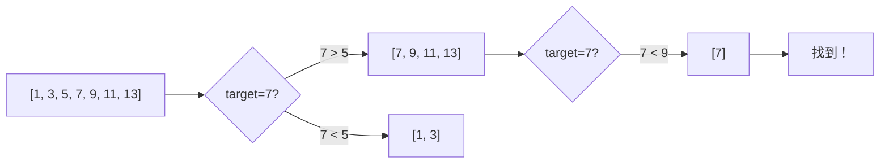

# 第 11 章：Binary Search（二分搜尋）

!!! note "🎯 本章學習目標"
    完成本章後，你將能夠：
    
    - [ ] 理解二分搜尋的核心思想與終止條件
    - [ ] 掌握尋找左邊界與右邊界的寫法
    - [ ] 解決旋轉陣列、峰值等變體問題
    - [ ] 識別「答案二分」類型的題目
    - [ ] 正確處理邊界條件避免無限迴圈
    
    **預估學習時間**：2.5 小時  
    **前置知識**：第 1 章 複雜度分析

---

## 1. 二分搜尋基礎

### 核心思想

**二分搜尋**利用**有序性**，每次將搜尋範圍縮小一半：



### 基本模板

```python
def binary_search(arr: list[int], target: int) -> int:
    """
    標準二分搜尋
    
    Time: O(log n)
    Space: O(1)
    
    返回：target 的索引，找不到返回 -1
    """
    left, right = 0, len(arr) - 1
    
    while left <= right:  # 注意：<=
        mid = left + (right - left) // 2  # 防止溢位
        
        if arr[mid] == target:
            return mid
        elif arr[mid] < target:
            left = mid + 1
        else:
            right = mid - 1
    
    return -1
```

!!! warning "常見錯誤"
    1. **溢位問題**：`mid = (left + right) // 2` 在某些語言可能溢位
       - 使用 `mid = left + (right - left) // 2`
    
    2. **無限迴圈**：`left = mid` 或 `right = mid` 可能導致無限迴圈
       - 確保每次迭代至少排除一個元素

---

## 2. 尋找左右邊界

### 尋找左邊界（第一個 >= target）

```python
def lower_bound(arr: list[int], target: int) -> int:
    """
    找第一個 >= target 的位置
    
    如果所有元素都 < target，返回 len(arr)
    
    Time: O(log n)
    """
    left, right = 0, len(arr)
    
    while left < right:  # 注意：<
        mid = left + (right - left) // 2
        
        if arr[mid] < target:
            left = mid + 1
        else:
            right = mid  # 注意：不是 mid - 1
    
    return left


def find_first(arr: list[int], target: int) -> int:
    """
    找第一個等於 target 的位置
    找不到返回 -1
    """
    idx = lower_bound(arr, target)
    if idx < len(arr) and arr[idx] == target:
        return idx
    return -1
```

### 尋找右邊界（最後一個 <= target）

```python
def upper_bound(arr: list[int], target: int) -> int:
    """
    找第一個 > target 的位置
    
    如果所有元素都 <= target，返回 len(arr)
    """
    left, right = 0, len(arr)
    
    while left < right:
        mid = left + (right - left) // 2
        
        if arr[mid] <= target:
            left = mid + 1
        else:
            right = mid
    
    return left


def find_last(arr: list[int], target: int) -> int:
    """
    找最後一個等於 target 的位置
    找不到返回 -1
    """
    idx = upper_bound(arr, target) - 1
    if idx >= 0 and arr[idx] == target:
        return idx
    return -1
```

### 三種模板比較

| 類型 | 迴圈條件 | mid 計算 | 更新方式 | 返回值 |
|------|---------|---------|---------|-------|
| 精確搜尋 | `left <= right` | `(left + right) // 2` | `left = mid + 1`, `right = mid - 1` | mid 或 -1 |
| 左邊界 | `left < right` | `(left + right) // 2` | `left = mid + 1`, `right = mid` | left |
| 右邊界 | `left < right` | `(left + right + 1) // 2` | `left = mid`, `right = mid - 1` | left |

---

## 3. Search in Rotated Sorted Array

```python
def search_rotated(nums: list[int], target: int) -> int:
    """
    在旋轉排序陣列中搜尋
    
    例如：[4, 5, 6, 7, 0, 1, 2]
    
    關鍵：判斷哪一半是有序的
    
    Time: O(log n)
    Space: O(1)
    """
    left, right = 0, len(nums) - 1
    
    while left <= right:
        mid = left + (right - left) // 2
        
        if nums[mid] == target:
            return mid
        
        # 判斷左半部是否有序
        if nums[left] <= nums[mid]:
            # 左半部有序
            if nums[left] <= target < nums[mid]:
                right = mid - 1
            else:
                left = mid + 1
        else:
            # 右半部有序
            if nums[mid] < target <= nums[right]:
                left = mid + 1
            else:
                right = mid - 1
    
    return -1
```

---

## 4. Find Peak Element

```python
def find_peak_element(nums: list[int]) -> int:
    """
    找峰值元素（比左右鄰居都大）
    
    假設：nums[-1] = nums[n] = -∞
    
    Time: O(log n)
    Space: O(1)
    """
    left, right = 0, len(nums) - 1
    
    while left < right:
        mid = left + (right - left) // 2
        
        if nums[mid] > nums[mid + 1]:
            # 峰值在左側（包含 mid）
            right = mid
        else:
            # 峰值在右側
            left = mid + 1
    
    return left
```

---

## 5. 答案二分

當問題的**答案具有單調性**時，可以二分答案。

### 經典問題：分割陣列的最大值最小化

```python
def split_array(nums: list[int], k: int) -> int:
    """
    將陣列分成 k 個連續子陣列，
    使得子陣列和的最大值最小化
    
    答案二分：
    - 答案範圍：[max(nums), sum(nums)]
    - 猜測一個最大和，檢查能否分成 <= k 份
    
    Time: O(n log(sum - max))
    Space: O(1)
    """
    def can_split(max_sum: int) -> bool:
        """檢查是否能在 max_sum 限制下分成 <= k 份"""
        count = 1
        curr_sum = 0
        
        for num in nums:
            if curr_sum + num > max_sum:
                count += 1
                curr_sum = num
                if count > k:
                    return False
            else:
                curr_sum += num
        
        return True
    
    left, right = max(nums), sum(nums)
    
    while left < right:
        mid = left + (right - left) // 2
        
        if can_split(mid):
            right = mid  # 可以達成，嘗試更小
        else:
            left = mid + 1  # 不可達成，需要更大
    
    return left
```

### Koko Eating Bananas

```python
def min_eating_speed(piles: list[int], h: int) -> int:
    """
    Koko 每小時吃 k 根香蕉，求最小 k 使得 h 小時內吃完
    
    Time: O(n log max(piles))
    Space: O(1)
    """
    def can_finish(k: int) -> bool:
        hours = sum((pile + k - 1) // k for pile in piles)
        return hours <= h
    
    left, right = 1, max(piles)
    
    while left < right:
        mid = left + (right - left) // 2
        
        if can_finish(mid):
            right = mid
        else:
            left = mid + 1
    
    return left
```

---

## 6. 二分搜尋在 Python 中的應用

### bisect 模組

```python
import bisect

arr = [1, 3, 5, 5, 5, 7, 9]

# lower_bound：第一個 >= 5 的位置
idx = bisect.bisect_left(arr, 5)   # 2

# upper_bound：第一個 > 5 的位置
idx = bisect.bisect_right(arr, 5)  # 5

# 插入並保持有序
bisect.insort_left(arr, 4)   # [1, 3, 4, 5, 5, 5, 7, 9]
bisect.insort_right(arr, 6)  # [1, 3, 4, 5, 5, 5, 6, 7, 9]
```

---

## 7. 複雜度分析

| 操作 | 時間複雜度 | 空間複雜度 |
|------|-----------|-----------|
| 標準二分搜尋 | O(log n) | O(1) |
| 尋找邊界 | O(log n) | O(1) |
| 旋轉陣列搜尋 | O(log n) | O(1) |
| 答案二分 | O(n log A) | O(1) |

其中 A 是答案範圍。

---

## 8. 面試重點

!!! warning "⚠️ 常見陷阱"
    1. **邊界條件**
       - `left <= right` vs `left < right`
       - `right = mid` vs `right = mid - 1`
       - 搞錯會導致無限迴圈或漏掉答案
    
    2. **旋轉陣列有重複元素**
       - 當 `nums[left] == nums[mid] == nums[right]`
       - 無法判斷哪邊有序，需要 `left++` 或 `right--`
    
    3. **答案二分的邊界**
       - 初始範圍要包含所有可能答案
       - 檢查函數的單調性要正確

!!! tip "💡 面試技巧"
    - **有序 + O(log n)**：立刻想到二分
    - **最大值最小化 / 最小值最大化**：答案二分
    - **先寫暴力解**：確認思路後再優化成二分
    - **畫圖模擬**：處理邊界時在紙上跑幾個例子

---

## 9. LeetCode 對應題目

| 難度 | 題號 | 題目名稱 | 考點 |
|------|------|---------|------|
| 🟢 Easy | #704 | Binary Search | 基礎模板 |
| 🟢 Easy | #35 | Search Insert Position | lower_bound |
| 🟡 Medium | #34 | Find First and Last Position | 左右邊界 |
| 🟡 Medium | #33 | Search in Rotated Sorted Array | 旋轉陣列 |
| 🟡 Medium | #162 | Find Peak Element | 峰值搜尋 |
| 🟡 Medium | #875 | Koko Eating Bananas | 答案二分 |
| 🔴 Hard | #4 | Median of Two Sorted Arrays | 進階二分 |
| 🔴 Hard | #410 | Split Array Largest Sum | 答案二分 |

---

## 10. 練習題

!!! question "練習 1：Search Insert Position（Easy）"
    **題目描述：**
    
    給定一個排序陣列和目標值，找到目標值在陣列中的索引。如果不存在，返回它應該插入的位置。
    
    **範例：**
    ```
    輸入：nums = [1,3,5,6], target = 5
    輸出：2
    
    輸入：nums = [1,3,5,6], target = 2
    輸出：1
    ```
    
    **提示：**
    <details>
    <summary>點擊查看提示</summary>
    這就是 lower_bound：找第一個 >= target 的位置。
    </details>

!!! question "練習 2：Search in Rotated Sorted Array II（Medium）"
    **題目描述：**
    
    類似旋轉陣列搜尋，但陣列中可能有重複元素。
    
    **範例：**
    ```
    輸入：nums = [2,5,6,0,0,1,2], target = 0
    輸出：true
    ```
    
    **提示：**
    <details>
    <summary>點擊查看提示</summary>
    當 nums[left] == nums[mid] == nums[right] 時，無法判斷有序區間，需要縮小範圍。
    </details>

!!! question "練習 3：Median of Two Sorted Arrays（Hard）"
    **題目描述：**
    
    給定兩個有序陣列，找出合併後的中位數。要求 O(log(m+n)) 時間。
    
    **範例：**
    ```
    輸入：nums1 = [1,3], nums2 = [2]
    輸出：2.0
    ```
    
    **提示：**
    <details>
    <summary>點擊查看提示</summary>
    二分較短陣列的分割位置，使得左側元素都 <= 右側元素。
    </details>

---

## 11. 解答與詳解

??? success "練習 1 解答"
    ```python
    def search_insert(nums: list[int], target: int) -> int:
        """
        Time: O(log n)
        Space: O(1)
        """
        left, right = 0, len(nums)
        
        while left < right:
            mid = left + (right - left) // 2
            
            if nums[mid] < target:
                left = mid + 1
            else:
                right = mid
        
        return left
    ```

??? success "練習 2 解答"
    ```python
    def search_rotated_with_duplicates(nums: list[int], target: int) -> bool:
        """
        Time: 平均 O(log n)，最壞 O(n)
        Space: O(1)
        """
        left, right = 0, len(nums) - 1
        
        while left <= right:
            mid = left + (right - left) // 2
            
            if nums[mid] == target:
                return True
            
            # 無法判斷時，縮小範圍
            if nums[left] == nums[mid] == nums[right]:
                left += 1
                right -= 1
            elif nums[left] <= nums[mid]:
                if nums[left] <= target < nums[mid]:
                    right = mid - 1
                else:
                    left = mid + 1
            else:
                if nums[mid] < target <= nums[right]:
                    left = mid + 1
                else:
                    right = mid - 1
        
        return False
    ```

??? success "練習 3 解答"
    ```python
    def find_median_sorted_arrays(nums1: list[int], nums2: list[int]) -> float:
        """
        Time: O(log(min(m, n)))
        Space: O(1)
        """
        # 確保 nums1 較短
        if len(nums1) > len(nums2):
            nums1, nums2 = nums2, nums1
        
        m, n = len(nums1), len(nums2)
        half = (m + n + 1) // 2
        
        left, right = 0, m
        
        while left <= right:
            i = (left + right) // 2  # nums1 的分割點
            j = half - i             # nums2 的分割點
            
            nums1_left = nums1[i - 1] if i > 0 else float('-inf')
            nums1_right = nums1[i] if i < m else float('inf')
            nums2_left = nums2[j - 1] if j > 0 else float('-inf')
            nums2_right = nums2[j] if j < n else float('inf')
            
            if nums1_left <= nums2_right and nums2_left <= nums1_right:
                # 找到正確分割
                if (m + n) % 2 == 1:
                    return max(nums1_left, nums2_left)
                else:
                    return (max(nums1_left, nums2_left) + 
                            min(nums1_right, nums2_right)) / 2
            elif nums1_left > nums2_right:
                right = i - 1
            else:
                left = i + 1
        
        return 0.0
    ```

---

## 12. 延伸學習

### 🚀 進階主題
- **三分搜尋**：用於單峰函數求極值
- **分數二分**：在 0 到 1 之間二分浮點數
- **矩陣二分**：在行列都有序的矩陣中搜尋

### ⏭️ 下一章預告
下一章我們將學習「**Recursion & Backtracking**」，這是解決排列、組合、子集等問題的核心技術，也是面試中最常見的演算法模式之一！
