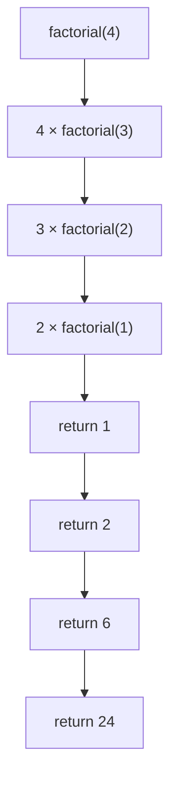
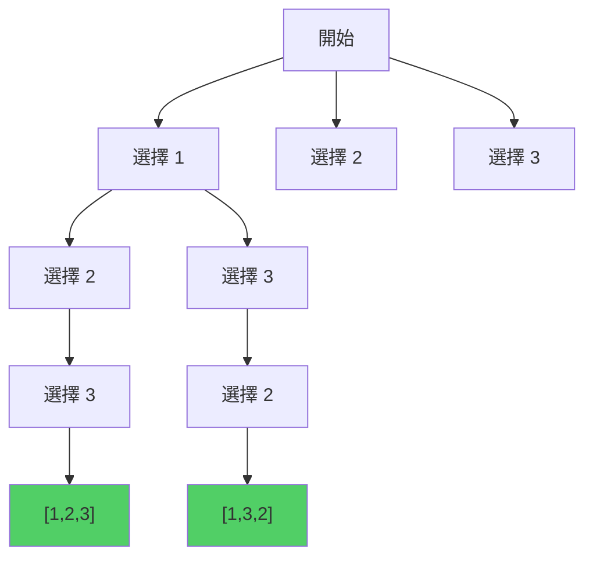

# 第 12 章：Recursion & Backtracking（回溯法）

!!! note "🎯 本章學習目標"
    完成本章後，你將能夠：
    
    - [ ] 理解遞迴的本質與呼叫棧行為
    - [ ] 掌握回溯法的通用模板
    - [ ] 解決子集、排列、組合三大類問題
    - [ ] 運用剪枝技巧優化回溯效率
    - [ ] 處理含重複元素的去重問題
    
    **預估學習時間**：3.5 小時  
    **前置知識**：第 1 章 複雜度分析

---

## 1. 遞迴基礎

### 遞迴三要素

1. **Base Case（終止條件）**：何時停止遞迴
2. **Recursive Case（遞迴關係）**：如何分解問題
3. **返回值**：如何組合子問題的結果

```python
def factorial(n: int) -> int:
    """
    階乘：n! = n × (n-1)!
    
    Base Case: 0! = 1
    Recursive: n! = n × (n-1)!
    """
    if n <= 1:          # Base Case
        return 1
    return n * factorial(n - 1)  # Recursive Case
```

### 遞迴呼叫棧



---

## 2. 回溯法框架

### 核心思想

回溯 = **DFS + 狀態恢復**

```python
def backtrack(path, choices):
    if 滿足終止條件:
        result.append(path[:])  # 收集結果
        return
    
    for choice in choices:
        if not is_valid(choice):
            continue  # 剪枝
        
        path.append(choice)      # 做選擇
        backtrack(path, new_choices)  # 遞迴
        path.pop()               # 撤銷選擇（回溯）
```



---

## 3. 子集問題

### Subsets（無重複元素）

```python
def subsets(nums: list[int]) -> list[list[int]]:
    """
    生成所有子集
    
    例如：[1,2,3] -> [[], [1], [2], [3], [1,2], [1,3], [2,3], [1,2,3]]
    
    Time: O(n × 2^n)
    Space: O(n)（不含結果）
    """
    result = []
    
    def backtrack(start: int, path: list[int]):
        result.append(path[:])  # 每個狀態都是一個子集
        
        for i in range(start, len(nums)):
            path.append(nums[i])
            backtrack(i + 1, path)  # i + 1：不包含自己
            path.pop()
    
    backtrack(0, [])
    return result
```

### Subsets II（有重複元素）

```python
def subsets_with_dup(nums: list[int]) -> list[list[int]]:
    """
    有重複元素的子集
    
    例如：[1,2,2] -> [[], [1], [2], [1,2], [2,2], [1,2,2]]
    
    關鍵：先排序，跳過同層的重複元素
    """
    nums.sort()  # 排序是關鍵！
    result = []
    
    def backtrack(start: int, path: list[int]):
        result.append(path[:])
        
        for i in range(start, len(nums)):
            # 同一層跳過重複元素
            if i > start and nums[i] == nums[i - 1]:
                continue
            
            path.append(nums[i])
            backtrack(i + 1, path)
            path.pop()
    
    backtrack(0, [])
    return result
```

---

## 4. 排列問題

### Permutations（無重複元素）

```python
def permutations(nums: list[int]) -> list[list[int]]:
    """
    生成所有排列
    
    例如：[1,2,3] -> [[1,2,3], [1,3,2], [2,1,3], [2,3,1], [3,1,2], [3,2,1]]
    
    Time: O(n × n!)
    Space: O(n)
    """
    result = []
    
    def backtrack(path: list[int], used: set):
        if len(path) == len(nums):
            result.append(path[:])
            return
        
        for num in nums:
            if num in used:
                continue
            
            used.add(num)
            path.append(num)
            backtrack(path, used)
            path.pop()
            used.remove(num)
    
    backtrack([], set())
    return result


# 更簡潔的寫法：交換法
def permutations_swap(nums: list[int]) -> list[list[int]]:
    result = []
    
    def backtrack(start: int):
        if start == len(nums):
            result.append(nums[:])
            return
        
        for i in range(start, len(nums)):
            nums[start], nums[i] = nums[i], nums[start]
            backtrack(start + 1)
            nums[start], nums[i] = nums[i], nums[start]
    
    backtrack(0)
    return result
```

### Permutations II（有重複元素）

```python
def permutations_unique(nums: list[int]) -> list[list[int]]:
    """
    有重複元素的排列
    
    例如：[1,1,2] -> [[1,1,2], [1,2,1], [2,1,1]]
    
    關鍵：排序 + 只在相同元素的第一個被使用時才使用後續相同元素
    """
    nums.sort()
    result = []
    used = [False] * len(nums)
    
    def backtrack(path: list[int]):
        if len(path) == len(nums):
            result.append(path[:])
            return
        
        for i in range(len(nums)):
            if used[i]:
                continue
            
            # 去重：相同元素，只有前一個被使用了才能用當前的
            if i > 0 and nums[i] == nums[i - 1] and not used[i - 1]:
                continue
            
            used[i] = True
            path.append(nums[i])
            backtrack(path)
            path.pop()
            used[i] = False
    
    backtrack([])
    return result
```

---

## 5. 組合問題

### Combinations

```python
def combinations(n: int, k: int) -> list[list[int]]:
    """
    從 1~n 中選 k 個數的所有組合
    
    例如：n=4, k=2 -> [[1,2], [1,3], [1,4], [2,3], [2,4], [3,4]]
    
    Time: O(k × C(n,k))
    Space: O(k)
    """
    result = []
    
    def backtrack(start: int, path: list[int]):
        if len(path) == k:
            result.append(path[:])
            return
        
        # 剪枝：剩餘元素不夠
        for i in range(start, n + 1 - (k - len(path)) + 1):
            path.append(i)
            backtrack(i + 1, path)
            path.pop()
    
    backtrack(1, [])
    return result
```

### Combination Sum（可重複選擇）

```python
def combination_sum(candidates: list[int], target: int) -> list[list[int]]:
    """
    找所有和為 target 的組合，每個數字可以重複使用
    
    例如：candidates=[2,3,6,7], target=7 -> [[2,2,3], [7]]
    """
    result = []
    
    def backtrack(start: int, path: list[int], remaining: int):
        if remaining == 0:
            result.append(path[:])
            return
        if remaining < 0:
            return
        
        for i in range(start, len(candidates)):
            path.append(candidates[i])
            backtrack(i, path, remaining - candidates[i])  # i：可重複選
            path.pop()
    
    backtrack(0, [], target)
    return result
```

### Combination Sum II（每個數字只能用一次）

```python
def combination_sum2(candidates: list[int], target: int) -> list[list[int]]:
    """
    每個數字只能用一次，有重複元素
    
    例如：candidates=[10,1,2,7,6,1,5], target=8 
         -> [[1,1,6], [1,2,5], [1,7], [2,6]]
    """
    candidates.sort()
    result = []
    
    def backtrack(start: int, path: list[int], remaining: int):
        if remaining == 0:
            result.append(path[:])
            return
        
        for i in range(start, len(candidates)):
            if candidates[i] > remaining:
                break  # 剪枝：超過目標
            
            if i > start and candidates[i] == candidates[i - 1]:
                continue  # 去重
            
            path.append(candidates[i])
            backtrack(i + 1, path, remaining - candidates[i])
            path.pop()
    
    backtrack(0, [], target)
    return result
```

---

## 6. 經典回溯問題

### N-Queens

```python
def solve_n_queens(n: int) -> list[list[str]]:
    """
    N 皇后問題
    
    Time: O(n!)
    Space: O(n)
    """
    result = []
    board = [['.' for _ in range(n)] for _ in range(n)]
    
    # 用 set 記錄被佔用的列和對角線
    cols = set()
    diag1 = set()  # 左上到右下對角線：row - col
    diag2 = set()  # 右上到左下對角線：row + col
    
    def backtrack(row: int):
        if row == n:
            result.append([''.join(row) for row in board])
            return
        
        for col in range(n):
            if col in cols or (row - col) in diag1 or (row + col) in diag2:
                continue
            
            board[row][col] = 'Q'
            cols.add(col)
            diag1.add(row - col)
            diag2.add(row + col)
            
            backtrack(row + 1)
            
            board[row][col] = '.'
            cols.remove(col)
            diag1.remove(row - col)
            diag2.remove(row + col)
    
    backtrack(0)
    return result
```

### Word Search

```python
def exist(board: list[list[str]], word: str) -> bool:
    """
    在網格中搜尋單字
    
    Time: O(m × n × 4^L)，L 是 word 長度
    Space: O(L)
    """
    m, n = len(board), len(board[0])
    
    def backtrack(i: int, j: int, k: int) -> bool:
        if k == len(word):
            return True
        
        if i < 0 or i >= m or j < 0 or j >= n or board[i][j] != word[k]:
            return False
        
        # 標記已訪問
        temp = board[i][j]
        board[i][j] = '#'
        
        # 四個方向
        found = (backtrack(i + 1, j, k + 1) or
                 backtrack(i - 1, j, k + 1) or
                 backtrack(i, j + 1, k + 1) or
                 backtrack(i, j - 1, k + 1))
        
        # 恢復狀態
        board[i][j] = temp
        
        return found
    
    for i in range(m):
        for j in range(n):
            if backtrack(i, j, 0):
                return True
    
    return False
```

---

## 7. 剪枝優化

### 常見剪枝策略

| 策略 | 說明 | 範例 |
|------|------|------|
| 排序剪枝 | 排序後提早終止 | 組合總和超過目標就 break |
| 去重剪枝 | 跳過重複元素 | `nums[i] == nums[i-1]` |
| 可行性剪枝 | 提前判斷不可能成功 | 剩餘元素不夠 k 個 |
| 最優性剪枝 | 已有更好解就剪掉 | 當前路徑長度 >= 最優解 |

---

## 8. 面試重點

!!! warning "⚠️ 常見陷阱"
    1. **忘記回溯（撤銷選擇）**
       - `path.append()` 之後一定要 `path.pop()`
    
    2. **去重時機搞錯**
       - 子集/組合：同一層去重 `i > start`
       - 排列：需要 `used` 陣列
    
    3. **結果收集時機**
       - 子集：每個節點都收集
       - 排列/組合：只在葉節點收集
    
    4. **深拷貝 vs 淺拷貝**
       - 必須 `result.append(path[:])`
       - 不能 `result.append(path)` ← 會被修改

!!! tip "💡 面試技巧"
    - **識別題型**：子集/排列/組合
    - **畫決策樹**：幫助理解遞迴結構
    - **先寫無剪枝版本**：確保正確後再優化
    - **解釋複雜度**：能說明為什麼是 O(2^n) 或 O(n!)

---

## 9. LeetCode 對應題目

| 難度 | 題號 | 題目名稱 | 考點 |
|------|------|---------|------|
| 🟡 Medium | #78 | Subsets | 子集模板 |
| 🟡 Medium | #90 | Subsets II | 子集去重 |
| 🟡 Medium | #46 | Permutations | 排列模板 |
| 🟡 Medium | #47 | Permutations II | 排列去重 |
| 🟡 Medium | #77 | Combinations | 組合模板 |
| 🟡 Medium | #39 | Combination Sum | 可重複選 |
| 🟡 Medium | #40 | Combination Sum II | 不可重複 |
| 🟡 Medium | #79 | Word Search | 網格回溯 |
| 🔴 Hard | #51 | N-Queens | 經典回溯 |

---

## 10. 練習題

!!! question "練習 1：Letter Combinations of a Phone Number（Medium）"
    **題目描述：**
    
    給定一個包含數字 2-9 的字串，返回所有它能表示的字母組合（按電話按鍵）。
    
    **範例：**
    ```
    輸入：digits = "23"
    輸出：["ad","ae","af","bd","be","bf","cd","ce","cf"]
    ```
    
    **提示：**
    <details>
    <summary>點擊查看提示</summary>
    建立數字到字母的映射，對每個數字遍歷其所有字母。
    </details>

!!! question "練習 2：Palindrome Partitioning（Medium）"
    **題目描述：**
    
    給定一個字串，將它分割成所有可能的回文子串組合。
    
    **範例：**
    ```
    輸入：s = "aab"
    輸出：[["a","a","b"],["aa","b"]]
    ```
    
    **提示：**
    <details>
    <summary>點擊查看提示</summary>
    從 start 開始，嘗試所有可能的 end，如果 s[start:end] 是回文就遞迴。
    </details>

!!! question "練習 3：Sudoku Solver（Hard）"
    **題目描述：**
    
    解數獨問題：填入 1-9 使得每行、每列、每個 3×3 宮格都包含 1-9。
    
    **提示：**
    <details>
    <summary>點擊查看提示</summary>
    遍歷每個空格，嘗試 1-9，用 set 記錄行/列/宮格的已用數字。
    </details>

---

## 11. 解答與詳解

??? success "練習 1 解答"
    ```python
    def letter_combinations(digits: str) -> list[str]:
        """
        Time: O(4^n)，n 是 digits 長度
        Space: O(n)
        """
        if not digits:
            return []
        
        mapping = {
            '2': 'abc', '3': 'def', '4': 'ghi', '5': 'jkl',
            '6': 'mno', '7': 'pqrs', '8': 'tuv', '9': 'wxyz'
        }
        
        result = []
        
        def backtrack(idx: int, path: list[str]):
            if idx == len(digits):
                result.append(''.join(path))
                return
            
            for char in mapping[digits[idx]]:
                path.append(char)
                backtrack(idx + 1, path)
                path.pop()
        
        backtrack(0, [])
        return result
    ```

??? success "練習 2 解答"
    ```python
    def partition(s: str) -> list[list[str]]:
        """
        Time: O(n × 2^n)
        Space: O(n)
        """
        result = []
        
        def is_palindrome(start: int, end: int) -> bool:
            while start < end:
                if s[start] != s[end]:
                    return False
                start += 1
                end -= 1
            return True
        
        def backtrack(start: int, path: list[str]):
            if start == len(s):
                result.append(path[:])
                return
            
            for end in range(start, len(s)):
                if is_palindrome(start, end):
                    path.append(s[start:end + 1])
                    backtrack(end + 1, path)
                    path.pop()
        
        backtrack(0, [])
        return result
    ```

??? success "練習 3 解答"
    ```python
    def solve_sudoku(board: list[list[str]]) -> None:
        """
        Time: O(9^(空格數))
        Space: O(81)
        """
        rows = [set() for _ in range(9)]
        cols = [set() for _ in range(9)]
        boxes = [set() for _ in range(9)]
        
        # 初始化已有的數字
        for i in range(9):
            for j in range(9):
                if board[i][j] != '.':
                    num = board[i][j]
                    rows[i].add(num)
                    cols[j].add(num)
                    boxes[(i // 3) * 3 + j // 3].add(num)
        
        def backtrack(i: int, j: int) -> bool:
            if i == 9:
                return True
            
            ni, nj = (i, j + 1) if j < 8 else (i + 1, 0)
            
            if board[i][j] != '.':
                return backtrack(ni, nj)
            
            box_idx = (i // 3) * 3 + j // 3
            
            for num in '123456789':
                if num in rows[i] or num in cols[j] or num in boxes[box_idx]:
                    continue
                
                board[i][j] = num
                rows[i].add(num)
                cols[j].add(num)
                boxes[box_idx].add(num)
                
                if backtrack(ni, nj):
                    return True
                
                board[i][j] = '.'
                rows[i].remove(num)
                cols[j].remove(num)
                boxes[box_idx].remove(num)
            
            return False
        
        backtrack(0, 0)
    ```

---

## 12. 延伸學習

### 🚀 進階主題
- **記憶化回溯**：結合 DP 避免重複計算
- **雙向 BFS**：加速搜尋
- **A* 搜尋**：啟發式回溯
- **Dancing Links**：高效解決精確覆蓋問題

### ⏭️ 下一章預告
下一章我們將學習「**Dynamic Programming**」，這是面試中最具挑戰性的主題之一。掌握 DP 思維後，許多看似複雜的問題都能迎刃而解！
