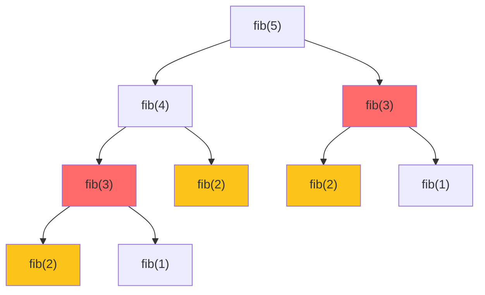

# 第 13 章：Dynamic Programming（動態規劃）

!!! note "🎯 本章學習目標"
    完成本章後，你將能夠：
    
    - [ ] 理解 DP 的核心思想：重疊子問題與最優子結構
    - [ ] 掌握狀態定義與狀態轉移方程的設計
    - [ ] 熟練 Top-down（記憶化）與 Bottom-up 兩種實作
    - [ ] 解決經典 DP 問題：背包、LCS、股票問題等
    - [ ] 進行空間優化（滾動陣列）
    
    **預估學習時間**：5 小時  
    **前置知識**：第 1 章 複雜度分析、第 12 章 遞迴

---

## 1. DP 核心概念

### 什麼時候用 DP？

當問題滿足以下條件：

1. **重疊子問題**：會重複計算相同的子問題
2. **最優子結構**：大問題的最優解包含小問題的最優解



紅色和黃色節點是重複計算的子問題！

### DP 解題步驟

1. **定義狀態**：`dp[i]` 代表什麼？
2. **狀態轉移方程**：`dp[i]` 如何從更小的狀態推導？
3. **初始條件**：最小子問題的答案
4. **計算順序**：Bottom-up 的遍歷順序
5. **返回值**：最終答案在哪？

---

## 2. 經典入門：Fibonacci & Climbing Stairs

### Fibonacci（記憶化搜尋 vs DP）

```python
# === 暴力遞迴：O(2^n) ===
def fib_naive(n: int) -> int:
    if n <= 1:
        return n
    return fib_naive(n - 1) + fib_naive(n - 2)


# === Top-down：記憶化遞迴 O(n) ===
def fib_memo(n: int, memo: dict = None) -> int:
    if memo is None:
        memo = {}
    if n <= 1:
        return n
    if n in memo:
        return memo[n]
    memo[n] = fib_memo(n - 1, memo) + fib_memo(n - 2, memo)
    return memo[n]


# === Bottom-up：迭代 DP O(n) ===
def fib_dp(n: int) -> int:
    if n <= 1:
        return n
    dp = [0] * (n + 1)
    dp[1] = 1
    for i in range(2, n + 1):
        dp[i] = dp[i - 1] + dp[i - 2]
    return dp[n]


# === 空間優化 O(1) ===
def fib_optimized(n: int) -> int:
    if n <= 1:
        return n
    prev, curr = 0, 1
    for _ in range(2, n + 1):
        prev, curr = curr, prev + curr
    return curr
```

### Climbing Stairs

```python
def climb_stairs(n: int) -> int:
    """
    爬樓梯：每次可以爬 1 或 2 階，到達第 n 階有幾種方法？
    
    狀態：dp[i] = 到達第 i 階的方法數
    轉移：dp[i] = dp[i-1] + dp[i-2]
    
    Time: O(n), Space: O(1)
    """
    if n <= 2:
        return n
    
    prev, curr = 1, 2
    for _ in range(3, n + 1):
        prev, curr = curr, prev + curr
    
    return curr
```

---

## 3. 一維 DP 問題

### House Robber

```python
def rob(nums: list[int]) -> int:
    """
    打家劫舍：不能搶相鄰的房子，求最大金額
    
    狀態：dp[i] = 考慮前 i 間房子的最大金額
    轉移：dp[i] = max(dp[i-1], dp[i-2] + nums[i])
              「不搶第 i 間」 vs 「搶第 i 間」
    
    Time: O(n), Space: O(1)
    """
    if not nums:
        return 0
    if len(nums) == 1:
        return nums[0]
    
    prev2, prev1 = 0, 0
    
    for num in nums:
        curr = max(prev1, prev2 + num)
        prev2, prev1 = prev1, curr
    
    return prev1
```

### Coin Change

```python
def coin_change(coins: list[int], amount: int) -> int:
    """
    零錢兌換：求湊成 amount 的最少硬幣數
    
    狀態：dp[i] = 湊成金額 i 的最少硬幣數
    轉移：dp[i] = min(dp[i - coin] + 1) for coin in coins
    
    Time: O(amount × len(coins))
    Space: O(amount)
    """
    dp = [float('inf')] * (amount + 1)
    dp[0] = 0
    
    for i in range(1, amount + 1):
        for coin in coins:
            if coin <= i and dp[i - coin] != float('inf'):
                dp[i] = min(dp[i], dp[i - coin] + 1)
    
    return dp[amount] if dp[amount] != float('inf') else -1
```

### Longest Increasing Subsequence (LIS)

```python
def length_of_lis(nums: list[int]) -> int:
    """
    最長遞增子序列
    
    方法一：經典 DP
    狀態：dp[i] = 以 nums[i] 結尾的 LIS 長度
    轉移：dp[i] = max(dp[j] + 1) for j < i if nums[j] < nums[i]
    
    Time: O(n²), Space: O(n)
    """
    if not nums:
        return 0
    
    n = len(nums)
    dp = [1] * n  # 每個元素自己就是長度 1
    
    for i in range(1, n):
        for j in range(i):
            if nums[j] < nums[i]:
                dp[i] = max(dp[i], dp[j] + 1)
    
    return max(dp)


def length_of_lis_binary_search(nums: list[int]) -> int:
    """
    方法二：貪婪 + 二分搜尋
    
    維護一個遞增陣列 tails：
    tails[i] = 長度為 i+1 的 LIS 的最小結尾
    
    Time: O(n log n), Space: O(n)
    """
    from bisect import bisect_left
    
    tails = []
    
    for num in nums:
        idx = bisect_left(tails, num)
        if idx == len(tails):
            tails.append(num)
        else:
            tails[idx] = num
    
    return len(tails)
```

---

## 4. 二維 DP 問題

### Unique Paths

```python
def unique_paths(m: int, n: int) -> int:
    """
    不同路徑：從左上到右下，只能往右或往下
    
    狀態：dp[i][j] = 到達 (i, j) 的路徑數
    轉移：dp[i][j] = dp[i-1][j] + dp[i][j-1]
    
    Time: O(m × n), Space: O(n)
    """
    dp = [1] * n  # 第一行都是 1
    
    for _ in range(1, m):
        for j in range(1, n):
            dp[j] += dp[j - 1]
    
    return dp[n - 1]
```

### Edit Distance

```python
def min_distance(word1: str, word2: str) -> int:
    """
    編輯距離：將 word1 轉成 word2 的最少操作數
    操作：插入、刪除、替換
    
    狀態：dp[i][j] = word1[:i] 轉成 word2[:j] 的最少操作
    轉移：
      - 如果 word1[i-1] == word2[j-1]: dp[i][j] = dp[i-1][j-1]
      - 否則: dp[i][j] = min(
            dp[i-1][j] + 1,    # 刪除
            dp[i][j-1] + 1,    # 插入
            dp[i-1][j-1] + 1   # 替換
        )
    
    Time: O(m × n), Space: O(m × n)
    """
    m, n = len(word1), len(word2)
    dp = [[0] * (n + 1) for _ in range(m + 1)]
    
    # 初始化
    for i in range(m + 1):
        dp[i][0] = i
    for j in range(n + 1):
        dp[0][j] = j
    
    for i in range(1, m + 1):
        for j in range(1, n + 1):
            if word1[i - 1] == word2[j - 1]:
                dp[i][j] = dp[i - 1][j - 1]
            else:
                dp[i][j] = min(
                    dp[i - 1][j] + 1,
                    dp[i][j - 1] + 1,
                    dp[i - 1][j - 1] + 1
                )
    
    return dp[m][n]
```

### Longest Common Subsequence (LCS)

```python
def longest_common_subsequence(text1: str, text2: str) -> int:
    """
    最長公共子序列
    
    狀態：dp[i][j] = text1[:i] 和 text2[:j] 的 LCS 長度
    轉移：
      - 如果相等：dp[i][j] = dp[i-1][j-1] + 1
      - 否則：dp[i][j] = max(dp[i-1][j], dp[i][j-1])
    
    Time: O(m × n), Space: O(m × n)
    """
    m, n = len(text1), len(text2)
    dp = [[0] * (n + 1) for _ in range(m + 1)]
    
    for i in range(1, m + 1):
        for j in range(1, n + 1):
            if text1[i - 1] == text2[j - 1]:
                dp[i][j] = dp[i - 1][j - 1] + 1
            else:
                dp[i][j] = max(dp[i - 1][j], dp[i][j - 1])
    
    return dp[m][n]
```

---

## 5. 背包問題

### 0/1 背包

```python
def knapsack_01(weights: list[int], values: list[int], capacity: int) -> int:
    """
    0/1 背包：每個物品只能選一次
    
    狀態：dp[i][w] = 考慮前 i 個物品，容量 w 的最大價值
    轉移：dp[i][w] = max(
        dp[i-1][w],                     # 不選第 i 個
        dp[i-1][w-weights[i]] + values[i]  # 選第 i 個
    )
    
    Time: O(n × capacity), Space: O(capacity)
    """
    n = len(weights)
    dp = [0] * (capacity + 1)
    
    for i in range(n):
        # 必須倒序遍歷！確保每個物品只用一次
        for w in range(capacity, weights[i] - 1, -1):
            dp[w] = max(dp[w], dp[w - weights[i]] + values[i])
    
    return dp[capacity]
```

### 完全背包

```python
def knapsack_complete(weights: list[int], values: list[int], capacity: int) -> int:
    """
    完全背包：每個物品可以選無限次
    
    和 0/1 背包的差別：正序遍歷
    """
    n = len(weights)
    dp = [0] * (capacity + 1)
    
    for i in range(n):
        # 正序遍歷！允許重複選擇
        for w in range(weights[i], capacity + 1):
            dp[w] = max(dp[w], dp[w - weights[i]] + values[i])
    
    return dp[capacity]
```

### Coin Change II（組合數）

```python
def change(amount: int, coins: list[int]) -> int:
    """
    零錢兌換 II：湊成 amount 的組合數
    
    完全背包變體
    """
    dp = [0] * (amount + 1)
    dp[0] = 1  # 湊成 0 有一種方法：不選
    
    for coin in coins:  # 外層遍歷物品
        for i in range(coin, amount + 1):  # 內層遍歷容量
            dp[i] += dp[i - coin]
    
    return dp[amount]
```

---

## 6. 區間 DP

### Palindromic Substrings

```python
def count_substrings(s: str) -> int:
    """
    計算回文子串數量
    
    狀態：dp[i][j] = s[i:j+1] 是否是回文
    轉移：dp[i][j] = (s[i] == s[j]) and dp[i+1][j-1]
    
    Time: O(n²), Space: O(n²)
    """
    n = len(s)
    dp = [[False] * n for _ in range(n)]
    count = 0
    
    # 遍歷順序：從短到長
    for length in range(1, n + 1):
        for i in range(n - length + 1):
            j = i + length - 1
            
            if length == 1:
                dp[i][j] = True
            elif length == 2:
                dp[i][j] = (s[i] == s[j])
            else:
                dp[i][j] = (s[i] == s[j]) and dp[i + 1][j - 1]
            
            if dp[i][j]:
                count += 1
    
    return count
```

---

## 7. 股票問題系列

### Best Time to Buy and Sell Stock（一次交易）

```python
def max_profit_one(prices: list[int]) -> int:
    """
    只能買賣一次
    
    Time: O(n), Space: O(1)
    """
    min_price = float('inf')
    max_profit = 0
    
    for price in prices:
        min_price = min(min_price, price)
        max_profit = max(max_profit, price - min_price)
    
    return max_profit
```

### Best Time to Buy and Sell Stock II（無限次交易）

```python
def max_profit_unlimited(prices: list[int]) -> int:
    """
    可以無限次買賣
    
    貪婪：收集所有上漲
    """
    profit = 0
    for i in range(1, len(prices)):
        if prices[i] > prices[i - 1]:
            profit += prices[i] - prices[i - 1]
    return profit
```

### Best Time to Buy and Sell Stock with Cooldown

```python
def max_profit_cooldown(prices: list[int]) -> int:
    """
    賣出後需要冷卻一天
    
    狀態：
      - hold: 持有股票
      - sold: 剛賣出（冷卻中）
      - rest: 休息狀態
    """
    if len(prices) < 2:
        return 0
    
    hold = -prices[0]
    sold = 0
    rest = 0
    
    for price in prices[1:]:
        new_hold = max(hold, rest - price)
        new_sold = hold + price
        new_rest = max(rest, sold)
        hold, sold, rest = new_hold, new_sold, new_rest
    
    return max(sold, rest)
```

---

## 8. 複雜度分析

| 問題類型 | 狀態數 | 轉移時間 | 總複雜度 |
|---------|-------|---------|---------|
| Fibonacci | O(n) | O(1) | O(n) |
| Coin Change | O(amount) | O(coins) | O(amount × coins) |
| LIS | O(n) | O(n) 或 O(log n) | O(n²) 或 O(n log n) |
| LCS | O(m × n) | O(1) | O(m × n) |
| 0/1 背包 | O(n × W) | O(1) | O(n × W) |

---

## 9. 面試重點

!!! warning "⚠️ 常見陷阱"
    1. **初始化錯誤**
       - dp[0] 的意義要想清楚
       - 邊界條件要正確設置
    
    2. **遍歷順序錯誤**
       - 0/1 背包：倒序
       - 完全背包：正序
       - 區間 DP：由短到長
    
    3. **狀態定義模糊**
       - 「以 i 結尾」vs「前 i 個」
       - 這會影響轉移方程

!!! tip "💡 面試技巧"
    - **先寫暴力遞迴**：畫出遞迴樹，找重疊子問題
    - **加入記憶化**：驗證思路正確
    - **轉成 DP**：確定遍歷順序
    - **空間優化**：用滾動陣列
    - **解釋狀態**：面試時要能清楚說明 dp[i] 的意義

---

## 10. LeetCode 對應題目

| 難度 | 題號 | 題目名稱 | 考點 |
|------|------|---------|------|
| 🟢 Easy | #70 | Climbing Stairs | 入門 DP |
| 🟢 Easy | #121 | Best Time to Buy and Sell Stock | 一維 DP |
| 🟡 Medium | #198 | House Robber | 一維 DP |
| 🟡 Medium | #322 | Coin Change | 完全背包 |
| 🟡 Medium | #300 | Longest Increasing Subsequence | LIS |
| 🟡 Medium | #1143 | Longest Common Subsequence | 二維 DP |
| 🟡 Medium | #72 | Edit Distance | 字串 DP |
| 🟡 Medium | #416 | Partition Equal Subset Sum | 0/1 背包 |
| 🔴 Hard | #312 | Burst Balloons | 區間 DP |
| 🔴 Hard | #188 | Best Time to Buy and Sell Stock IV | 狀態機 DP |

---

## 11. 練習題

!!! question "練習 1：Maximum Subarray（Easy）"
    **題目描述：**
    
    給定一個整數陣列，找出具有最大和的連續子陣列。
    
    **範例：**
    ```
    輸入：nums = [-2,1,-3,4,-1,2,1,-5,4]
    輸出：6
    解釋：[4,-1,2,1] 的和最大
    ```
    
    **提示：**
    <details>
    <summary>點擊查看提示</summary>
    Kadane's Algorithm：dp[i] = max(nums[i], dp[i-1] + nums[i])
    </details>

!!! question "練習 2：Partition Equal Subset Sum（Medium）"
    **題目描述：**
    
    給定一個只包含正整數的陣列，判斷是否可以分成兩個和相等的子集。
    
    **範例：**
    ```
    輸入：nums = [1, 5, 11, 5]
    輸出：true
    解釋：[1, 5, 5] 和 [11]
    ```
    
    **提示：**
    <details>
    <summary>點擊查看提示</summary>
    轉換成 0/1 背包問題：能否湊出 sum/2？
    </details>

!!! question "練習 3：Burst Balloons（Hard）"
    **題目描述：**
    
    n 個氣球，編號 0 到 n-1，每個氣球有一個數字 nums[i]。戳破氣球 i 得到 nums[i-1] × nums[i] × nums[i+1] 硬幣。求最大硬幣數。
    
    **範例：**
    ```
    輸入：nums = [3,1,5,8]
    輸出：167
    ```
    
    **提示：**
    <details>
    <summary>點擊查看提示</summary>
    區間 DP：思考「最後戳破哪個氣球」。
    </details>

---

## 12. 解答與詳解

??? success "練習 1 解答"
    ```python
    def max_subarray(nums: list[int]) -> int:
        """
        Kadane's Algorithm
        
        dp[i] = 以 nums[i] 結尾的最大子陣列和
        dp[i] = max(nums[i], dp[i-1] + nums[i])
        
        Time: O(n), Space: O(1)
        """
        max_sum = curr_sum = nums[0]
        
        for num in nums[1:]:
            curr_sum = max(num, curr_sum + num)
            max_sum = max(max_sum, curr_sum)
        
        return max_sum
    ```

??? success "練習 2 解答"
    ```python
    def can_partition(nums: list[int]) -> bool:
        """
        0/1 背包問題
        
        Time: O(n × sum)
        Space: O(sum)
        """
        total = sum(nums)
        
        # 奇數無法分成兩半
        if total % 2 != 0:
            return False
        
        target = total // 2
        dp = [False] * (target + 1)
        dp[0] = True
        
        for num in nums:
            for i in range(target, num - 1, -1):  # 倒序！
                dp[i] = dp[i] or dp[i - num]
        
        return dp[target]
    ```

??? success "練習 3 解答"
    ```python
    def max_coins(nums: list[int]) -> int:
        """
        區間 DP
        
        dp[i][j] = 戳破 (i, j) 開區間內的氣球獲得的最大硬幣
        
        Time: O(n³)
        Space: O(n²)
        """
        # 加上邊界 1
        nums = [1] + nums + [1]
        n = len(nums)
        dp = [[0] * n for _ in range(n)]
        
        # 遍歷區間長度
        for length in range(2, n):
            for i in range(n - length):
                j = i + length
                # k 是最後戳破的氣球
                for k in range(i + 1, j):
                    coins = nums[i] * nums[k] * nums[j]
                    dp[i][j] = max(dp[i][j], dp[i][k] + dp[k][j] + coins)
        
        return dp[0][n - 1]
    ```

---

## 13. 延伸學習

### 🚀 進階主題
- **狀態壓縮 DP**：用位運算壓縮狀態
- **樹形 DP**：在樹結構上進行 DP
- **數位 DP**：計算滿足條件的數字個數
- **插頭 DP**：解決網格問題（如哈密頓路徑）

### ⏭️ 下一章預告
下一章我們將學習「**Greedy Algorithm**」，這是另一種重要的演算法思維。掌握貪婪策略的選擇與正確性證明是面試的加分項！
