# 資料結構與演算法

!!! success "🎯 課程目標"
    本課程專為準備 **FAANG（Google、Microsoft、Amazon、Meta）技術面試**的工程師設計。
    透過系統性的學習，你將掌握面試必考的資料結構與演算法核心知識。

## 📚 課程大綱

```mermaid
graph LR
    subgraph 基礎篇
        A1["1. 複雜度分析"]
        A2["2. Array & String"]
        A3["3. Linked List"]
        A4["4. Stack & Queue"]
    end
    
    subgraph 進階資料結構
        B1["5. Hash Table"]
        B2["6. Tree"]
        B3["7. BST"]
        B4["8. Heap"]
        B5["9. Graph"]
    end
    
    subgraph 演算法篇
        C1["10. 排序"]
        C2["11. Binary Search"]
        C3["12. Backtracking"]
        C4["13. DP"]
        C5["14. Greedy"]
    end
    
    A1 --> A2 --> A3 --> A4 --> B1
    B1 --> B2 --> B3 --> B4 --> B5
    B5 --> C1 --> C2 --> C3 --> C4 --> C5
```

---

## 🚀 基礎篇

建立紮實的資料結構基礎，理解時間與空間複雜度分析。

| 章節 | 主題 | 重點 | 預估時間 |
|------|------|------|---------|
| [第 1 章](chapter_01_complexity.md) | 複雜度分析 | Big O、時間/空間複雜度 | 2 小時 |
| [第 2 章](chapter_02_array_string.md) | Array 與 String | 雙指標、滑動窗口 | 3 小時 |
| [第 3 章](chapter_03_linked_list.md) | Linked List | 快慢指標、反轉技巧 | 2.5 小時 |
| [第 4 章](chapter_04_stack_queue.md) | Stack 與 Queue | 單調棧、BFS 應用 | 2.5 小時 |

---

## 🔥 進階資料結構

深入理解面試高頻資料結構，掌握各種操作的實作與應用。

| 章節 | 主題 | 重點 | 預估時間 |
|------|------|------|---------|
| [第 5 章](chapter_05_hash_table.md) | Hash Table | O(1) 查找、碰撞處理 | 3 小時 |
| [第 6 章](chapter_06_tree.md) | Tree 與 Binary Tree | 遍歷方式、遞迴思維 | 3 小時 |
| [第 7 章](chapter_07_bst.md) | Binary Search Tree | BST 性質、平衡樹概念 | 2.5 小時 |
| [第 8 章](chapter_08_heap.md) | Heap 與 Priority Queue | Heapify、Top K 問題 | 2.5 小時 |
| [第 9 章](chapter_09_graph.md) | Graph | BFS/DFS、拓撲排序 | 4 小時 |

---

## 💡 演算法篇

掌握經典演算法思維，解決複雜的面試問題。

| 章節 | 主題 | 重點 | 預估時間 |
|------|------|------|---------|
| [第 10 章](chapter_10_sorting.md) | 排序演算法 | Quick Sort、Merge Sort | 3 小時 |
| [第 11 章](chapter_11_binary_search.md) | Binary Search | 邊界處理、變體應用 | 2.5 小時 |
| [第 12 章](chapter_12_recursion_backtracking.md) | Recursion & Backtracking | 回溯框架、剪枝優化 | 3.5 小時 |
| [第 13 章](chapter_13_dynamic_programming.md) | Dynamic Programming | 狀態轉移、經典模式 | 5 小時 |
| [第 14 章](chapter_14_greedy.md) | Greedy Algorithm | 貪婪策略、正確性證明 | 2.5 小時 |

---

## 🎓 學習建議

!!! tip "高效學習策略"
    1. **按順序學習**：每章內容都建立在前面章節的基礎上
    2. **動手實作**：親自打一遍程式碼，不要只看不練
    3. **練習題必做**：每章的 3 道練習題是精選的面試經典題
    4. **複習複雜度**：每個解法都要能分析時間和空間複雜度

!!! info "各公司面試風格"
    - **Google**：強調複雜度優化，會追問「還能更快嗎？」
    - **Microsoft**：實際應用情境，可能問系統設計相關
    - **Amazon**：Scalability 考量，注重程式碼品質
    - **Meta**：實作完整度，會要求處理邊界情況

---

## ⏱️ 時間規劃

| 學習模式 | 建議時程 | 每日時間 |
|---------|---------|---------|
| 密集準備 | 4 週 | 3-4 小時/天 |
| 穩紮穩打 | 8 週 | 1.5-2 小時/天 |
| 週末學習 | 12 週 | 4-5 小時/週末 |

---

**開始你的學習之旅吧！** 👉 [第 1 章：複雜度分析](chapter_01_complexity.md)
