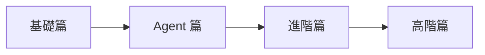

# 🚀 LangGraph 學習指南

歡迎來到 **LangGraph 學習指南**！這是一個完整的互動式學習平台，幫助您從零開始掌握 LangGraph Agent 開發。

## 📚 課程內容

本課程共 **13 個章節**，涵蓋以下主題：

| 分類 | 章節 | 難度 |
|------|------|------|
| **基礎篇** | 環境設定、第一個 Graph、狀態管理 | ⭐ |
| **Agent 篇** | ReAct Agent、Tool 整合、條件路由 | ⭐⭐ |
| **進階篇** | 記憶體持久化、人機協作、多 Agent 系統 | ⭐⭐⭐ |
| **高階篇** | 錯誤處理、串流輸出、子圖設計、最佳實踐 | ⭐⭐⭐⭐ |

## 🛠️ 環境需求

- Python 3.12+
- OpenAI API Key（或其他 LLM 提供者）

## 🚀 快速開始

```bash
# 設定 API Key
cp .env.example .env
# 編輯 .env 填入您的 API Key

# 啟動 Jupyter Lab
uv run jupyter lab

# 啟動 MkDocs 開發伺服器
uv run mkdocs serve
```

## 📖 學習路徑



### 建議學習方式

1. 📖 先閱讀 [學習指南](LangGraph_學習指南.md) 了解概念
2. 💻 依序完成實作練習的 Jupyter Notebook
3. 🔄 反覆練習，建立自己的專案

---

**祝學習愉快！** 🎉
